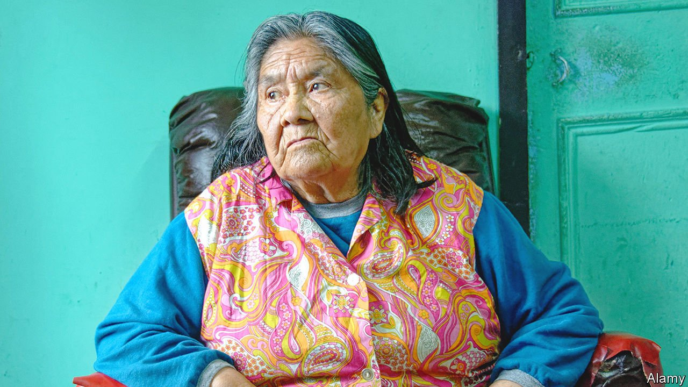

###### Last of the line

# Cristina Calderón was the only full-blooded member of her people 

##### The champion of Yaghan language and culture died on February 16th, aged 93 

 

> Mar 5th 2022 

THE DESTRUCTION of a language, a culture and a people’s independence can happen swiftly, with one raid or one venturesome virus. More often it is a process of slow decline, over decades or centuries, caused by miscegenation and indifference. Foreign, modern ways prove more attractive; the old traditions come to seem primitive, even shameful; children refuse to learn or speak the complicated words. So the culture disappears, and with it a world that no other people knew.

Cristina Calderón was the last representative of her world, the Yaghan people of Tierra del Fuego on the stormy southernmost tip of South America. She was the last person who could remember men going out in bark canoes to row south through the Beagle Channel, their naked torsos coated with seal fat against the freezing cold. She remembered going hunting herself in a boat, learning to stone seagull chicks without feeling sorry for them; because God, Watauineiwa, had made them to be eaten, just as he had decided to take her grandfather when he was hit in the stomach by a “Spaniard”. Sailing past ice floes, she either avoided looking at them or painted her face black, out of respect, for they were as wise as human beings. In the woods she ran fast because of Hannus, the giant ape-man who lived there. She wore shoes made of fur from the guanaco, a creature like a llama, and ate berries cooked in seal oil, which were a treat.


The Yaghan were an amphibious people, living half on the sea, catching otters and fish, and half on land, working as sheep-shearers, in akalis or huts made of planking and corrugated iron. She had been born in such a hut to Lanixweliskipa and her husband Akacexanincis, Yaghans who had already changed their names to Carmen Harban and Juan Calderón. White people would not laugh at them then. When Charles Darwin had dropped by in the mid-19th century, the Yaghans had numbered around 3,000. By the time she was born in 1928 there were 100 or so, still clinging to the old ways. Gradually, however, they began to move to a more settled life in Bahía Mejillones, the Bay of Mussels, where she grew up, and where they could scrape a living catching shellfish. Out in the waters beyond the Beagle Channel, skimming between fjords and glaciers, they had known freedom, rough as it was. But to settle permanently was to die, little by little.

Over her long lifetime—in which she was orphaned at six, took three partners, lost the best of them to lung disease, and had nine children, two of whom died early—her people were squeezed by the Chilean government into a smaller and smaller space, eventually Villa Ukika near Puerto Williams. There they lived in better houses, but as a remnant people. Among the 50 or so Yaghans now surviving, “Abuela Cristina” was the last of pure Yaghan blood.

As such, she was an object of affectionate curiosity to the world. Journalists sought her out, trailing this dumpy figure in her thick woollen leggings and cardigans as she knitted socks, her main source of income, or battled the endless wind to pick rushes to weave into traditional baskets. She looked vulnerable sometimes in her solitude, the last of the line. But appearances were deceptive. Just as she doggedly withstood the elements, so she was fighting to hand on her language and her culture.

For her first nine years she had spoken nothing but Yaghan. It was a vast language, catalogued by Thomas Bridges in the 19th century at 32,400 words. Many offered a tiny snapshot of Yaghan life: ilan tashata for the fierce winter storm from the south, carrying snow, which blew on the night she was born; tuock-ollafor the act of hiring a man to carve bone to make spearheads. Some were extraordinarily concise, or caught nuances other languages did not even attempt: mamihlapinatapai meant “a look between two people, each of whom expects the other to do something that they both want but neither dares to start”. Her own favourite words were two of the simplest: januja, the Moon, and lamp, the Sun.

Until Bridges, no one had tried to write them down; this was not a literate society. And until she took up the task, no one did anything more to record it. She and her grand-daughter, Cristina Zárraga, spent years compiling a Yaghan-Spanish dictionary, running language workshops and making recordings on which she spoke the melodious words. In 2005 she also published a book of Yaghan legends. Though her family were all mixed race, and the youngest members had no interest in learning this language, they encouraged her because she was still the heart of the community, carrying the Yaghan fire.

She did not pretend the past had been perfect. Life had been hard, so far down south that they almost touched Antarctica. It was also socially primitive. Men and women were meant to be equal, but she was forced at 15 to marry a man many years her senior, whom she did not know. When she protested, she was told that marriage was the only thing that could guarantee her food, clothes and a peaceful life; and she took that as true, as she remembered an unmarried aunt and a sister routinely going naked.

Yet Yaghan society was democratic, after a fashion. There were no chiefs. There was also no education except at the feet of the shamans, and little entertainment except the round of initiations and burials. She treasured a photograph of her father as a handsome young man in mourning, with his face-paint and his pure white headdress made of the feathers of wild geese. Such things had not been seen for a long, long time.

In very old age she would sit knitting amid a pile of crochet cushions in the fine white wooden house she had been given by the Chilean government. After years of suppression of the Yaghans, it had now declared her a national treasure. UNESCO had proclaimed her a treasure for the whole of humanity. She was still weaving her baskets, to show how it was done. She had left her language on recordings and her books in libraries. There was nothing more, practically, that she could do. As she gazed from her windows out across the Beagle Channel, she still saw the distant shapes of bark canoes setting out on the water. ■

