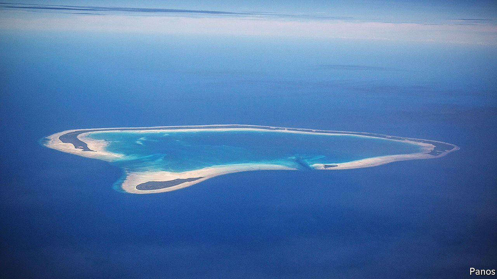

###### Atolls as power stations

# How to power Pacific islands 

##### Turn the atolls themselves into power stations 

 

> Mar 5th 2022 

YOUR LATEST electricity bill may have been a rude shock. But chances are it is way less than the bills facing inhabitants of remote islands such as those of the Federated States of Micronesia. In that country, an archipelago of just over 600 islands in the western Pacific Ocean, the residential rate per kWh is about three times the norm in America.

Small Pacific islands generally rely on diesel generators. Connecting them to grids is too expensive. Solar power takes up too much space. And wind turbines are not designed to withstand the hurricanes that sometimes blow through. But, as Matt Lewis of Bangor University, in Britain, told this year’s Ocean Sciences Meeting (held virtually) on February 28th, the answer may lie in the very geography of the islands themselves.


Lots of Pacific islands are atolls. Others, though more substantial, have fringing reefs. Both of these set ups involve lagoons separated from the ocean by the reef, yet connected to it via a number of narrow channels. The lagoons themselves are kept filled slightly above sea level by waves overtopping the reef. To Dr Lewis, this arrangement looks a lot like a hydroelectric power station, with the reef acting as the dam and the lagoon as the reservoir behind it. All that is missing is the generating turbines, which he proposes to put in the channels.

To work out the details he teamed up with Ryan Lowe, an Australian oceanographer who studies the ecology of reefs and has devised a simple mathematical formula for the wave-driven outflows of lagoons. After putting some numbers about the size and general shape of atolls into Dr Lowe’s model, together with the levels of waves and tides in the world’s oceans, the pair conclude that, for a typical atoll anywhere in the Pacific, with, say, five channels through its reef, suitably placed generators could yield more than 50kW. This would provide power for at least 250 islanders. They reckon that a turbine on such an atoll would run for about 75% of the time. That is promising, Dr Lewis says, considering that the average wind turbine manages only 40%.

The next step will be to do this calculation for real, for as many inhabited islands with lagoons as possible. By combining satellite images with Dr Lowe's formula, Dr Lewis reckons this should be fairly easy. He expects to find hundreds of lagoons suitable for conversion, and is already talking to firms which might be interested in developing appropriate turbines.

To enjoy more of our mind-expanding science coverage, , our weekly newsletter.

