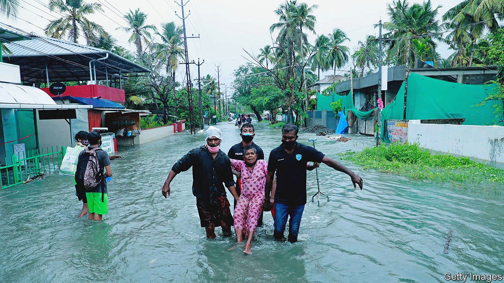
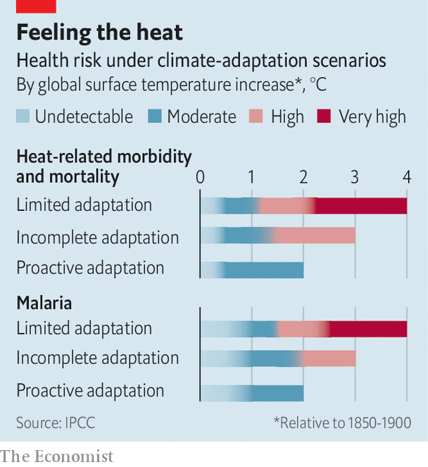

###### Climate change

# The latest UN climate report is gloomy, with some sunny patches 

##### It says that adaptation is as important as prevention 

 

> Mar 5th 2022 

THERE IS A peculiarly modern form of the uncanny which Glenn Albrecht, a philosopher, dubs “solastalgia”. It is an uneasy feeling that what you took to be the natural way of things has been changed, without your consent, and that your life does not fit into it as once it did. It is the sort of feeling you might expect if, say, what used to be an unusually wet year was now merely typical. It might be dismissed as the “new normal”. But it does not feel normal, and it never will. Before you get used to it, it will have changed yet again.

The vast new overview of the impacts of global warming published by the Intergovernmental Panel on Climate Change (IPCC) on February 28th paints a picture of a planet where solastalgia is the norm. Half a billion people, it says, most of them in medium or high latitudes, live in places where the average year is now wetter than wet years were in the 20th century. In low latitudes, by contrast, there are 160m people living where the reverse is true.


These “unfamiliar” climates, as the report calls them, do not merely generate unease. Shifts in averages bring with them large changes in the likelihood of extreme events—and those can do great harm, especially to people already vulnerable as a result of poverty, of political or social exclusion, of an already degraded environment that is the material basis of their livelihoods, or of all of the above and more besides. The report is not just a diagnosis of malaise. It is, in the words of Antonio Guterres, the UN secretary-general, an atlas of human suffering.

The IPCC notes that there have been increases in extreme high temperatures, both on land and in the seas; in torrential rain; in droughts; and in weather conducive to wildfires. And these have reliably hit the vulnerable more than the rest of the world. In the 2010s mortality caused by floods, droughts and storms was 15 times greater in highly vulnerable regions than in the least vulnerable.

Climate change is contributing to humanitarian crises which see vulnerable people displaced in all parts of the world. Instances of food insecurity and malnutrition that can be blamed on droughts and floods have increased in Africa and Latin America. Contrary to some analysis, though, the report does not see much of a climate influence on violent conflict.

Adept adaptations

Adaptation can cope with some of this, and in places, the report finds, it has already made a difference. One example is Ahmedabad, a city in Gujarat, in western India, which the report praises for pioneering “preparedness for extreme temperatures and heatwaves” by adopting an early warning system (the first in South Asia) and changing building regulations to stop the trapping of heat, among several other measures. Another instance is the use of sand dams in Kenya. These increase storage of groundwater in riverbanks by up to 40%, thus helping people weather droughts. But there is increasing evidence of what the IPCC calls an “adaptation gap”. As the climate has worsened, the distance between adaptations actually being undertaken and those which are needed has widened. And it looks set to widen further.

In the near term, trying to narrow this widening gap is a crucial task. Adaptation often takes second place to prevention in discussions about climate change, and it is true that, because total greenhouse-gas emissions are the long-term determinant of such change, dramatically reducing emissions takes logical precedence over all other responses to the crisis. But the IPCC argues that, over the coming decades, the difference between worlds with better and worse adaptation is greater than between worlds with more or fewer emissions. That alone should give efforts to adapt to a changing climate a new urgency.

Three into one does go

In 1988, when the IPCC was set up, it was charged by the relevant UN bodies with assessing what was known for sure about climate change, in order to provide a basis for discussions on which all could agree. It split that task into three parts: the physical science of climate change; the impacts of climate change on the human and natural world; and the possible responses. Each was parcelled out to a working group of researchers. The resulting report was crucial to the negotiation of the UN Framework Convention on Climate Change (UNFCCC), in 1992, and immediately spurred calls for a second assessment. The assessing has been progressing ever since, with more and more researchers involved in producing reports that have grown steadily larger and less frequent.

Having delivered its fifth assessment report in 2014, the panel is now in the throes of releasing the three tranches of the sixth. The tranche on the physical science came out last August. April will see the one on research into the mitigation of climate change. The 3,700 pages (a browser-freezing 280 megabytes) released on February 28th are an account of the state of play regarding impacts, vulnerabilities and adaptation.

The impacts of the warming which has raised the global mean temperature 1.1-1.3°C above its pre-industrial value can be seen around the world. They affect people, the things they grow for food and fabric, and the rest of the living world. The report documents widespread shifts in the timing of the seasons and notes that half of the species scientists have looked at in this context are moving towards higher latitudes, higher altitudes or both, to cool down (though it does admit there may be some sampling bias here).

Plants people eat are also under stress. Increases in agricultural productivity over the past 50 years are significantly lower than they would have been in the absence of climate change, the report notes with moderate confidence. (After problems with earlier assessments, almost all the judgments in the sixth come complete with confidence estimates, which can range from low to very high.)

 


Some natural systems are approaching or surpassing their capacity to adapt. Coral reefs, rainforests, coastal wetlands and polar and mountainous ecosystems are all butting up against “hard limits”. For example, at 1.5°C of warming the report expects the number of terrestrial and freshwater species at very high risk of extinction may be as great as 14%.

Human systems, too, may prove to have hard limits. There are combinations of heat and humidity that make un protected outdoor life impossible. At 100% humidity, people cannot survive above 35°C because they cannot cool down by sweating. In the nearer term, though, what the report calls “soft limits” matter more.

Heatwaves in the northern hemisphere last summer illustrate the point. British Columbia recorded a freakishly high temperature of 49.6°C. Almost simultaneously, Iraqis protested against electricity cuts as temperatures in their country exceeded 50°C. The Canadian heatwave was more unusual than the one in Iraq. And Canada has the resources to prepare for another, if it so chooses. Iraq does not. It is up against its soft limits—hence the protests.

Soft limits can be overcome, but not easily. In Iraq’s case, that would require simultaneously overhauling the attitudes and capacity of the government, reforming institutions, and getting groups of donors to provide new money to support all this.

That sort of transformational change remains rare. But efforts to adapt have nevertheless increased in number and ambition. As a consequence, enough experience is now available for the assessment to look, for the first time, at how well the world is doing, as well as at how much it needs to do. The findings are mixed.

Planning for adaptation is now widespread. Implementation, sadly but predictably, rather less so. Some programmes now in place have brought additional benefits beyond their alleviation of climate risk. The restoration of mangrove forests along coasts—which Indonesia, home to more than a fifth of the world’s mangroves, is currently trying to pursue—not only sequesters carbon and helps protect against sea-level rise and erosion. It also boosts fish stocks, balances concentrations of nutrients, and attracts tourists and, thus, money.

The report does, however, raise worries about the quality of some adaptation efforts. Actions to lower immediate risks, it argues, can reduce opportunities for the transformational adaptation it sees as crucial to improving things over the longer term. It warns of risks from “maladaptation”, in which efforts to deal with the impacts of climate change do more harm than good. One example would be building a sea wall around a city. Doing so protects the residents from rising sea levels and storm surges in the short term. But it can change the pattern of currents by the coast, creating worse erosion elsewhere.

Actions and words

Such measures may also create a false sense of security. In the floodplain around the Jamuna river in Bangladesh there is evidence that the presence of levees attracts more people to live there, increasing the number of deaths that would result were a levee to break. Starting an irrigation system in an area where rain can no longer be relied on to grow crops could lead to overconsumption of river water, leaving people downstream with less. “In choosing the right solutions, we need to be thinking about more than just one climate hazard and also about the range of side-effects of the interventions we undertake,” says Maarten van Aalst, director of the Red Cross Red Crescent Climate Centre, and one of the report’s authors.

The fact that tangible damage is already here adds not just physical burdens but also political ones. Negotiation at the meetings of UNFCC, most recently in Glasgow last November, becomes particularly heated over what the convention calls “loss and damage”—impacts which have already been felt, and over which poor countries have a case for compensation.

Reportedly, the biggest ructions in the closed plenary in which the wording of the “summary for policymakers” was hashed out between the authors and the representatives of governments signed up to the process stemmed from attempts by some of those governments to ensure that it did not do too much to bolster the poor countries’ case. Politics is hardly a new addition to the IPCC. It was, after all, created in part to generate political “buy in” to scientists’ warnings. But from here on, with assessment a matter of the present, not the future, expect the tensions to grow. ■

For more coverage of climate change, register for , our fortnightly newsletter, or visit our 

To enjoy more of our mind-expanding science coverage, , our weekly newsletter.

