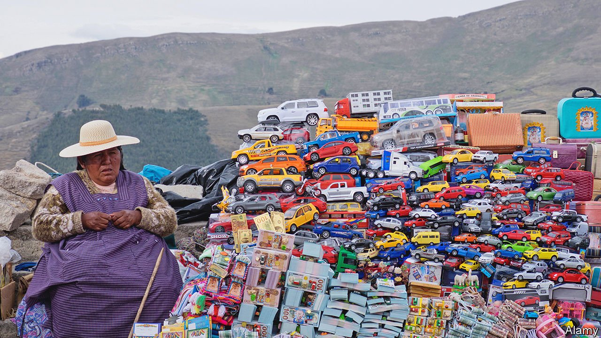

###### Honk for impunity

# Bolivia is awash with contraband cars from Japan 

##### Around 25,000 so-called chutos enter the country every year 

 

> Mar 5th 2022 

SIX DAYS a week not much happens in Challapata, but every Sunday the town’s main square fills with Japanese cars. Few, if any, have licence plates. They are chutos, or contraband cars. Most have been shipped from Japan to Chile, and then smuggled in.

Perhaps 25,000 chutos enter Bolivia a year; around 60,000 cars are imported legally. The business took off in 2008, when the government banned imports of cars of more than five years old. The old bangers continued to clatter in, illegally.


The fair in Challapata is the biggest in the country. The chuteros make little attempt to hide themselves. Mechanics fix suspension wrecked by the drive over the mountains from Chile; others move steering wheels from right to left. Chutos are advertised on Facebook, along with fake licence plates. Younger chuteros post videos of themselves on TikTok, a video-sharing app, racing over the salt flats, set to their own music genre, chutocumbia, in which singers croon about the hardship they endure to feed their families.

The government has tried to beef up controls along the border with Chile. But Bolivia is poor and the border is long; the flow of chutos has not abated. Smugglers say they pay $100 a car for border guards to look away. Police who catch a chuto inside Bolivia can be bribed, too.

A chuto costs around half or even a third as much as a legally imported car. Buyers avoid not only import tariffs, but also an annual road tax. The government is wary of cracking down, mostly because of the sheer number of people who would be affected.

Instead in 2011 the government allowed owners of chutos to register their cars, provided they could prove the vehicle had not been stolen in another country. Those doing so had to start paying road tax, but would no longer risk extortion if caught by the police. Ruben Ferrufino, a spokesperson for a group of chuto owners, is pushing for another amnesty. If not, his group is threatening to impose road blocks—another common sight in Bolivia.

