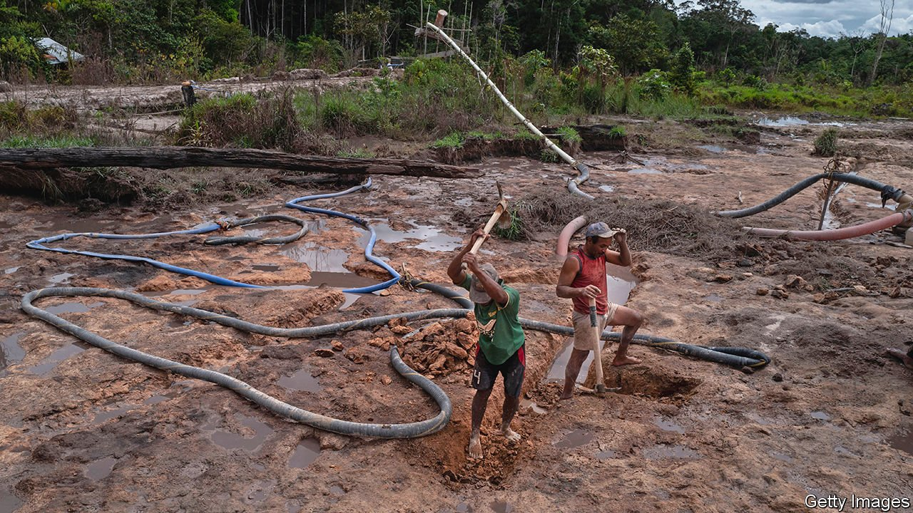

###### Parks and wrecking

# Nicolás Maduro lets miners trash Venezuela’s forests 

##### “Ecosocialism” apparently means bulldozing nature to build mansions 

 

> Mar 5th 2022 

AS THE TWICE-WEEKLY flight from Caracas descends towards the Canaima national park, cabin staff urge passengers to look out of the portside windows for the best view. It is good advice. Massive flat-topped mountains, at least 500m years old, emerge from the mist like ancient gateways to another world. Everything appears pristine, untouched by humanity.

But glance out of the other side of the plane and a sadder image appears. There in the valley, the forest is scarred with bare patches of mud and sand, evidence of the destruction wrought by illegal gold mining. And Venezuela’s government, far from trying to stop such environmental plunder, is encouraging it.


Venezuela was once renowned for its greenery. In 1977 it became the first Latin American country to set up a ministry of the environment. Vast tracts of land were designated national parks. Wildlife conservation laws were enacted. Canaima, which had been a protected park since the 1960s, became the brightest blossom in a floral crown. In those days PDVSA, the state oil firm, was well-run and provided successive governments with so much cash that they saw little need to chop down the nation’s forests.

Under Nicolás Maduro, Venezuela’s Putin-pandering socialist dictator, a different plan is afoot. His regime is cash-strapped and corrupt. Thanks to mismanagement and sanctions, PDVSA is in tatters, so Mr Maduro is desperate for new sources of revenue. From the Amazon to the Caribbean, he has allowed an unrestrained scramble for minerals to take place.

That scramble began in earnest in 2016, when oil prices were painfully low. Mr Maduro announced that a crescent-shaped territory almost three times the size of Switzerland in southern Venezuela was open for miners to dig up. He called it the Arco Minero, or the mining arc. The stated aim was to attract investment for the extraction of gold, iron, cobalt, bauxite, tantalite, diamonds and other minerals.

In 2019, after Mr Maduro stole an election, the United States imposed sanctions on PDVSA. Venezuela’s economy was already tanking, and the regime became even more desperate for cash. “We had to learn quickly to depend less on black gold, and look for gold gold,” says a business executive in Caracas.

When in a hole, start digging

Some legitimate deals were signed—including with Chinese, Canadian and Congo lese mining firms. But none led to significant projects. Long-term investments in a country with such a predatory government are not for the faint-hearted. Instead, a free-for-all began in the Arco Minero, a gold rush overseen by a murky alliance of drug-traffickers, generals, gangs and Colombian guerrillas, with the regime sucking up a big share of the proceeds.

In 2016 Global Initiative, an NGO, estimated that a whopping 91% of Venezuelan gold was illegally produced. Since Mr Maduro created the mining arc, that proportion is likely to have increased even further. An investigation in January by Armando Info, an independent news site, with El Pais, a Spanish newspaper, revealed that the two main mining states of Bolívar and Amazonas have at least 42 concealed airstrips for gold-smugglers.

Illegal mining is attractive for many Venezuelans, because the alternatives are so dire. Under Mr Maduro wages have collapsed. Government workers make less than $10 a month. Tens of thousands of people, mostly men, have moved to Canaima to try their luck as freelance diggers. Many locals have joined in. With tourists now afraid to come to Venezuela, the park’s indigenous Pemon guides, who once escorted hikers, have little to do but dig.

Trees have been torn down to make way for pits. According to data from Global Forest Watch, an environmental group, between 2002 and 2020 Venezuela lost 533,000 hectares of humid primary forest, or around 1.4% of the total humid forest area. “Mining has gone amok,” says Alejandro Álvarez Iragorry, an environmentalist. Venezuela is now the leading illegal miner in the Amazon. In 2019 RAISG, a watchdog, counted 1,899 mining sites in the Venezuelan part of the Amazon basin. The Brazilian Amazon, a territory more than ten times the size, had only 321.

Miners are polluting the local water. They use mercury to separate gold from ore; the waste then leaches invisibly into streams and rivers. Dangerously high levels of mercury have been found in hair samples taken from indigenous people who bathe in and drink from local streams. More than a third of the Pemon people tested in Canaima last year had levels above what is deemed safe by the World Health Organisation, according to SOS Orinoco, an environmental group. Mercury poisoning increases the likelihood that mothers will give birth to infants with brain damage.

The state oil firm is environmentally reckless, too. Under Mr Maduro’s predecessor and mentor, Hugo Chávez, thousands of staff were sacked for opposing the regime and replaced with lackeys. Since then the firm has become less competent. Skills have been lost, infrastructure has rusted. Venezuela averages 5.8 oil spills a month, according to the Ecological Policy Observatory, a watchdog.

In Lake Maracaibo, where the first big oil discoveries were made in the 1920s, locals say spills have become constant since 2015. Sewage and agricultural pollution have only worsened matters; much of the vast lake is now covered with a putrid carpet of algae. The government accuses environmentalists of exaggerating the problem, and impedes their work. After a spill in 2020 in the Morrocoy national park in the country’s north-west, scientists complained that they were unable to measure damage to the seabed because PDVSA had closed off access to the area.

In 2011 the government stopped publishing environmental statistics. So the true scale of water pollution and deforestation can only be estimated. Weather stations installed at a steep cost in the 1970s on the peaks of the Canaima mountains lie abandoned. In 2014 the Ministry of the Environment was renamed the Ministry of Ecosocialism. “The government here is rightly proud of the beauty of this country, but there seems little sense of the duty to protect it,” says a diplomat.

Last October Mr Maduro announced plans to build a “communal” city in the Ávila national park, a glorious mountain which overlooks Caracas and has been protected from construction since 1958. The purpose of the project is not clear. One theory is that Mr Maduro, who has expressed interest in Indian mysticism, might be hoping to build something like Auroville, a town in India built in the 1960s by followers of a guru “to realise human unity”. Since Mr Maduro seldom follows through on his grandiose announcements, Venezuelans may never know.

But in another once-unspoilt part of the country, the bulldozers are already at work. On Gran Roque, the largest island of the Los Roques archipelago, close to a unique coral reef, a series of concrete mansions and a hotel are being erected. This appears to violate government decrees from 2004 banning construction. Experts fear the project will upset the delicate environmental balance of an area famed for its wildlife, including an endangered species of turtle.

The investors in the buildings are not known, but locals say a high-ranking government official appears to be the owner of one of the largest homes. Bulldozing nature to build mansions is an odd definition of ecosocialism, but it’s a mad, mad, mad, Maduro world in Venezuela. ■

