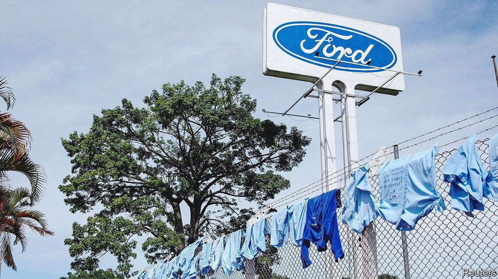
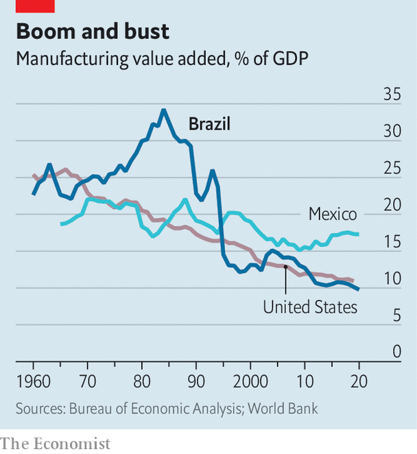

###### South America’s rust belt

# Why industrial decline has been so stark in Brazil 

##### No other country has seen manufacturing as a share of GDP vanish so fast 

 

> Mar 5th 2022 

THE PEOPLE of São Bernardo do Campo, a city near São Paulo, are called batateiros, or potato farmers. Yet they are better known for manufacturing. Almost a century ago they made furniture. In the 1950s they started turning out cars. Soon the area that includes the city, known as ABC after its largest towns’ initials, became the biggest industrial zone in Latin America. One worker there, Luiz Inácio Lula da Silva, rose to the top of the metalworkers’ union and, eventually, to the top of Brazilian politics.

But when Urban Systems, a consultancy, named the city as the best place in Brazil to do business in industry last year, many people were surprised. In 2013 ABC had 190,000 formal jobs in industry (which includes both manufacturing and processing). By 2019 it had 140,000, or nearly a third fewer. Dusty “for sale” signs mark some of the 127 idle industrial areas that Gisele Yamauchi, a local researcher, has counted in São Bernardo. In 2019 Ford, an American carmaker, said it was leaving São Bernardo after nearly a century in Brazil. In 2021 the city’s formal industrial sector held steady, with roughly as many jobs created as lost. But the shift to services is clear.

 


Indeed São Bernardo is part of a broader trend in the country. In the 1980s manufacturing peaked at 34% of Brazil’s GDP. In 2020 it was just 11% (see chart).

In other countries, too, the relative importance of manufacturing has declined. As factories grow more efficient, it takes fewer people to make each widget, and manufacturing employment tends to fall even as output rises. But what is notable about Brazil is that output growth has been mediocre, too. Between 1980 and 2017, manufacturing value added in Brazil in real terms grew by only 24%, compared with 69% in neighbouring Argentina and 204% worldwide.

Brazil’s science-based industries have also lost their share of GDP faster than expected. In the 1980s Brazil produced 55% of the pharmaceutical ingredients it used. By 2020 this had dropped to 5%. When the covid-19 pandemic created a huge demand for vaccines, Brazil was caught short. A lack of materials delayed its vaccine roll-out.

As global trade liberalised after 1990, Brazil opened up what had been a ferociously protected economy. But only somewhat. It has continued to shield much of its domestic industry from foreign competition, says Fabiano Colbano of the World Bank. Successive governments focused on stoking domestic demand, rather than raising productivity. Firms have failed to integrate much into global supply chains. Tariffs were kept high and regulations hasslesome.

São Bernardo’s mayor has tried to make the city an easier place to do business. During the pandemic he has snipped red tape, lowered taxes and built more roads. He secured pledges of investment in logistics and other aspects of manufacturing, worth $1.75bn for 2021 and 2022 (the city budget for 2022 is $1.2bn). But elsewhere in Brazil, covid-19 has accelerated industry’s slide.

The commodities boom has helped to create a record trade surplus for Brazil. But this has masked a deficit of $53bn (or 3.3% of GDP) in manufactured goods. Indeed a reliance on commodities, exports of which in Brazil are equivalent to 8% of GDP, typically tends to speed up the decline in manufacturing by strengthening the local currency, which makes imports cheaper. China has long preferred to buy raw commodities and process them at home. In 2009 China imported primary food products from Brazil worth $7bn, compared with processed food products worth almost $600m. In 2019 the figures were $23bn and $5bn, respectively.

Brazil does not necessarily need a huge industrial sector to thrive. In São Bernardo factory floors have been transformed into shopping malls and many locals have found jobs as telemarketers. Some economists argue that the decline of manufacturing has given Brazil an opportunity to play to its strengths in agriculture and oil.

Yet others feel this optimism is misplaced. “Brazil is the worst example of premature deindustrialisation in the world,” argues Rafael Cagnin of IEDI, an industry association. Workers have moved into low-skilled service jobs, rather than high-tech, skilled ones. On average, their productivity and income have fallen, he says. In São Bernardo, the highest salaries for all workers in formal employment remain in car manufacturing. Real median wages in São Bernardo have decreased every year since 2017, including in IT.

An economic crisis between 2014 and 2016 gave Brazil such a shock that any attempt to separate out the effects of industrial policy is hard. Even before covid-19, unemployment was at its highest level in 50 years, according to the World Bank.

Industrial decline can have political consequences. In the United States the loss of Midwestern manufacturing jobs may have pushed some voters to plump for Donald Trump in 2016. In Brazil the elections of 2018 were dominated by corruption and the fallout of the recession, but one study by two Brazilian researchers found that the areas most affected by trade liberalisation in the 1990s were the most likely to vote for Jair Bolsonaro, the populist president. He even won in Lula’s old stomping ground of São Bernardo.

The next presidential election, in October, could be pivotal for manufacturing. Mr Bolsonaro has not made boosting industry a priority, although at the end of February he pledged a tax cut for industrial products. Lula, who looks likely to run against him, has said that although commodities are important, Brazil needs “to be strong in industry, in science and technology”. The next few months are likely to involve a scramble to win the hearts and votes of places like São Bernardo. ■

