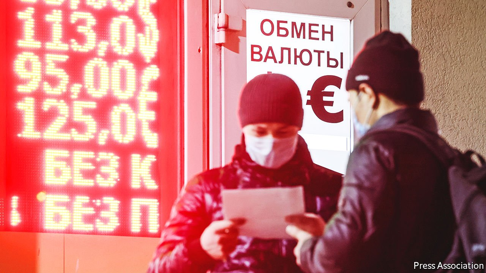

###### The world this week

# Business 

#####  

 

> Mar 5th 2022 

Russia’s central bank ordered the Moscow stock exchange to close following the invasion of Ukraine. Trading was halted in certain  on the New York Stock Exchange and Nasdaq. The value of Russian stocks traded in London tumbled to become almost worthless. The London exchange later suspended dealings in dozens of firms. The Russian finance ministry is to use $10bn from the sovereign-wealth fund to shore up shares in domestic companies. Sberbank, Russia’s biggest, was forced to cease its operations in Europe permanently.

 responded to the tough sanctions introduced by America and its allies by retrenching from Russia. After three decades in the country, BP is getting rid of its stake in Rosneft (BP could face a $25bn write-down). Shell is ending its joint ventures with Gazprom. ExxonMobil said it would pull all its investments in Russian oil and gas. Total will not make any further investments. Outside energy, Maersk and MSC, the world’s biggest shipping lines, suspended services to Russia. Apple said it would no longer sell iPhones there. Daimler Truck, Jaguar Land Rover and Volvo will not deliver cars to the country; Ford suspended its Russian operations. Dell halted its sales in Russia.


America and the EU banned Russian airlines from their air space. Sanctions also prohibit the sale or supply of aircraft to Russia, which includes planes that are leased to Russian airlines. Facebook, YouTube and TikTok blocked access to RT (Russia Today) and other Russian propaganda outlets.

The sporting world also stepped up to the plate. FIFA and UEFA banned Russian football clubs and the national team from participating in international tournaments; UEFA also terminated its lucrative sponsorship deal with Gazprom. Roman Abramovich, who was mentioned in the British Parliament as a possible target of sanctions, put Chelsea (disparagingly known as Chelski in London) up for sale. He has owned the Premier League side since 2003. After a U-turn, Russian and Belarusian athletes were banned from the Winter Paralympics.

Oil prices soared, despite a move by America, Europe and others to release a collective 60m barrels of oil from their reserves. That attempt to tame prices was offset by the decision of OPEC+, which includes Russia, to maintain modest production increases for April. America and other countries have pressed the cartel to ramp up output further. Brent crude reached roughly $115 a barrel.

The euro zone’s annual inflation rate hit 5.8% in February, a fourth consecutive record. Energy prices were 31.7% higher than a year earlier (the EU typically relies on Russia for 30-40% of its natural gas).

Jerome Powell said that the  still plans to raise its main interest rate this month, the first increase since late 2018, despite the economic turmoil caused by Russia’s war in Ukraine. Annual consumer-price inflation is running at 7.5% in America, and will probably be driven higher by the post-invasion spike in energy prices.

Volkswagen had to suspend some work at its factories in Germany, which rely on car-parts supplies from Ukraine. Meanwhile, Toyota was forced to halt production at all its plants in Japan when a cyber-attack targeted one of its Japanese suppliers. It was not clear who was behind the attack.

The chief executive of Toshiba unexpectedly resigned, less than a year into the job. His predecessor stepped down in April last year, amid an investors’ revolt over the future of the conglomerate. It says a revised plan to split in two will still be put to shareholders at a meeting later this month, but there is fresh speculation that Toshiba might be subject to another bid to take it private.

Zoom’s quarterly earnings disappointed investors. The videoconference company is dealing with a sharp slowdown in sales as more people abandon home-working and return to the office. Revenue grew by 21% in the three months to January 31st, year on year, compared with 191% last spring. Zoom’s share price has lost over three-quarters of its value since its peak in 2020.

Waterstones, Britain’s biggest bookseller, bought Blackwell’s, an independent chain specialising in academic tomes, for an undisclosed sum. Its flagship store in Oxford has been serving the university since 1879. Last year 212m printed books were sold in Britain, the most in a decade, despite (or maybe because of) lockdowns.

We are watching you

A first-year undergraduate at the University of Central Florida who hit the headlines by tracking the movements of Elon Musk’s private jet has turned his energies to the flight patterns of Vladimir Putin and Russian oligarchs. Jack Sweeney’s new Twitter handle, @RUOligarchJets, so far tracks around 40 private jets registered to the tycoons or their companies. He said he didn’t think Mr Putin would be leaving Russia any time soon.

