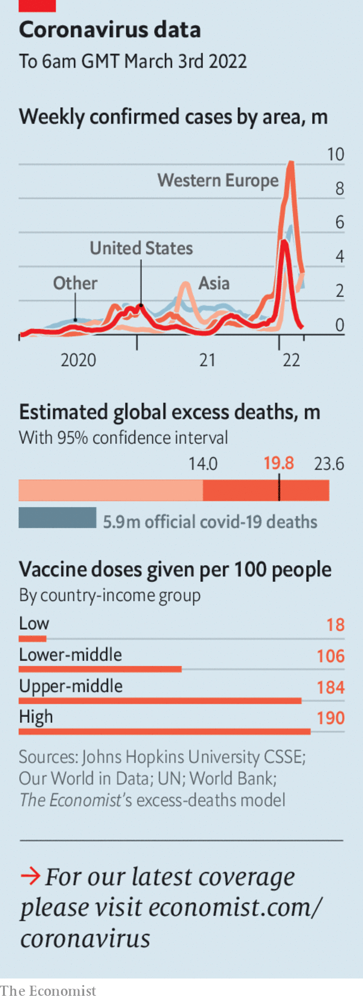

###### The world this week

# Politics 

#####  

 

> Mar 5th 2022 

Vladimir Putin’s invasion of  did not go to plan in its first week. Russian vehicles ran out of fuel or broke down. The invaders, who had been told they were liberating Ukraine from a “Nazi” government, met stiff resistance and suffered heavy casualties. Ukrainian forces fought back ferociously. Crowds of civilians stood in the way of tanks. Mr Putin switched to more brutal tactics, raining shells on civilians in cities, a war crime. The International Criminal Court started to collect evidence. Russian troops captured Kherson, a port. Kyiv, the capital, prepared for a siege.


At least 1m  fled Ukraine, mostly to Poland but also to Hungary, Moldova, Romania and Slovakia. Women and children were evacuated on packed trains. The EU vowed to let them in. Ukraine ordered men under 60, who are subject to conscription, to stay behind.

America and the EU imposed unprecedented  on Russia. Big Russian banks were expelled from the global-payments plumbing, and Western firms were banned from dealing with them, except in the energy trade. Russia’s central bank was barred from tapping most of its $630bn in foreign reserves. The rouble crashed, and the central bank doubled its main interest rate to 20%. Panicked queues formed at cash machines in Russia. Sanctions were also imposed on oligarchs close to Mr Putin.

NATO rejected calls for a no-fly zone over Ukraine, since enforcing it would mean shooting down Russian planes and risking war with a nuclear power. However, Western countries promised to  to help Ukraine defend itself. Even Germany said it would, reversing a long-standing ban. Olaf Scholz, the German chancellor, said that Germany would rapidly boost defence spending to meet the NATO target of 2% of GDP.

took to the streets in Russia to decry the invasion of Ukraine. The Kremlin responded with arrests and repression, shutting down two of the last independent broadcasters in Russia and ordering all media to take their information about the war from official sources.

America, the EU and Britain announced new sanctions against officials in Belarus, the launch-pad for the Russian push towards Kyiv. Belarus held a phoney referendum on letting Russia station nuclear weapons on its soil.

In America Democrats and Republicans found rare agreement over Mr Putin’s assault on the global order. Members of both parties gave the Ukrainian ambassador a standing ovation during President Joe Biden’s state-of-the-union speech to Congress.

At the UN,  Mr Putin’s invasion. Besides Russia itself, only four voted against the motion: the dictatorships of Belarus, Eritrea, North Korea and Syria. Another 35 abstained, including China and India.

Ukraine asked  to use its tight relationship with Russia to help end the conflict. China’s government said it respected “the territorial integrity of all countries”, but refused to call Russia’s invasion an invasion. It also opposed the sanctions placed on Russia by the West and its allies. However, it said it was “extremely concerned about the harm to civilians” in Ukraine.

An American delegation led by Mike Mullen, a former chairman of the joint chiefs of staff, visited . Mr Mullen met Tsai Ing-wen, Taiwan’s president, and reassured her of America’s support for the island’s security. Taiwan, which China’s Communist Party regards as a breakaway province to be reconquered, has been alarmed by the invasion of a smaller country by a bigger, more powerful neighbour.

The Intergovernmental Panel on Climate Change published an assessment of the effects of . (Last August it released a review of the latest scientific research on the physics of climate change.) The new report confirmed that things are getting worse. Very high temperatures, torrential storms, droughts and wildfires are occurring far more often and causing shifts in the timing of seasons.

At least 13 people were killed in Australia when record rainfall caused flooding. Brisbane, the worst-affected city, recorded 790 millimetres of rain in a week. By contrast London gets 690 millimetres of rain in an average year.

 


Rumours of a lockdown led to panic buying of food and basic necessities in Hong Kong. Public hospitals have been overwhelmed with patients as the city struggles to replicate the mainland’s “zero-covid” approach. Hong Kong’s chief executive, Carrie Lam, said there would be no citywide lockdown.

The World Bank agreed to release more than $1bn from the Afghanistan Reconstruction Trust Fund, which was frozen after the Taliban took power in August. The money will be used for humanitarian aid through the UN and other agencies, in the hope that this might keep it out of the Taliban’s hands. More than 20m Afghans are at risk of acute hunger.

America’s Supreme Court agreed to hear a case that could curtail the federal government’s powers to reduce from power plants. In an unusual move, the state of West Virginia is bringing the case against regulations that have never become law.

Joe Biden said one reason why he nominated Ketanji Brown Jackson to replace Stephen Breyer on America’s Supreme Court is that the court “should look like the country”. Ms Jackson will be the first black woman to don a justice’s robe.

The junta that seized power earlier this year in Burkina Faso said there would be a three-year transition period before elections. Paul-Henri Sandaogo Damiba, the coup leader installed as president, will not be allowed to run.

Valery Gergiev was sacked as conductor of the Munich Philharmonic after he refused to condemn Mr Putin’s invasion of Ukraine. The Rotterdam Philharmonic also ended its long association with Mr Gergiev.

