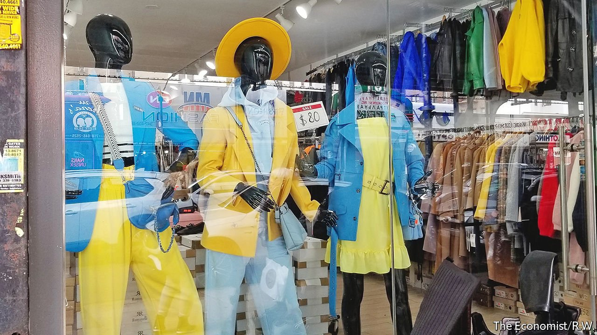

###### Little Odessa and Ukraine Village

# America’s Ukrainians rally and mobilise 

##### Preparing for a fifth wave of immigrants 

 

> Mar 5th 2022 

THE MANNEQUINS in the window of Executive, a boutique in Brooklyn’s Brighton Beach, are dressed in the blue and yellow of Ukraine’s flag. Inside, Khystyna, who moved to America ten years ago, can think only of home and her family. “It’s impossible to function, to sleep,” she says. Brighton Beach, known as Little Odessa, is the largest Ukrainian enclave in New York. Brooklyn has 44,000 immigrants from Ukraine, more than 13,000 of them in Brighton Beach. Firouza Ruzenaji, originally from Uzbekistan, works all night sewing Ukrainian flags to keep up with demand.

In all, more than 125,000 people of Ukrainian descent call New York City home. They came to America in four waves. Up to a half a million arrived between 1890 and the first world war. A smaller second wave came after that war. A large third wave came after 1945. Lydia Zaininger, of the Ukrainian Institute of America, a cultural centre, says footage of Ukrainians fleeing with children echoes her own history. Her widowed grandmother fled Ukraine with three children in the late 1940s.


The fourth wave—mostly Jewish—arrived in the 1980s and 1990s. Victoria Neznansky came to America in 1989 as a refugee. She had begun to hope things had improved for Ukraine, with its young Jewish president. “There’s no forgiveness for what Putin is doing,” she says.

Although few Ukrainians still live there, Little Ukraine, a pocket of Manhattan’s East Village, is still the community’s spiritual and cultural hub, notes Alexander Motyl, a political scientist. New Yorkers have flocked to the area to show support. They queue around the block to dine at Veselka and Ukrainian East Village, for varenyky (dumplings) and borscht. Hundreds of non-Ukrainian New Yorkers are visiting The Ukrainian Museum. “They are learning that the Ukrainians have always been resilient,” says Maria Shust, its director.

Chicago has the second-largest Ukrainian population: some 26,000. Among those descended from Ukrainian immigrants is J.B. Pritzker, the governor of Illinois, who appeared at a rally on February 27th at the St Volodymyr and Olha Ukrainian Catholic Church in Chicago’s Ukrainian Village. At Tryzub Ukrainian Kitchen, a sign told diners that the restaurant is now fully booked for days.

Volunteers at Razom, a non-profit organisation, have raised $5m to help Ukraine and its refugees. Its volunteers are mostly young professional Ukrainians working in New York. Mariya Soroka, a co-founder of Razom (which means together), notes that almost for the first time the various generations of Ukrainians are coming together. Her colleague Mariia Khorun, a lawyer, is co-ordinating infrastructure for refugee resettlement. She predicts, “There’s going to be another wave.”

For exclusive insight and reading recommendations from our correspondents in America, , our weekly newsletter.

