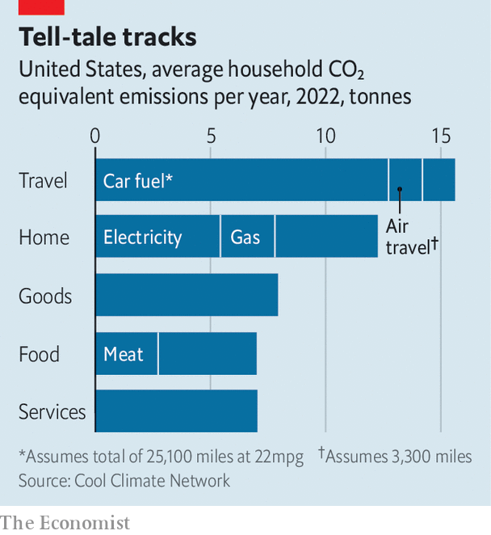

###### Carbon trackers

# Carbon-footprint calculators and their lessons 

##### What households and companies can learn about global warming from online carbon trackers 

 

> Mar 5th 2022 

CHRIS JONES of the University of California, Berkeley, was on a river in the Amazon rainforest when he put the finishing touches on the world’s first online household carbon calculator. That was in 2005. He hoped that, if he could show people how much greenhouse gas was associated with daily activities—driving the car, heating the house—they might change their behaviour and contribute in some small measure to saving the Amazon. Seventeen years and a proliferation of rival calculators later, trackers are providing a wealth of often-neglected information about the carbon emissions of everyday life. They provide local and micro data which usefully supplement the  of the Intergovernmental Panel on Climate Change.

Trackers work by asking users to answer questions such as: how many miles a year do you drive; how much is your annual household electricity bill; how often do you eat meat? They then calculate a personal or household estimate of emissions of carbon-dioxide equivalent (COe) per year. Alex Beale, a climate blogger in Atlanta who has studied them, reckons there are dozens of household carbon trackers and hundreds of specialist ones, including those which calculate emissions from food or other industries, such as a new one from the Stockholm Environment Institute (SEI) to track emissions from shipping. For individuals, reckons Mr Beale, the most comprehensive are the Cool Climate tracker run by Dr Jones at Berkeley and the calculator set up by the World Wildlife Fund (WWF) and SEI. What do they tell us?


Dr Jones describes the main household polluting activities as “cars, coal, cows and consumption, roughly in that order”. By far the largest single source of emissions is the family vehicle. One car of average fuel efficiency driven 14,000 miles (22,500km) spews out 7 tonnes of carbon, according to Dr Jones’s tracker. Swapping it for an electric vehicle would save over 6 tonnes, or an eighth of the average American household’s yearly emissions.

 


No other change would generate that much saving, though electricity in the home is responsible for over 5 tonnes of carbon emissions a year, so generating it with solar panels would come close (see chart). Like electric vehicles, a roof full of solar panels is not cheap. Changing diets costs less, and American households consume meat worth 2.7 tonnes of COe a year, far more than most people. If Americans miraculously went vegetarian, that would be like half an average solar roof.

These household averages, however, disguise what may be the most important thing carbon trackers reveal: that apparently similar households produce very different emissions. By combining their tracker’s results with postal code data, the University of California team worked out average emissions by area. Places with high emissions—mostly suburbs—produce four or five times as much carbon as inner cities or rural areas, a much larger multiple than might have been expected. Chicago’s households produce 37 tonnes of COe a year; suburban Eola’s, some 35 miles (56km) from the Windy City, emit 96 tonnes. This is not only because of commuting. Trips to and from work account for less than a fifth of miles driven; the rest are to shops, schools and so on.

Even more striking is the difference air travel makes. The average household contribution from flying is 1.5 tonnes, less than a car. But half of Americans never fly. According to Cool Climate, flying 100,000 miles a year (as some frequent flyers do) produces a stunning 43 extra tonnes of CO. If jet-set households were to cut their travel sharply, they would have a disproportionate effect on emissions. They might even do something for the Amazon.

Over the next 30 years, many countries are promising to move to net-zero carbon, implying that household emissions will have to be cut to close to nothing. Stephanie Roe, WWF’s lead climate scientist, reckons that, at best, half the reduction might be achieved through demand-side measures, such as behavioural changes by individuals and households. And even that would require companies and governments to provide more incentives to change through supply-side investments to make low-carbon options cheaper and more widely available. Trackers, it seems, have daunting lessons for public bodies and private households alike. ■

For exclusive insight and reading recommendations from our correspondents in America, , our weekly newsletter.

For more coverage of climate change, register for , our fortnightly newsletter, or visit our 

