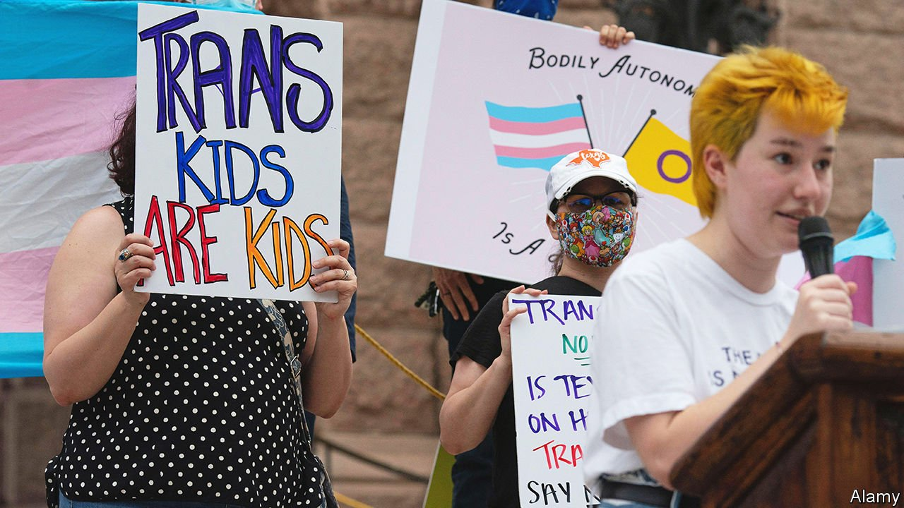

###### Transgender rights

# Don’t mess with minors’ sex in Texas 

##### Governor Greg Abbott demands that treatment with puberty blockers be investigated as child abuse 

 

> Mar 5th 2022 

REPUBLICANS IN TEXAS seem to have developed a penchant for promoting vigilantism. In September the state deputised citizens to sue anyone involved in an abortion after about six weeks of pregnancy. And on February 22nd Texas’s Republican governor, Greg Abbott, said treatment with puberty blockers and surgeries of minors who identify themselves as transgender should be investigated as “child abuse”. Doctors, nurses, teachers and “the general public” should report it, he said. Failure to do so could result in “criminal penalties”.

Though the new order is not, like the abortion ban, a law, it is in some respects harsher. It uses a criminal mechanism (rather than a civil one) and requires any person to report alleged lawbreaking. This came after a legal opinion from Ken Paxton, the state’s attorney-general, which concluded that such treatments can constitute child abuse under Texas law.


It is unclear what this might mean in practice. Some district attorneys have said they will not enforce the order, in which case the state attorney-general’s office could do so. Either way, children would not be removed from their parents without a court order, according to the Texas chapter of the American Civil Liberties Union, an advocacy group for individuals’ rights.

Jo Ivester, the Austin, Texas-based author of “Once a Girl, Always a Boy” (about her trans son, now an adult) and a volunteer for Stand with Trans, a nationwide group that works with trans youngsters and their families, says she has spoken to a lot of anxious parents. “Their reactions range from, ‘if this happens we need to move out of Texas’, to those who worry less [that their children would be taken from them] because they know cases would have to go court.” A more immediate fear, she says, is that the order will lead to more discrimination against trans people, especially bullying in school.

There are mounting worries about the use of puberty-blockers, which may be given to trans-identifying children from about the age of nine, and the cross-sex hormones that in most cases follow. Blockers have not undergone a clinical trial for this purpose. They prevent bones from developing properly and may affect brain development. When combined with cross-sex hormones they can lead to infertility and inability to have an orgasm. Several countries are curtailing their use.

On February 22nd Sweden said the risks of these drugs outweighed the possible benefits and the drugs should no longer be available outside research except as a last resort. In America, by contrast, where doctors take their guidance from the World Professional Association for Transgender Health (WPATH), most medical associations have endorsed the use of such drugs for children. Some doctors say they prescribe them on a first consultation.

Erica Anderson, a clinical psychologist and a former president of the American chapter of WPATH, herself a trans woman, is one of the few practitioners in America to have expressed concern that some doctors are too quick to prescribe blockers and cross-sex hormones. However she is “just appalled”, she says, “that politicians are making these draconian efforts to curb what they see as a wrong approach. Using child-abuse statutes to prosecute largely well-meaning people is immoral.”

Dr Anderson accepts that it is hard to make comparisons between Sweden, with its national health system and long tradition of affirming trans rights, and America, where there is little oversight of mushrooming gender clinics and the issue has become polarised. Still, she hails Sweden’s curbs on the use of such drugs as “brave”. “We should re-examine what we are doing,” she says. But, “I care about what is best for children and what is best for children is that some of them have the option.”

Others disagree, believing that all such irreversible interventions for minors are wrong. That is unlikely to be the chief reason Texas is trying to stop them, however. This month both Mr Abbott and Mr Paxton faced primary challenges; their rivals accused them of being insufficiently conservative. The absence in America of any discussion about the way trans-identifying children are treated makes such political opportunism easier. ■

For exclusive insight and reading recommendations from our correspondents in America, , our weekly newsletter.

