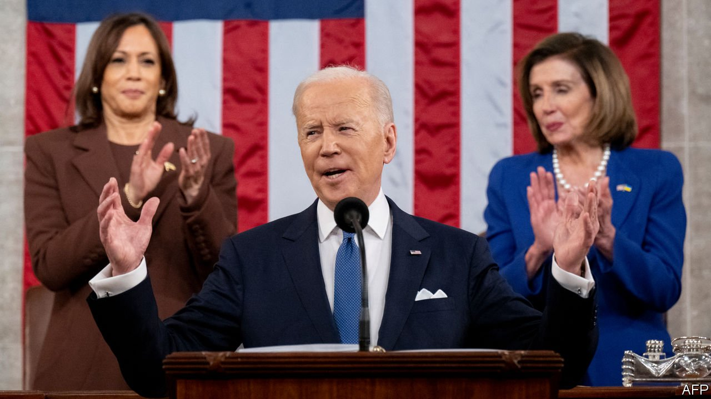
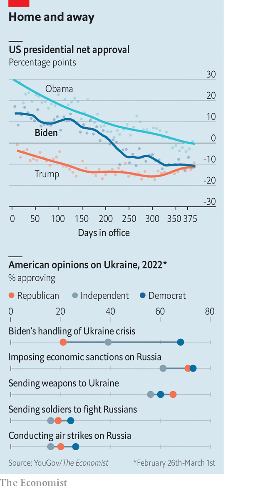

###### State of the union

# Joe Biden’s state-of-the-union address fails to impress 

##### Ukraine aside, a gaffe-laden speech does nothing to turn Democrats’ problems around 

 

> Mar 5th 2022 

EVERY WOULD-BE president daydreams of the moment: the very first state-of-the-union address to Congress, the chance to be at the centre of the annual American pageant. After 50 years in Washington, and having attended a fair few of the spectacles himself, President Joe Biden will have fantasised about his turn at speechmaking more than most. The reality, however, was hardly triumphant.

After a little more than one year in office, Mr Biden is in a slump. Setback has piled atop setback. After months of agonising negotiations, the signature legislative agenda of the administration—a gargantuan safety-net and climate-change spending package called Build Back Better—. High inflation, exacerbated by the large fiscal stimulus that Mr Biden signed, has wrecked his standing as an economic steward. Having promised to manage the pandemic better than his predecessor, Mr Biden has found himself at the mercy of covid-19 variants. And even his supposed core competence in foreign policy has looked in doubt since the  of American forces from Afghanistan (though his handling of the crisis in Ukraine has so far been more adroit).


Voters are unimpressed, and ready to punish his Democratic Party in the mid-term elections to be held in November. Mr Biden’s net approval rating is minus 11 percentage points. That makes him precisely as unpopular as Donald Trump had become at this point in his presidency.

The importance of the state-of-the-union address is questionable, despite all the attention it gets. Examine the swing in presidential-approval ratings taken by Gallup, a polling outfit, before and after the spectacles over the past four decades, and you will find an average change of zero points. The recitation of the president’s wish-list, which these speeches routinely descend into, has only an indirect relationship with actual policy. A careful study by a trio of political scientists—John Lovett, Shaun Bevan and Frank Baumgartner—found that popular presidents can successfully use the occasion to hector Congress into examining their agenda. “On the other hand, any powers of the president to influence the congressional agenda disappear completely when presidents lose their popular lustre,” they write.

It is hard to imagine any speech capable of overcoming these realities, not to mention difficulties of partisan animus and gridlock, no matter how well-crafted or excellently delivered. Unfortunately for Mr Biden, his effort on March 1st was neither.

The answers to America’s domestic ailments were unsatisfying. Mr Biden seems to have lost faith in his ability to legislate—not daring to mention even once the name Build Back Better. The president was reduced to suggesting that components of this sweeping legislation could still pass, in an uninspiringly half-hearted manner.

Once central, climate change was relegated to occasional mentions. The recommendation that Congress reconsider already proposed legislation that stands no chance of passage, such as a pro-unionisation bill and Democrats’ preferred antidote to voter suppression, will prove to be lifeless. Mr Biden unveiled no major new pieces of domestic policy.

The president’s proposed solution to the problem of inflation was autarky and populism. “More goods moving faster and cheaper in America. More jobs where you can earn a good living in America. And instead of relying on foreign supply chains, let’s make it in America,” he said, to boisterous chants of “USA!” from Democrats. He also pledged a “crackdown on these companies overcharging American businesses and consumers”.

Much sotu about nothing

Although never regarded as a gifted orator, Mr Biden was in especially poor form, at times stumbling through both his scripted lines and ad libs. He spoke of the “Iranian people” when he meant Ukrainians and confused the word “vaccine” for “virus”. After the perfunctory closing line “May God protect our troops”, the president felt compelled to shout a mystifying postscript into his microphone: “Go get him!” (or perhaps, as some transcribed it, “Go get ’em!”).

The president was strongest at the start of his speech, denouncing Vladimir Putin’s war in stark terms and leading the assembly in a standing ovation for the Ukrainian ambassador. “When dictators do not pay a price for their aggression they cause more chaos,” he said. There was chest-thumping over the success of the severe economic sanctions that America and its allies have imposed on Russia over its aggression, warmly received by members of both parties. “He has no idea what’s coming,” Mr Biden said of Mr Putin. The president also stressed that America and its allies would defend “every single inch” of NATO territory. But he reiterated that he would not risk direct confrontation over Ukraine with Mr Putin’s nuclear-armed state.

 


Unusually for any big political question, Americans of all partisan stripes are in broad agreement with the president’s strategy. Surveys taken by YouGov for The Economist after Mr Putin launched his invasion show that sizeable majorities of Democrats, Republicans and independents support imposing economic sanctions and dispatching weapons to Ukraine (see chart). And there is similar agreement that sending American soldiers into combat—or even conducting air strikes on Russian soil—would be a terrible idea.

The bipartisanship goes only so far. Despite broadly agreeing with his policy decisions (and the bipartisan ovations on Ukraine on Tuesday), Republicans are unwilling to laud the president for his handling of the crisis. Just 21% say they approve of his leadership on Ukraine. The hope that a foreign crisis might rally Americans around their president, as happened for George W. Bush after the attacks on September 11th 2001, looks misplaced.

There were signs of cooling relations between the Democratic Party’s progressive and moderate factions. Having added progressive phraseology like “equity” and “environmental justice” to his administrative and personal lexicon, Mr Biden is now pointedly distancing himself from his party’s leftist flank. “The answer is not to defund the police,” he said, lambasting a slogan that has now become a liability for Democrats running for office. “The answer is to fund the police,” he declared, scoring a rare standing ovation from Republicans. (He also drew their applause when he argued that: “If we are to advance liberty and justice, we need to secure the border.”)

Rashida Tlaib, one of the members of the “Squad”, a group of progressive House Democrats, delivered her own response to Mr Biden’s speech, an act more often associated with the opposition. She blasted “just enough corporate-backed Democratic obstructionists” for stymying the president’s agenda over the past year. The actual Republican response, delivered by Kim Reynolds, the governor of Iowa, said Mr Biden had “sent us back in time—to the late ‘70s and early ‘80s” when inflation and crime were high and Russian troops were running amok.

For much of the first year of his presidency, Democrats have been hobbled by internecine squabbles. Conservative Democratic senators like Joe Manchin and Kyrsten Sinema have played spoiler to the president’s agenda, to the increasingly evident irritation of progressives. If Republicans were to capture one of the chambers in Congress at the end of the year, this acrimonious debate would be rendered academic. The current polling suggests this to be the likeliest outcome. Over his hour-long speech, Mr Biden managed to give no new reason to think otherwise. ■

For more coverage of Joe Biden’s presidency, visit our dedicated  and follow along as we track shifts in his . For exclusive insight and reading recommendations from our correspondents in America, , our weekly newsletter.

