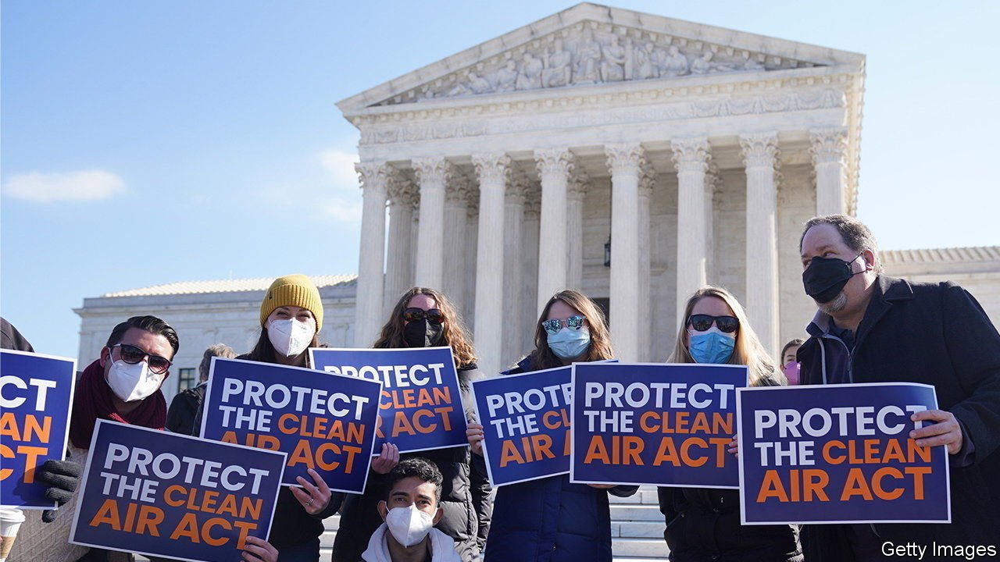

###### Climate control

# The Supreme Court may throttle Joe Biden’s plans to reduce greenhouse-gas emissions 

##### The justices seem inclined to curtail the Environmental Protection Agency’s authority 

 

> Mar 5th 2022 

ON FEBRUARY 28TH a report by a United Nations panel of experts warned of “irreversible impacts for people and ecosystems” from the continued emission of greenhouse gases. That same day America’s Supreme Court considered how robust a role the Environmental Protection Agency (EPA) has in reducing carbon emissions under the Clean Air Act, a landmark pollution-control law passed in 1963.

The justices spent little time taking stock of the future of the planet. Instead, the discussion in West Virginia v EPA was narrow and technical. The case asks whether the EPA may reduce emissions only by regulating techniques and technologies inside power plants—as the Trump administration believed—or if it may take a broader approach, including policies to shift to cleaner energy sources.


The more expansive vision for the EPA fuelled Barack Obama’s Clean Power Plan (CPP), which the Supreme Court put on hold when the plan faced a sheaf of lawsuits in 2016. Donald Trump then replaced Mr Obama’s regime with a significantly watered-down plan that met judicial resistance of its own. The court of appeals for the District of Columbia circuit unwound Mr Trump’s cancellation of the CPP in January 2021, throwing the controls to Joe Biden, who wants to slash emissions by 2030. But the new administration decided not to revive the CPP, as its benchmarks had already been met. According to Elizabeth Prelogar, Mr Biden’s solicitor-general, the EPA plans to have a new proposed set of rules ready by the end of 2022.

In the meantime power plants chug along—representing about a third of America’s carbon footprint—with no regulations in place. That lacuna lent this week’s proceedings an air of surreality, as the court typically hears challenges only to current or impending policies. Ms Prelogar argued that West Virginia and other Republican states, along with their coal-company allies, lacked standing to sue. The parties “aren’t harmed by the status quo”, she said, and are just trying to “constrain EPA’s authority” in the future. Few justices seemed receptive to this claim. Chief Justice John Roberts said the plaintiffs liked Mr Trump’s regulatory scheme and “now they don’t have it”. That’s reason enough, he said, for the case to be “fully justiciable”.

The bulk of the hearing was devoted to parsing the Clean Air Act to determine what Congress empowered the EPA to do. When the law refers to the “best system of emission reduction”, Justice Stephen Breyer asked, isn’t that an invitation to a more systemic approach than just plant-by-plant regulation? Justice Elena Kagan questioned the logic of distinguishing between inside and outside power plants. A rule focused on the plant itself could be “catastrophic”, she said, as costly technological fixes could “drive the entire coal industry out of business”.

But Lindsay See and Jacob Roth, the lawyers arguing against the EPA, insisted that the term “standards of performance” in the act limited the EPA to site-specific rules. And letting the EPA tackle “an issue as massive as climate change”, Ms See said, could reshape energy policy. Construing the Clean Air Act that way, “it’s hard to see what costs wouldn’t be justified.”

Justice Samuel Alito voiced the same concern, with a hint of dubiousness about the threat of climate change. Some people, he said, believe the climate crisis “is a matter of civilisational survival”. Should the EPA be charged with balancing that threat with the costs of regulation and job-market effects? Such a query, several conservative justices suggested, may trigger the court’s “major questions doctrine”, according to which matters of great political or economic significance do not belong with unelected bureaucrats unless Congress has explicitly given them such authority.

Concerns about federal agencies growing too big for their statutory britches have animated several recent Supreme Court judgments on policies prompted by the pandemic. Last August a 6-3 majority ended Mr Biden’s home-eviction moratorium, finding little connection between the mission of the Centres for Disease Control and Prevention and the rental market. In January the same six justices rejected the Occupational Safety and Health Administration’s rule requiring large firms to demand vaccination or testing of their employees.

The Biden administration seems headed for another defeat when a ruling comes this spring. The question is how sweepingly the Supreme Court will constrain agencies—and whether the EPA will retain tools to reduce America’s toll on the climate. ■

For exclusive insight and reading recommendations from our correspondents in America, , our weekly newsletter.

For more coverage of Joe Biden’s presidency, visit our dedicated  and follow along as we track shifts in his . For exclusive insight and reading recommendations from our correspondents in America, , our weekly newsletter.

