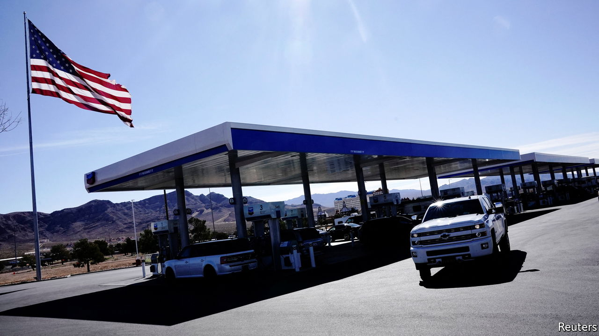

###### Gas tax

# The debate over suspending America’s petrol tax 

##### Shaky economics v shiny politics 

 

> Mar 5th 2022 

“I WILL DO everything in my power to limit the pain the American people are feeling at the gas pump. This is critical to me.” So declared Joe Biden when announcing the first round of sanctions against Russia on February 24th. That petrol prices are critical to President Biden is beyond doubt. High inflation is already weighing on his popularity. Soaring oil prices, a consequence of the sanctions, will only add to the pressures. How can he limit the pain? The structure of the sanctions, ensuring that Russian oil can still reach global markets, is part of the answer. Another part may be a proposal that has sparked debate among economists in America: a reprieve from petrol taxes for the rest of this year.

This idea was already circulating in Washington in the weeks before Russian troops flooded into Ukraine. With little interruption over the past year and a half, petrol prices have climbed and climbed. Drivers now pay, on average, $3.50 per gallon, the highest since 2014, a reflection of constrained supply and strong demand. On February 9th Mark Kelly and Maggie Hassan, two Democratic senators, introduced a bill, the “Gas Prices Relief Act”, which would suspend the federal tax at the pumps for the remainder of the year. With the tax set at 18.4 cents per gallon, the temporary halt would amount to a price cut for drivers of roughly 5%.


That may sound like a decent discount. Yet it would merely return petrol prices to their level in late January, when consumers were already grumbling about them. And many economists fret that these meagre savings would come at a high cost.

There are three main concerns. First, just because the government cuts taxes does not mean that drivers would reap all the benefits. A study of a petrol-tax moratorium in Indiana and Illinois in 2000 concluded that consumers saw prices decline by only about 60% of the tax cut, because a resulting increase in demand increased the pre-tax price of petrol.

Second, it would lead to a fiscal drain. The revenues raised from the petrol tax go to the Highway Trust Fund, which helps pay for road construction and mass transit. The trust fund is already running low, and the tax holiday would deprive it of about $20bn, a big blow, according to the Committee for a Responsible Federal Budget, a watchdog group.

Lastly, the incentives would be perverse for anyone concerned about climate change. Justin Wolfers, an economist at the University of Michigan, wryly proposed a reframing of the tax-holiday proposal: “Would it be a good idea for the government to give cheques to people in proportion to how much they drive and how fuel-inefficient their car is?”

Nevertheless, during the past fortnight two notable economists have offered partial defences of a petrol-tax holiday: both view it as short-term relief for inflation-weary consumers. Paul Krugman, a New York Times columnist, argued that, with refineries well shy of full capacity, American producers could meet additional demand without increasing prices. Soaring global crude prices would, however, still swamp any discount. Olivier Blanchard, a former chief economist at the International Monetary Fund, said that governments could offer tax breaks or subsidies based on past fuel consumption, thereby providing a discount but constraining demand—a clever, if perhaps impractical, idea.

In any case the economics debate may miss the point. The average American household spends about 3% of their annual income on petrol. A small tax saving would barely move the needle on inflation. Yet prices at the pump stare down at drivers in big bold numbers on the petrol-station signs that they pass just about every day, making them one of the most concrete manifestations of inflationary pressures. It is no coincidence that many of the Democratic politicians pushing for a tax holiday, including Mr Kelly and Ms Hassan, are in tight election races this year. They want to show voters that they are doing something—anything—to rein in inflation. Never let a questionable policy get in the way of good politics. ■

For exclusive insight and reading recommendations from our correspondents in America, , our weekly newsletter.

