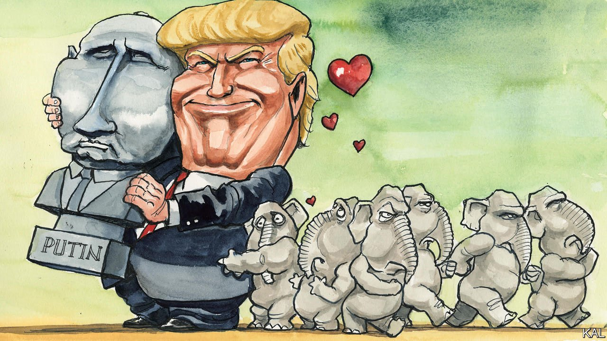

###### Lexington

# The end of the Putin delusion 

##### Donald Trump’s party is returning to its senses on Russia 

 

> Mar 5th 2022 

IF VLADIMIR PUTIN’S invasion of Ukraine rests on a grand delusion, it is one he might have learned watching Fox News and other outlets of the American right. Ever since Donald Trump rose to the top of the Republican primaries in 2016, conservative talking-heads have praised the Russian leader’s vigour and acuity and denigrated his Ukrainian, European and NATO adversaries as corrupt, weak and gutless. As recently as last week, Tucker Carlson, America’s most popular cable host, suggested that, if forced to choose between Russia and Ukraine, he would pick Russia. Only a warmongering liberal obsessive would fuss over Mr Putin’s prosecution of the faraway conflict, he added: “Is he making fentanyl? Is he trying to snuff out Christianity? Does he eat dogs?”

The subsequent reality of Ukraine’s bombed towns, dead children and heroic resistance has not entirely pierced this delusion. Fox is still airing pro-Putin commentary. Mr Trump still praises the Russian leader. Speaking at the Conservative Political Action Conference (CPAC) on February 26th, he condemned the war but snuck in that Mr Putin was “smart” and “playing [Joe] Biden like a drum”. Even so, the war has caused the most dramatic rethink among Republicans since Mr Trump took over their party.


Republican voters, who felt warmly towards Mr Putin under Mr Trump, have swung hard towards Ukraine. So have Republican politicians, with a fervour—illustrated by the blue-and-yellow flags many wore to the state-of-the-union address this week—that would recently have been unimaginable. Two years ago they dismissed Mr Trump’s guns-for-political-favours shakedown of Volodymyr Zelensky as a nothing burger. Now they demand that Mr Biden do even more to support the Ukrainian leader than he is.

The right’s Putin fandom was always more about posturing than substance. Its cheer-leaders were the ultranationalist, isolationist fringe that Mr Trump elevated. Members of that relatively small group admire Mr Putin as an authoritarian challenger of the liberal order. Diehards such as Steve Bannon also consider him the leader of white Christian repulse to godless China, which seems more debatable. Yet most Republican voters expressed more mildly positive feeling towards the Russian leader, mainly because Mr Trump kept praising him. And that was enough to deter many Republican politicians from speaking on the issue.

Even now, some of the most ambitious Republicans only do so delicately. Few of those who spoke at CPAC—the right’s annual beauty pageant—dared mention Ukraine. Mike Pompeo, who as secretary of state may have done more to embolden Mr Putin than anyone except Mr Trump, broached the subject only in order to blame the crisis on Mr Biden. “No matter where you stand on this Ukraine-Russia situation,” said Senator Marco Rubio gingerly, “one thing I think everyone can agree upon is that the people of Ukraine are inspiring to the world.” Yet the changing mood among Republican voters is encouraging Republican lawmakers to be more forthright by the day. Though few suggest American troops should be deployed to Ukraine, most are no longer ambivalent about where America stands in the fight.

Americans have in the past witnessed many periods of introspection and self-doubt—only to relaunch themselves, re-emboldened, into global affairs. According to the scholar Walter Russell Mead, such action tends to be triggered by isolationists (whom he terms “Jacksonian”) apprehending a frightening new global threat. That may be happening now; polls suggest Mr Trump’s supporters increasingly consider Mr Putin to be dangerous as well as malign. Alternatively, suggests Kori Schake of the American Enterprise Institute, it may be that Americans can always be rallied by a compelling struggle between good and evil: “People being worth defending is what motivates Americans.” In any event, two things seem clear. After a prolonged isolationist funk, Republicans have rejoined the internationalist mainstream on this issue. And in doing so they have turned from Mr Trump.

The crisis underlines how positive that is. Had Mr Trump won a second term, he might have tried to remove America from NATO by now. His administration would certainly have been incapable of the Biden team’s patient diplomacy. Yet there are probably limits to how far the normalisation of Republican foreign policy will go.

Previous foreign-policy schisms—over Germany in the 1940s, for example, and Korea in the 1950s—gave way to a sense of common purpose. By contrast, in their latest gratuitous criticisms of Mr Biden, Republicans seem determined to punish him for being right. Perhaps they wish to distract from their own former apologism for Mr Putin. Mainly, though, their carping illustrates the extent to which conservatism has become more about reflexive opposition to the left than the specifics of any issue.

This makes the Republicans bad-faith actors on Ukraine, barely capable of providing the constructive criticism that the Biden administration needs. Senator Mitt Romney, who has justly criticised both parties’ history with Mr Putin and praised Mr Biden’s recent diplomacy, is one of the few Republicans with credibility on the issue. Not coincidentally, he was also the only Republican senator to vote to impeach Mr Trump for coercing Mr Zelensky.

Better dead than Dem

In their disloyal opposition, Republican politicians are again channelling their supporters. They rate Mr Biden’s performance as badly on Ukraine as they do generally, even though most Republican voters, whether they know it or not, support his policy. Were the president an abler politician, he might turn that around. As it is, the Republicans look on course to make one of his biggest successes look like yet another failure. This raises the odds that Mr Biden’s party will take a beating in November. In turn, that would probably improve Mr Trump’s chances of coming back for a second term. In which case, his party’s heartening foreign-policy refresh might well prove to be irrelevant. ■

Read more from Lexington, our columnist on American politics:

 (Feb 26th) (Feb 19th) (Feb 12th)

For more coverage of Joe Biden’s presidency, visit our dedicated  and follow along as we track shifts in his . For exclusive insight and reading recommendations from our correspondents in America, , our weekly newsletter.

