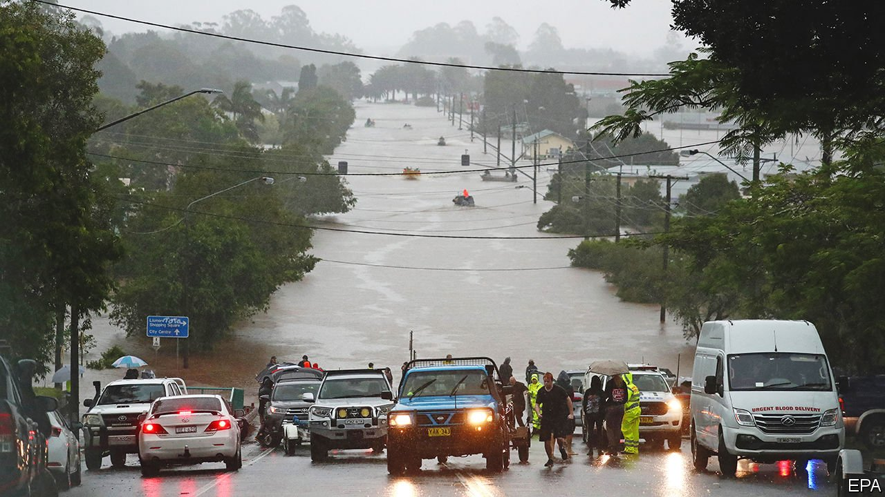

###### Extreme no more

# Australia is battered by catastrophic floods 

##### Freakish weather is becoming increasingly common 

 

> Mar 10th 2022 

THE WILSONS RIVER broke its banks on the night of February 27th while Lismore, a town of around 30,000 in New South Wales, was sleeping. Its residents snoozed through early-hours emergency warnings that “risk to life [was] imminent”. Within hours the town was submerged. Residents scrambled into their attics. Mothers carried children onto rooftops. An army of locals launched tin boats into the floods to save them. Four people died.

Eastern Australia has been hammered by what politicians call “once-in-1,000-year” flooding. It has already had a soggy summer because of La Niña, a phenomenon which triggers downpours there. Then on February 23rd, meteorologists warned that an area of low pressure was forming over southern Queensland. It sucked moisture from the sea, forming an “atmospheric river” over the east coast. It has dumped biblical quantities of water ever since.


Brisbane, Queensland’s capital, received almost 80% of its annual rainfall in less than a week in February, flooding 15,000 homes. As the rain edged into northern New South Wales, it ripped up roads and drowned herds of cattle. Storms lashed Sydney on March 8th, causing a dam to spill over. Some 50,000 people in the state have been forced to evacuate. As The Economist went to press, 21 people had died in flooding in the two states.

Scientists are wary of blaming floods on global warming because everything from rainfall to urban development contributes to them. They disagree, too, about whether climate change is a factor in this kind of never-ending downpour. No matter the cause, extreme weather is now a regular occurrence in Australia. New South Wales was buffeted by its last “once-in-100-year” floods, which submerged Western Sydney, just a year ago. In 2019 and 2020 vast tracts of the country were torched in bushfires which destroyed more than 3,000 homes and killed 33 people. Unlucky towns such as Lismore have in recent years been hit by both fire and floods.

It does not help that the state and federal governments’ response has been bungled. When disaster strikes, official aid is often slow to come. In 2019 the federal government set aside almost A$4bn ($2.9bn) for a fund that would help it respond to crises and mitigate future ones. But it has spent hardly any of that money. It has now deployed the army and is dishing out cash to victims, but locals fume that they were left for days without power or fuel as supplies of food and water dwindled. Good samaritans clothed and fed them. A university is putting up the homeless. “Isn’t somebody meant to write a plan for this?” wonders Ella Buckland, a resident of Lismore.

A debate now rages about how or even whether places like Lismore should rebuild. Analysts think the floods might trigger insurance claims worth more than A$3bn. Premiums are already so high in disaster-prone towns that many locals can no longer afford cover. Some politicians would like the government to pay companies to insure houses that will inevitably be struck by future fires or floods, as it does in the cyclone-bashed Northern Territory. “If we are going to start thinking every time there’s a natural disaster that we have to give up and leave because it’s too hard, then where are we going to live?” asks Lismore’s mayor, Steve Krieg. That is becoming a question for ever more Australians. ■

For more coverage of climate change, register for , our fortnightly newsletter, or visit our 

