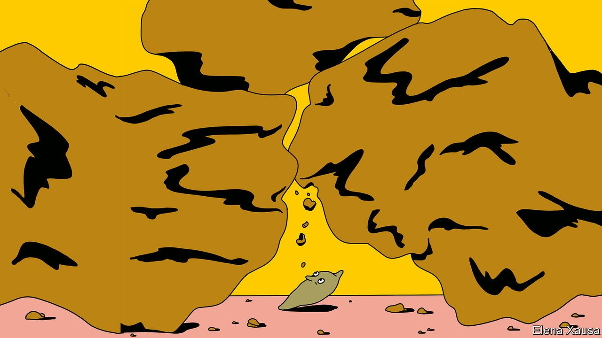

###### Banyan

# It is getting harder for small states to balance great powers 

##### A decade-long saga in Nepal shows the difficulty of keeping everyone happy 

 

> Mar 12th 2022 

ON MARCH 1ST, even as Russian shells and missiles rained down upon Kyiv, Kharkiv and Mariupol, Antony Blinken, America’s top diplomat, made time for a chat with Sher Bahadur Deuba, the prime minister of faraway Nepal. Ukraine was one subject of conversation—Nepal voted to condemn Vladimir Putin’s invasion at the UN the following day. It was also an occasion to mark 75 years of diplomatic ties between the two countries. “Neighbours”, as Ronald Reagan put it, “on the other side of the world.”

But the most important item on the agenda was the approval by Nepal’s parliament two days earlier of the Millennium Challenge Corporation (MCC) compact, a $500m development grant from America. The ratification marked the culmination of a decade-long saga that has riven the country, caused angry protests and irritated both the United States and China. As the war in Ukraine forces small- and medium-sized countries to take stock of their allegiances and relationships, Nepal’s experience bodes ill for those trying to avoid getting caught between rival powers.


Ever since the British left South Asia in 1947 Nepal has been bossed around by India. More recently China, with its tempting offers of investment and loans, has been throwing its weight around. It has widened its focus from quelling pro-Tibet activities in Nepal to influencing foreign policy more broadly. In the past few years America has become more interested in the region as well, seeing it as a venue to counter China. “There is an old adage of Nepal being a yam between two boulders,” says Amish Raj Mulmi, the author of “All Roads Lead North”, a book on Nepal’s relations with its humongous neighbours. “Now we know it is three boulders.”

The grant from the MCC, a foreign-aid programme, should have been an easy sell for Nepalese politicians. It is the biggest in the country’s history. It is transparent, aimed narrowly at improving east-west road links and building power transmission lines to India, and has a fixed, five-year lifespan. Investments in hydropower have given Nepal a surplus of energy, and India is a keen customer. The long-term benefits of trading electricity with India are immense. It is for these reasons that Nepal applied for the grant in 2012, and signed an agreement in 2017.

Yet the MCC became controversial soon afterwards. In 2018 Mike Pompeo, Mr Blinken’s hawkish predecessor, declared that it made Nepal a part of America’s “Indo-Pacific strategy”, designed to counter China in Asia. Other American officials echoed the suggestion. China was livid. Nepali politicians were aghast.

The grant became politicised at home, too. Some of the language in the compact gave rise to the notion that its terms would override Nepal’s laws, and thus its sovereignty. More imaginative conspiracists suggested that it was a Trojan horse to place American troops on Nepalese soil. Such theories were aided by Chinese-orchestrated disinformation campaigns, which found many takers amid the country’s fractious politics. “It became controversial at the level of the common man,” says Nishchal Nath Pandey of the Centre for South Asian Studies, a think-tank in Kathmandu, the capital.

By the time a new coalition government came to power in July last year, the Americans were losing patience. Not only would Nepal cease to be eligible for the grant if its parliament did not ratify the agreement by February 28th; in addition, American diplomats privately made clear, they would be forced to review bilateral relations with Nepal, and might conclude that it no longer had an independent foreign policy, according to a person close to the prime minister.

In the end a fix was found. Parliament approved the MCC, but attached to it an “interpretative declaration” stressing Nepal’s sovereignty and the supremacy of its constitution. Now it was the turn of the  Global Times, the Chinese state’s English-language mouthpiece, to warn that “it remains uncertain whether the MCC will undermine China-Nepal co-operation in the future”. In seeking to balance rival powers, Nepal found itself in exactly the squeezed-yam position it had long sought to avoid.

In the cold war Nepal extracted favours from all powers. The Chinese built cement factories, the Indians constructed roads, Americans helped with health care. But the lesson for small states, says Mr Pandey, is that it is becoming much more complicated to avoid taking sides: “That is not going to satisfy these major powers. They will want these smaller countries to be completely on their turf.”

Read more from Banyan, our columnist on Asia:

 (Mar 5th) 

 (Feb 26th)

(Feb 19th)

