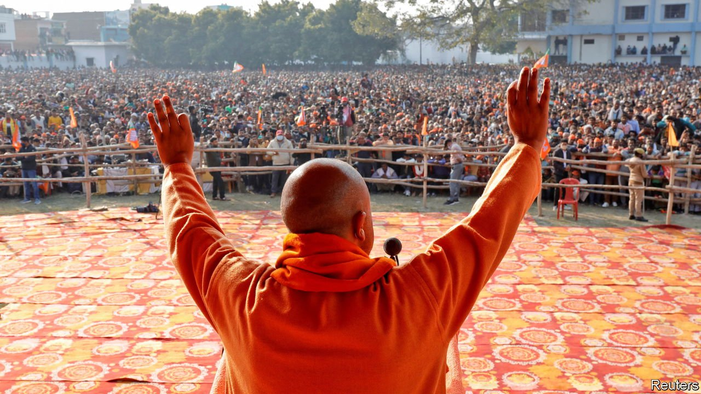
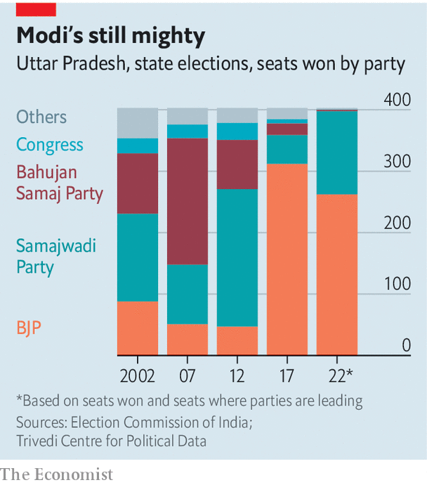

###### Uttar domination

# Narendra Modi’s party triumphs in India’s bellwether state 

##### The Bharatiya Janata Party holds on to Uttar Pradesh, while Congress collapses in Punjab 

 

> Mar 12th 2022 

AS THE COUNT came in on March 10th from elections in five Indian states, there were few big surprises. The Bharatiya Janata Party (BJP) of Narendra Modi, the prime minister, held on to the country’s most populous state, Uttar Pradesh. The Hindu nationalists also stayed on top in the small states of Goa, Manipur and Uttarakhand. And if Mr Modi’s party made a poor show in medium-sized Punjab, most of whose 30m people are Sikhs, this came with a sweet consolation. Punjabis gave a far crueller thrashing to Congress, the BJP’s fading national rival, reducing a hefty majority in one of the grand old party’s last redoubts to less than 15%. Voters elected instead the newish Aam Aadmi Party (AAP).

With just two years to go before India’s next general election in 2024, this is good news for Mr Modi. If there is one force in Indian politics more reliable than money or hawa—meaning “wind”, or having the momentum of success behind you—it is anti-incumbency. This factor is especially strong in the sprawling and impoverished state of Uttar Pradesh, whose 240m people have a hard habit of tossing out governments after a single term.


Its voters did trim the BJP’s majority from three-quarters of seats in the outgoing state assembly to a more modest two-thirds. But to stay in power at all, despite the terrible ravages of covid-19 and the effects of an economic slump that predates the pandemic, is no mean feat. To do so in a state that accounts for one in seven seats in the national Parliament makes opposition hopes of ousting Mr Modi even slimmer.

 


India’s prime minister is not the only big winner from this round of state elections. The steepness of Congress’s fall in Punjab was more than matched by the rise of the AAP. Formed barely a decade ago and adopting the humble broom as its symbol, the party rules just one quasi-state, India’s capital, Delhi. Its leader, Arvind Kejriwal, a former tax inspector, projects an image of hard-working modesty. The party’s focus on public service and its reputation for probity had until now won more praise than votes. But the capture of Punjab, with a stunning 77% of seats, has catapulted Mr Kejriwal to national prominence. Some now see him as a potential challenger to Mr Modi, if not in 2024 then in 2029.

That may be premature. AAP’s surge in Punjab at the expense of Congress reprises a decades-old phenomenon. Across India regional forces, often led by reformist dissidents from within Congress and built on local resentments, have sheared off votes from the once-dominant big-tent party. But these upstarts have typically remained big fish in small ponds. At the national level, the BJP has become an increasingly lonely shark. Unless its opponents work out how to join forces, Mr Modi’s party will continue to swim unchallenged.

The result in Uttar Pradesh proves the point. Taken together, the BJP’s rivals won a majority of votes, as they did in the previous state election, in 2017. But with Congress’s tally of seats having shrunk yet again, there are only local parties, nearly all built on narrow caste alliances and tactical voting by minority groups, to vie with Mr Modi’s behemoth. The BJP’s formula of “Hindu consolidation”—posing as the protector of upper castes while wooing lower ones with handouts and hate speech against Muslims—works again and again.

Mr Modi’s man in Uttar Pradesh and the state’s chief minister, Yogi Adityanath, has been the face of this political strategy since coming to power in 2017. Despite having held the state, however, the saffron-robed priest does not appear strengthened by the vote. After all, the BJP’s tally of seats dropped substantially, and some of the opposition’s biggest inroads came on Mr Adityanath’s own home turf in the state’s east. Many voters say they like his no-nonsense approach to law and order. More still have praised the BJP’s covid-era programme to supply free food. When this comes to an end later this month, and when fuel prices, peculiarly flat throughout the election season despite a near doubling of world prices, inevitably surge, some BJP voters may feel less happy. ■

