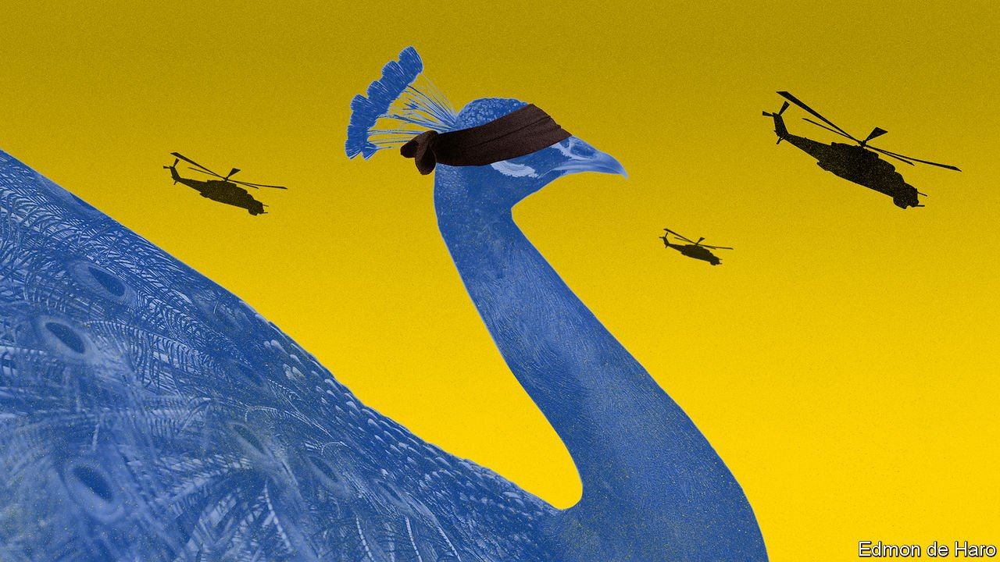

###### Abstemious to a fault

# Why won’t India’s government condemn Vladimir Putin? 

##### It thinks it has more to lose from alienating him than from annoying the West 

 

> Mar 12th 2022 

INDIAN POLITICIANS love to remind people that their country is the world’s biggest democracy. They are also extremely prickly about its borders. Yet India has failed to condemn President ’s attempt to wipe off the map another independent democracy, . In the UN Security Council, the General Assembly and the Human Rights Council, India conspicuously abstained from resolutions deploring Russia’s invasion of its neighbour. That perplexes some observers in Western capitals. The government of Narendra Modi, the prime minister, has done much to improve ties with America and Europe in recent years. But when asked to choose sides, India sits on the fence. To some, it seems that Mr Modi favours Mr Putin.

Not so, say Indian policymakers, pointing to official statements that lament the violence, express support for sovereignty and territorial integrity, and call for diplomacy to be given a chance. Moreover, they say, the abstentions should be seen in the context of India’s long tradition of being beholden to no superpower. Yet many of the countries India once claimed to lead in a cold-war era “non-aligned movement” have joined in the condemnation of Mr Putin’s actions.


India’s abstentions are shaped by past habits and current priorities. Start with the past: its ties with the Soviet Union ran deep, for all its protestations of non-alignment. Russia provided food aid and economic subsidies, and Indian bookstalls were crowded with the translated works of Lenin and approved Russian novelists. The KGB ran around Delhi, the capital, with bags of cash for influential people.

Today India counts on the support of Russia, with which it has a “special and privileged strategic partnership”, for its claims over Kashmir—one reason for never crossing it at the UN. Also influential is India’s assessment of its defence needs, relying on Moscow, as it did in the cold war, for weapons. Half its arms imports come from Russia, including big-ticket items such as submarines, T-90 battle tanks, Su-30 fighter aircraft and a surface-to-air missile system known as the S-400.

More importantly, 70% of India’s existing arsenal is Russian-made. That makes it difficult to wind down business. Even if India were to stop importing new materiel today, it would still need ammunition, spare parts and technical support for what it already has. Russia is also helping India make more of its own weaponry, points out Anit Mukherjee of the S. Rajaratnam School of International Studies in Singapore. The search for “strategic autonomy” is a mantra in Delhi.

Politicians in America and Europe have lambasted India for abstaining at the UN and buying weapons from Moscow. On March 3rd a State Department official, Donald Lu, told lawmakers that President Joe Biden’s administration was considering whether to punish India for its reliance on Russian arms and equipment. Axios, a news website, reported that a leaked cable instructed American diplomats to remind their counterparts that India’s stance “places you in Russia’s camp, the aggressor in this conflict”. The administration later said the cable was a draft that had been disseminated in error.

Indian officials and analysts are at once irritated by Western criticism and relaxed about the consequences. Irritated, because they divine Western hypocrisy. India would very much like to rely less on Russian arms and buy more from America. But they are either too expensive or, in the case of missile systems, out of reach: America would not sell India its latest versions.

Elsewhere, Indian policymakers ask, where has been the full-throated condemnation of China’s aggression along its shared border with India, which in June 2020 turned into a deadly high-altitude brawl? And they are still fuming over America’s hasty withdrawal last year from Afghanistan, leaving the country to the Taliban. They feel it handed an easy advantage to Pakistan, the Taliban’s backers.

Yet Indian officials are also relaxed, because they calculate, probably correctly, that India will suffer few consequences from the West over its stance at the UN. America and India have a shared interest in countering Chinese assertiveness or aggression. That has underpinned the logic of the four-nation Quad, a security grouping that also counts Australia and Japan as members. Plenty of Asia hands in Washington argue that America should keep its eye on the larger goal of containing . In this context, it makes sense to overlook India’s softness on Russia, they say.

That may be so. But India’s response points to other weaknesses. It claims to have leverage over Russia because it is the biggest buyer of its arms. Yet India’s government still had immense trouble evacuating the 20,000-odd Indian students caught in Ukraine. (Most have now escaped, but at least one was killed during Russia’s shelling of Kharkiv.) Neither Mr Modi nor any other Indian bigwig has rushed to Moscow to urge Mr Putin to change course. They are under no pressure at home, either. Most Indians do not care much about the war.

India’s coddling of Mr Putin could yet become a liability. It is bad for India’s reputation, and will become more so if he commits even worse atrocities, such as using chemical or battlefield nuclear weapons. And if Russia comes out of the war exhausted, impoverished and dependent on China, that could indirectly harm India, too. What might China demand in return for supporting Mr Putin?

In 1962, when India and China fought a bloody border war, Nikita Khrushchev, the Soviet leader, initially favoured his Chinese “brothers” over his Indian “friends” and pushed India to accept Chinese terms. Russia is in no position to boss India around today. But if it became dependent on China to survive sanctions, and China demanded that it sell less top-of-the-line military kit to India and more to China, Mr Putin would surely agree.

India’s deployment of Russian s-400 missiles has already created a vulnerability. China deploys the same system, so its military planners know its flaws and strengths intimately. India could deter China more effectively with a different system. If American kit is too costly, plenty of alternatives exist.

Meanwhile, the war is hurting India’s economy. Sharp rises in the price of crude oil, cooking oil, fertiliser and more will make it harder for the central bank to curb inflation without stunting growth. Economists are already predicting slower growth and higher inflation. That would hit the pockets of ordinary folk. And by squeezing Mr Modi’s budget, including for defence, it would make his goal of strategic autonomy ever harder to achieve. ■

Our recent coverage of the Ukraine crisis can be found .

