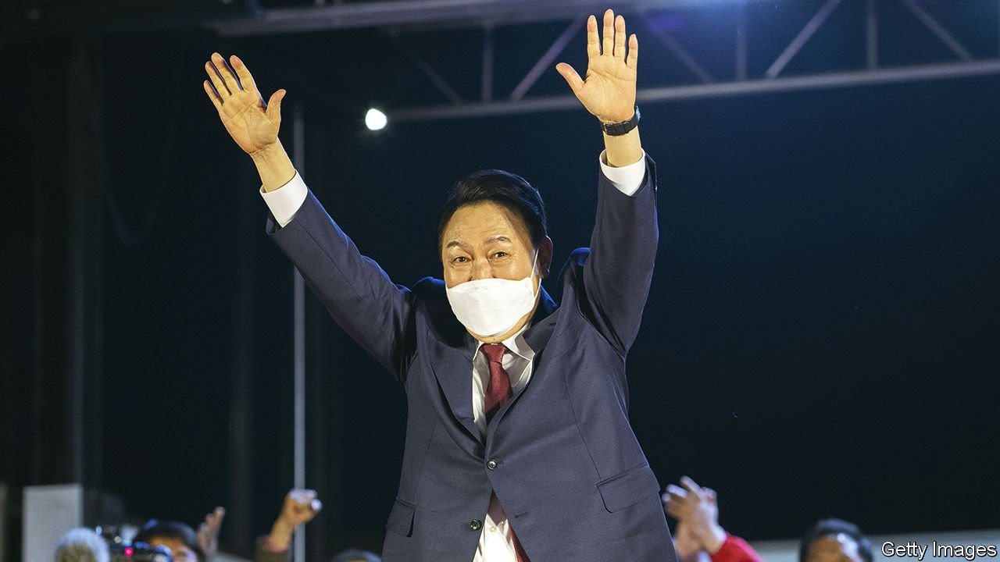

###### Wishy-washy victory

# Yoon Suk-yeol will be the next president of South Korea 

##### He was elected in the closest race in his country’s democratic history 

 

> Mar 12th 2022 

ON SOUTH KOREAN television screens on election night, news channels kept viewers entertained with zany coverage. Instead of clean-cut talking heads, one broadcaster’s vote count was accompanied by computer-generated avatars of the two main presidential candidates in stained T-shirts, dirt-splattered leather jackets and weather-beaten motorcycle boots. As the numbers slowly ticked up, they danced to K-pop, rode locomotives and raced cars and motorbikes through a desolate, post-apocalyptic landscape. The dystopian setting and animated mudslinging summed up an election that had been defined less by sober debates about policy than by name-calling and political stunts.

It was close until the very last moment. Exit polls on the evening of March 9th showed the two main candidates—Yoon Suk-yeol of the conservative People Power Party and Lee Jae-myung of the governing left-of-centre Minjoo Party—in a dead heat. Mr Yoon carried the day by the smallest margin in South Korea’s democratic history, winning 48.56% of the vote to Mr Lee’s 47.83%, with a turnout of 77.1%. He will take office in May.


The son of professors, Mr Yoon is a long-standing member of Seoul’s elite. He made his name as a hard-driving prosecutor who played a key role in going after Park Geun-hye, a former president, for corruption. He entered politics less than a year ago, quitting his job as chief prosecutor under Moon Jae-in, the outgoing president, after the two fell out over an investigation of the justice minister.

Mr Yoon has promised voters a presidency defined at home by anti-corruption, meritocracy and the rule of law. On foreign policy his priorities are closer alignment with America and a tougher stance against North Korea and China. In his acceptance speech, Mr Yoon said that he would work with his opponents and make national unity a priority after a divisive campaign.

That will be essential if Mr Yoon hopes to achieve anything. The new president will struggle to pass any legislation without the support of his opponents, who retain a legislative supermajority in the National Assembly. Indeed, they could sabotage his presidency from the very beginning, for instance by rejecting his nominee for prime minister, or by refusing to lend support to his proposed package of pandemic recovery measures, the top item on his agenda. Given the wafer-thin margin by which Mr Yoon won the presidency, there is no guarantee that his PPP will win the next National Assembly elections in 2024, so he may face an unfriendly legislature for his entire term.

The promise of unity will anyway have rung hollow to most voters. His campaign stoked division. He claimed that women in South Korea, which is routinely rated the worst place among rich countries to be a working woman, no longer suffered from baked-in discrimination. He also blamed feminism for the country’s low fertility rate. That endeared him to young men frustrated by compulsory military service and a lack of good jobs when they get out, but lost him the support of women under 60, according to exit polls.

Worse, he played to the electorate’s basest instincts, pandering to conspiracy theories about potential election-rigging by his opponent, who has conceded defeat, and threatening to prosecute opposition politicians for corruption if elected. Minjoo politicians, many of whom enthusiastically cheered him on when he prosecuted conservatives, are unlikely to take well to similar treatment.

Away from home, Mr Yoon’s job will be no easier. Vladimir Putin’s invasion of Ukraine has deepened the political and economic fissures between Western democracies and autocracies such as Russia and China. That complicates South Korea’s already tricky position as a military ally of America that trades a lot with China. Meanwhile South Korea’s bothersome northern neighbour has ramped up missile testing this year. It also appears to be rebuilding a nuclear test facility which it dismantled during a period of detente in 2018, raising the possibility of heightened tensions in the coming months. When it comes to growing into his new role as president, the former prosecutor has little time to lose. ■

