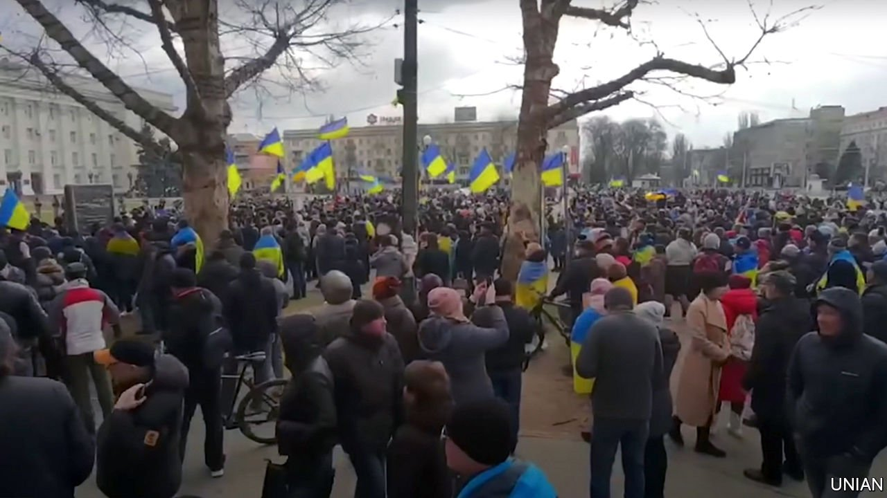

###### Occupation? No thanks!

# Russian soldiers expecting to be welcomed to Ukraine were soon disabused 

##### Now things are turning nastier 

 

> Mar 12th 2022 

KHERSON IS ABOUT as far up the Dnieper from the Black Sea as Bordeaux is up the Gironde from the Bay of Biscay; its population, 280,000, is a bit larger. It is normally a sleepy, provincial place. On February 24th, though, when Russian tanks rolled out of Crimea, 120km to the south-east, it became a vital objective in Russia’s attempt to take control of a corridor along Ukraine’s entire coast. When, having encountered more resistance than they expected, some of those tanks reached the centre of Kherson on March 1st, Russian state media heralded the fall of the city as the campaign’s first “liberation”.

Kherson’s citizens were having none of it. They waved Ukrainian flags, shouting and screaming at the Russians to leave. Some of them stood in the way of tanks. The city’s mayor and the governor of the Kherson oblast, both in effect hostages, insisted that they would take orders only from Kyiv. A week into the occupation they were sticking to their guns.


Across Ukraine, from Berdyansk on the Azov Sea to Sumy in the north-east, Russian forces have met resistance when they advance and obstreperousness when they think they have gained control. They and their leaders expected something more welcoming. The FSB, a successor to the KGB, told Russia’s president, Vladimir Putin, that it had thoroughly penetrated Ukraine’s political and military leadership, and laid the groundwork for a pro-Russian regime—a key reason for the Kremlin’s war optimism. But the FSB grossly exaggerated its networks of agents in Ukrainian cities.

Mr Putin can hardly have believed the taradiddles he peddled about Ukraine’s drug-addled neo-Nazi elite perpetrating genocide and ordinary Ukrainians desperate for rescue by their Russian brothers. Videos of prisoners of war show that at least some of the rank and file seem to have bought such stories. But they found no welcome anywhere. The mood is generally one of contempt.

In Kherson unabashed pro-Ukrainian rallies have continued daily. Alexander Mogilinkov, one of thousands to attend them, said by phone on March 8th that the violence of the Russian army had at that time galvanised people. Protesters are nervous, he says, and they face a new threat they do not understand. But they are even more fearful of the repression and poverty that Mr Putin has imposed on the nearby regions of Donetsk and Luhansk, which have been controlled by Russia since 2014.

Initially flummoxed, on March 9th Russian forces detained over 400 protesters in what Ukrainian authorities said represented the beginning of a new repressive regime. The mayor of Novopskov, a town near Donbas, told the BBC that daily protests there stopped when Russian soldiers shot three protesters and beat another on March 5th. There have been reports from elsewhere of tanks being deliberately rammed into houses, hostage taking and sexual violence. European intelligence officials say that the FSB has drafted plans for public executions to break morale.

In Crimea the intelligence services have a tried and tested approach for dealing with opposition. Anton Naumlyuk, a Russian journalist who has reported from the annexed peninsula since 2016, says it differs little from schemes used by Tsarist political police to sniff out revolutionaries at the start of the 20th century. “First, they map networks to understand who the real opinion leaders are, and they target them. If people co-operate, fine. If not, they start to disappear.” Crimea SOS, a non-governmental organisation, says 36 of 43 men kidnapped in Crimea since 2014 were definitely taken by Russian security forces. Six of the 43 were found dead; 18 were never found at all.

Kherson may be seeing something similar. On March 7th local media said Oleksandr Tarasov, an activist, had been reported missing following that evening’s protest. He emerged 24 hours later, apparently distressed, and said in a bizarre “confession” that he had been working as a provocateur for Ukraine’s security services.

Occupation need not mean terror. But Philip Ingram, once a colonel in British military intelligence, says a successful occupying force needs civil engineers, medical support and civil-affairs staff, and this has never been an area in which Russian forces have excelled. “They are not designed, from a military perspective, to occupy and rebuild,” he says. “Just hold and destroy.” Locals in Kherson report the occupiers to be hungry, looting and “out of control”.

Many Ukrainians with pro-Russian sympathies used to think that a rapprochement between the two countries was possible. “For all of my friends that hope is already dead,” says Andrii Yatskevich, a sailor from Kherson. Viktor Merinkov, the director of a boarding school for deaf children in the city, says that “As far as locals are concerned, Russia has become a by-word for fascist invaders.” His wife Valentina interrupts to urge him to temper his language; the couple have responsibility for eight children now stranded in the city, she reminds him. ■

Read more of our recent coverage of the 

