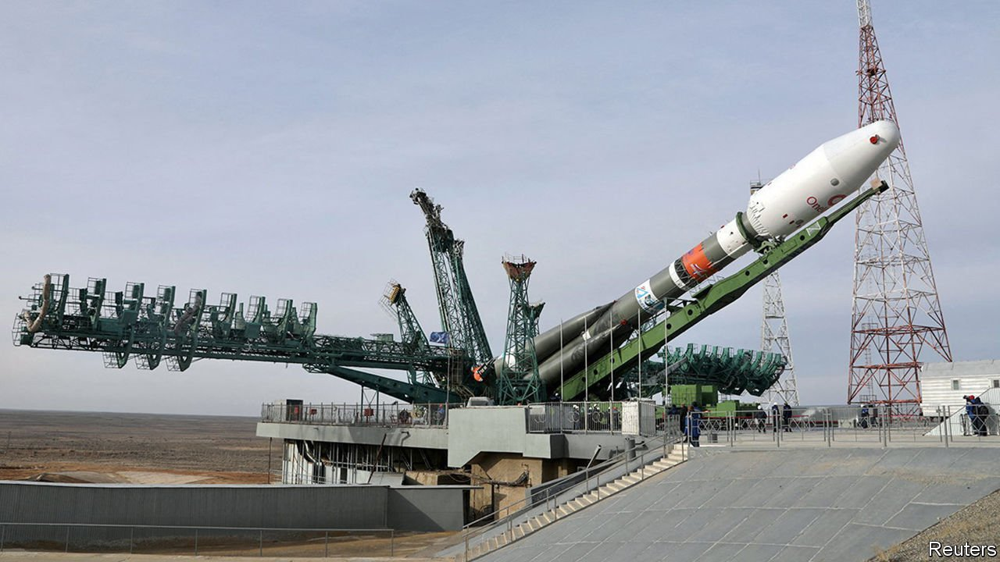

###### Failure to launch

# Britain’s government bailed out OneWeb in 2020. Now it’s in trouble 

##### Losing access to Russian launchpads is a big blow for the satellite-internet company 

 

> Mar 12th 2022 

IN MARCH 2020 OneWeb, a satellite-internet company, filed for bankruptcy after its biggest funder, SoftBank, a Japanese tech investor, declined to pump an extra $2bn into the firm. OneWeb emerged from bankruptcy in November 2020 clutching $1bn of fresh capital, including $500m from Britain’s government for a 33% stake, reduced to 19% in later investment rounds. It planned to start selling internet access in Britain in late 2021 and elsewhere in 2022.

But OneWeb’s timelines have often slipped. In 2018 Greg Wyler, its founder, was saying he planned to sell internet connectivity in some places in northern latitudes by the end of 2019. By the end of 2021 that still had not happened. A planned 2022 “global roll-out” already looked unlikely when, on March 2nd, Russia’s space agency set new preconditions for OneWeb’s planned launch from Baikonur, Russia’s main spaceport. OneWeb had to guarantee that its satellites would not be used for military purposes. And the British government had to relinquish its stake.


Kwasi Kwarteng, Britain’s business secretary, rejected the demand to sell up out of hand. On March 3rd OneWeb suspended launches from Baikonur. Its 36 satellites and the Russian rocket they are strapped to were wheeled back into a shed.

Until then, the task of putting OneWeb’s satellites in orbit was going well. It had launched 428, of a planned 648, through a contract with Arianespace, a French firm that managed its Russian launches. But losing Russian launch capacity will set it back. Other sites are booked up. One firm that could offer some capacity, Elon Musk’s SpaceX, has raced ahead building a competitor to OneWeb, launching more than 2,000 satellites. Its Starlink constellation offers services around the world.

More big-tech money will soon be in orbit. Kuiper, a subsidiary of Amazon started in 2019 by Jeff Bezos, then the firm’s boss, says it will launch its first satellites this year. Mr Musk’s constellation benefits from Space X’s launch capability. Kuiper will be able to piggyback on the ground stations Amazon Web Services has built to relay signals between satellites, users and the rest of the internet. OneWeb must stand on its own.

The loss of launch capacity comes on top of other problems. A global semiconductor shortage means trouble in sourcing components it needs for ground stations. Its business model is to sell connectivity wholesale to other internet service providers, including BT in Britain and AT&amp;T in America. But that means it must rely on those companies to install the equipment users need in order to connect to the satellite network. Starlink, by contrast, sells directly to consumers as well as wholesale.

OneWeb’s unusual range of shareholders also risks muddling its incentives. When Britain left the European Union, it lost any say over Europe’s Galileo navigation system. OneWeb is one of the firms vying to provide it with a replacement. And so British taxpayers find themselves with a stake in a satellite-internet company that is competing with firms backed by two of the world’s richest tech barons, one of which controls the launch capability upon which OneWeb may soon depend.

The British government’s growing tolerance for risky investments is part of a shift in philosophy towards prioritising ownership and control of strategic technology infrastructure. This has its merits. But bailing out a capital-intensive business with deep-pocketed competitors and a shaky business model always looked like too much risk for too little reward. ■

