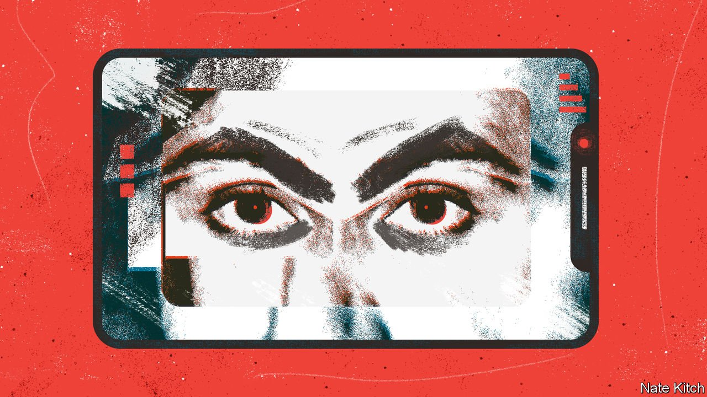

###### Big employer is watching you

# Companies are spying on job candidates online 

##### Online vetting is spreading—and worrying 

 

> Mar 12th 2022 

YOU MAY never know why. The email will arrive and reasons offered for your rejection might be the real ones—or not. Companies do not always like to admit that they have been scrolling through your Instagram or Twitter feed, noting drunken photos and off-colour jokes. Yet many, particularly the big ones, are doing just that. And in increasing numbers, they are acting on what they find when deciding whom to hire and whom to pass over.

Bosses have always snooped on their underlings, then judged them. The open-plan office and flat-topped office desk evolved, in part, because they were more convenient than cosy Victorian bureaus for seeing what clerks were up to. Now the rise of the online self means the employer’s eye can travel still farther: past your desk, past your office and into your home, family and even (through ill-judged social-media posts) your most intimate thoughts. Today, companies wield the sort of spy power less commonly associated with directors than with dictators, even deities.


Even before the pandemic, online vetting of applicants was becoming more common. Research in 2017 for YouGov, a pollster, found that 28% of large companies had turned down applicants after carrying out such checks. But it is becoming more popular: Reed Screening, a large vetting agency, was asked to run over a third more social-media checks in December 2021 than a year earlier. And social snooping is becoming more socially acceptable. This month the government gave the practice tacit approval when the Department for Education said schools and colleges “should consider carrying out an online search (including social media) as part of their due diligence”.

If you want to keep a secret…

The way screening works is simple: a flunky is asked to scroll through some, very possibly all, of an applicant’s online presence. Any “problematic” behaviours will be marked with a red flag, says Keith Rosser, the founder of Reed Screening, one of the largest British companies doing this work. There are likely to be a lot of red flags because companies, like deities and dictators, tend towards the disapproving.

God disliked “drunkenness, orgies and things like these”, wrote Paul to the Galatians. Companies, in Mr Rosser’s telling, do too. They also disapprove of racist, sexist and ableist language; people who spend too much time on social media; and, finally, people who are rude about their boss.

There are laws governing such snooping. David Erdos of the Centre for Intellectual Property and Information Law at Cambridge University says that companies are supposed to warn candidates before screening their social media, and tell them that they have the right to withhold consent. Conscientious companies follow these rules, but others may not. The fact that a job application may lead to screening is “not necessarily communicated to candidates”, says Simon Wadsworth of Igniyte, a company that helps manage online reputations. As for the right to refuse, it is hardly practicable. “Who on earth is…going to be that person who says: ‘Hang on a minute, I’m not happy about that?’” asks Mr Erdos. “That itself is likely to be a red flag.”

All agree that the spread of online screening is alarming, not least as it is so unforgiving. Older methods of societal judgment offered at least some escape. Religions allow for repentance; legal systems include statutes of limitations. But the internet is forever. People may be unable ever to be free of their online past, says Mr Erdos. As indeed some cricketers and footballers, recently castigated for comments made almost a decade ago when they were but teenagers, have found to their cost.

Those within the industry think laws should be tightened, with penalties for infractions. In the meantime, caution is advisable. In talks to university students, Mr Rosser warns them what companies will do to their social media when they apply for jobs. They are “universally terrified”, he says. And rightly. ■

