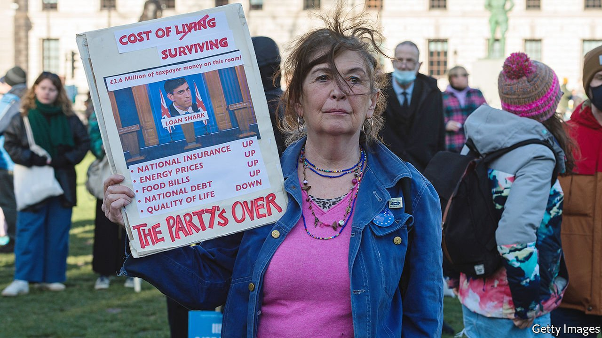

###### Twists and turns

# Higher inflation is raising the cost of servicing Britain’s government debt 

##### The overall effect on the public finances is complicated 

 

> Mar 12th 2022 

AS CONFLICT IN Ukraine sends , inflation is set to rise further. Capital Economics, a consultancy, estimates that consumer-price inflation will rise above 8% in April, and will still be above 6% by the end of the year. Faced with the sharpest fall in household living standards since the mid-1970s, Rishi Sunak, the chancellor, is being asked to dole out relief. But anyone expecting largesse will probably be disappointed. Mr Sunak is anxious about inflation increasing government spending on debt interest, and in no mood to splurge.

The cost of servicing the government’s debt is indeed rising sharply, as over a fifth of the total is linked to retail-price inflation. (That index tends to increase slightly more quickly than consumer-price inflation.) In October 2021 the Office for Budget Responsibility (OBR), a fiscal watchdog, predicted that spending on debt interest would be £3.6bn ($4.8bn) in January. In fact it was £6.1bn. Although the share of inflation-linked debt has stayed roughly steady since the mid-2000s, the surging stock means that rising inflation now translates into a larger cash cost.


In ordinary times, this would not be a big problem for the chancellor. Inflationary surprises do indeed push up debt-interest spending. But as the real value of government debt falls, they should also produce a capital gain. Inflation-linked debt will dampen, but not reverse, this effect. Meanwhile inflation can increase wages and thus the tax base, while spending on benefits and public services lag behind. Last October, for example, Mr Sunak fixed departmental budgets in cash terms for the next three years. And next month government-welfare payments (including pensions) will increase by just 3.1%, last September’s inflation reading.

Unfortunately, today’s inflationary surge will be more complicated in its effects. In October 2021 the OBR said that inflation that fed through to wages (which are tax-rich) could reduce borrowing over the medium term, but not if it merely reflected higher costs for businesses, with limited effects on the tax base. Ruth Gregory of Capital Economics warns that current inflation may be the “wrong type”, and largely to do with utility bills. These are subject to a value-added tax rate of 5%, much lower than the standard 20%, which limits the extra tax revenue raised. And pricier energy could dampen consumer spending on other things, crimp industrial production and squeeze the economy—not generally good for the public finances.

Interest-rate setters at the Bank of England are determined to stop higher inflation from becoming entrenched, and so are in the process of raising interest rates. In the long run, of course, their commitment to keeping inflation low should contain the government’s borrowing costs. But the more immediate effects on the public finances are less flattering. As a response to the financial crisis, from 2009 the bank swept up long-term government bonds and issued short-term bank reserves in their place. The interest rate on the latter was lower than the former, and the Treasury pocketed the difference. But tighter monetary policy reduces that effect and could even reverse it.

For now, there is no need for Mr Sunak to panic. Temporarily high inflation will not be disastrous for the public finances, says Moyeen Islam of Barclays Capital, since spending on debt interest is not particularly high in historical terms, compared with government revenues. Borrowing in the coming financial year will be higher than the OBR predicted last October, Ms Edwards thinks, but the debt-to- GDP ratio will be lower than expected. And although yields on ten-year government debt have risen since a trough in mid-2020, they are still only 1.5%, around the level of 2018 and below anything seen in 1980-2014.

The inflation shock continues. On March 8th Britain joined America in announcing that it would phase out Russian oil imports. Global food and commodity prices have shot up, raising the risk of hoarding and export bans. With each new jolt, it seems increasingly likely that hawks at the Treasury will bow to political pressure and spend to soften the blow for households. The budget of, say, the Ministry of Defence, may be topped up, too. And despite all the jitters about inflation, the public finances should cope. ■

