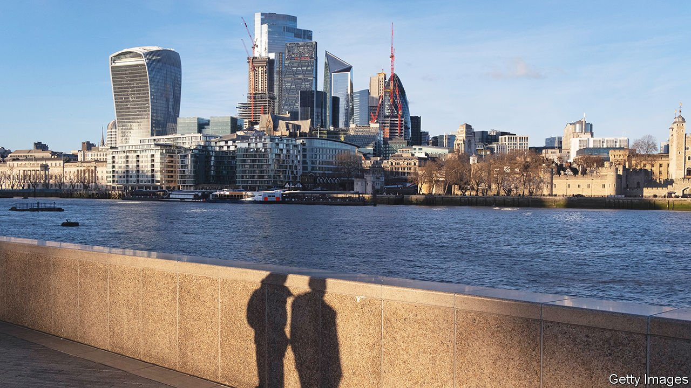
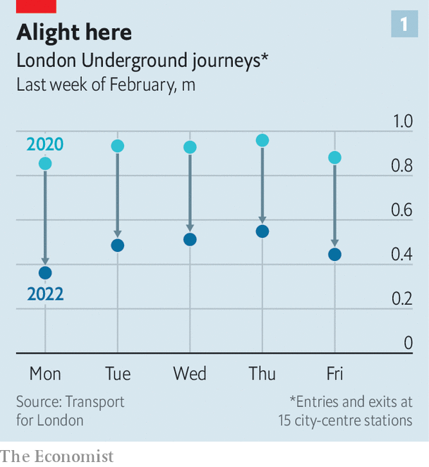
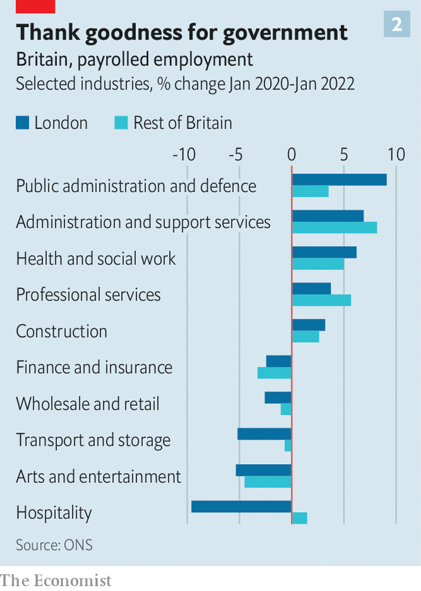

###### No more manic Mondays

# Two years on, Britain’s capital has recovered from covid-19 

##### In some ways, Brexit has helped 

 

> Mar 12th 2022 

TWO YEARS ago, on March 12th 2020, Boris Johnson solemnly told Britons that covid-19 was more dangerous than influenza, and that “many more families are going to lose loved ones before their time”. A week later schools and restaurants were ordered to close. It was the beginning of a long, painful period for the country. For London, it was also an existential crisis.

Much of what had made the capital ever more appealing and successful—the crowding together of clever people, the excellent public-transport network, the restaurants and culture—was drastically curtailed. White-collar workers fell into a routine of Zoom calls and garden offices that kept them away from its centre. The flow of immigrants, upon whom London depends to keep its population growing, almost dried up. But it has recovered over the past few months by doing what great cities do.


The centre of the city remains subdued. The financial district, which was always deserted on weekends, is now quiet much of the time. Many finance and other professional-services workers have become “TWATs”, going into the office on Tuesdays, Wednesdays and Thursdays, at most (see chart 1). “A very small percentage would be happy coming in five days a week,” says Darren Burns of Morgan McKinley, a recruitment agency.

 


Combined with a slump in tourism, this working pattern has devastated shops and restaurants. The Centre for Cities, a think-tank, estimated in January that shops in central London had lost 47 weeks’ worth of sales, more than those anywhere else. According to Visit England, in the two years to December 2021 London went from having the highest hotel-occupancy rate of any British region to the lowest. Tax data show that the number of Londoners employed in the hospitality sector has fallen by 10%. Elsewhere the number rose slightly (see chart 2).

 


But cities are adaptable, as Enrico Moretti, an economist at the University of California, Berkeley, told a gathering of Londoners on March 4th (via video link, of course). As long as they have lots of highly educated people, they can endure the collapse of even large industries. London proves his point. The number of payrolled jobs in London fell more than any other region in the first year of the pandemic, then grew more than anywhere else. In January it passed the pre-covid peak.

London specialises in industries such as the arts and hospitality that were wrecked by the pandemic. But it also specialises in legal services, health care and public administration, which have grown. Although the government boasts of moving civil servants to smaller towns, the number in the capital rose by more than 10,000 in the year to March 2021. The hurried hiring induced by Brexit has been a boon for London. The Department for International Trade, which was created in 2016, had 2,690 employees last March, all but 370 in London.

People continue to move to the capital. Rents for London homes fell early in the pandemic, largely because many landlords who had rented by the week to business travellers and tourists dumped their properties on the market. Rents have rebounded as the excess is mopped up. Zoopla, a listings service, says that the number of rental properties per estate agent has fallen from a peak of 30 in July 2020 to just 11—lower than before the pandemic.

Businesses have been less sure-footed. Mat Oakley of Savills, an estate agent, says that many firms are delaying decisions about location as they wait for working habits to settle into a pattern. But those that do move strongly favour Grade A offices—the most appealing kind. In a tight labour market firms must coax, rather than bully, their employees into work. Mr Oakley also believes that workers will be given more space, which will put a brake on office downsizing in response to home-working. They had gradually lost it over the years: in 2018 more than a third of offices in London and south-east England had densities higher than one worker per eight square metres, according to the British Council for Offices.

Coaxing employees back probably also means office jobs will remain concentrated in central London, near public-transport hubs, rather than dispersing to the suburbs. Simon Brown of CBRE, another estate agency, recalls that some people were predicting a decentralisation of offices as a result of the pandemic. “That is not how things have panned out,” he says.

Mr Johnson’s Conservative government has little time for London, a Labour-dominated city that it seems to have written off electorally. Its “levelling up” policies are all about boosting the Midlands and North, and largely overlook the deep poverty that remains in the capital. It has provided only short-term funding for Transport for London, which is struggling with a collapse in revenue from Tube fares, and only after dire warnings that without support, entire lines might have to close.

That neglect could yet harm the city. But one post-Brexit policy shift will favour London. In January 2021 Britain went from an immigration system that favours Europeans to a system that favours the global middle class. People may be allowed to settle if a British employer is prepared to pay them £25,600 ($33,600), or the going rate for their job in the country as a whole. Because London salaries are higher, many are likely to start there. The city used to be by far the most important gateway to Britain. It ought to reclaim that status. ■

Dig deeper

All our stories relating to the pandemic can be found on our . You can also find trackers showing ,  and the virus’s spread across .

