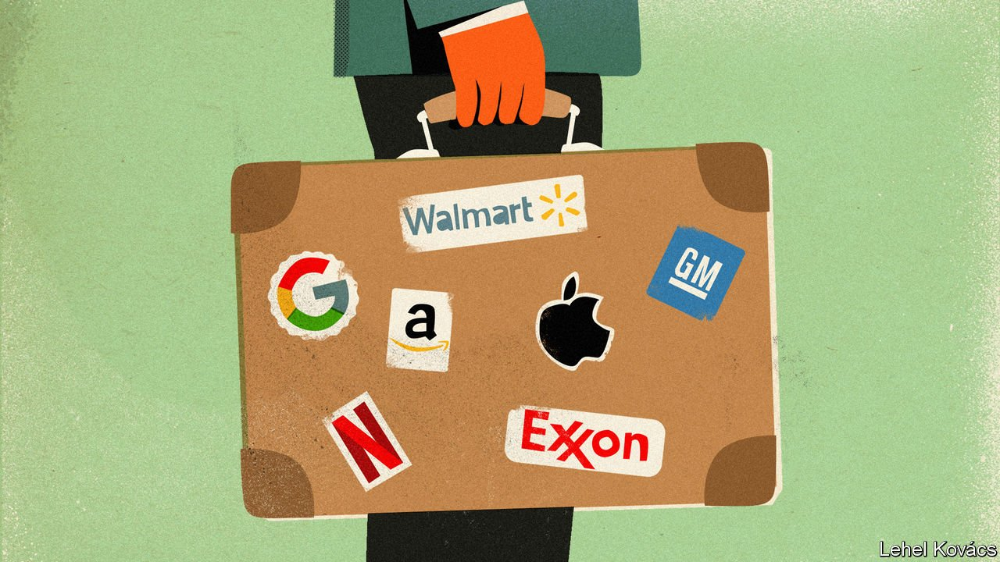

###### The travelling-salesman problem

# Amid Russia’s war, America Inc reckons with the promise and peril of foreign markets 

##### Multinational companies grapple with a fracturing world 

 

> Mar 12th 2022 

THE RUSH from Russia was unlike anything in recent memory. Within days of Vladimir Putin’s invasion of Ukraine, American companies from Apple to Exxon Mobil suspended their business in Russia or said they would abandon it. Companies with factories and other assets in the country are now mulling ways to fend off possible expropriation. American technology giants are embroiled in a battle over misinformation—Russian authorities blocked access to Facebook on March 4th and said they would jail or fine those spreading “fake” news about the war. A day later Visa and Mastercard said they would suspend all operations in Russia.

For companies, the Russia risks are extreme. They also point to a broader phenomenon. American multinational firms find themselves astride a fracturing world. Countries that once used commerce to ease relations with geostrategic competitors increasingly use tariffs and sanctions to undermine perceived adversaries. Politicians from Beijing to Brussels hope industrial policy will protect their economies from external pressure, be it a war, pandemic or geopolitical rivalry. Joe Biden, America’s president, used his state-of-the-union speech on March 1st to extol the merits of protectionism. “Instead of relying on foreign supply chains,” he intoned, “let’s make it in America.”


As the rules of global commerce change, America’s biggest companies are changing, too. They are testing ways to minimise risks and benefit from industrial policy when they can. It is a treacherous endeavour. Since the start of the year the share prices of American firms focused on the domestic market have slumped by 5%, according to Goldman Sachs, a bank. American companies dependent on overseas revenue have seen theirs plunge by nearly three times as much.

Not long ago multinationals seemed spoiled for choice. The collapse of the Berlin Wall in 1989 heralded the entry of the Soviet bloc into the global trading system. On signing the North American Free Trade Agreement in 1993, Bill Clinton predicted an export boom for American business. China’s entry to the World Trade Organisation in 2001 would, boosters said, help America Inc tap China’s huge market and make the Communist Party less mercantilist. For American companies, the world was not just their oyster but a towering platter of fruits de mer.

 


Overseas markets remain essential to many American companies. In 2020 they supplied 28% of the revenue for companies in the S&amp;P 500 index of America’s biggest firms, according to Goldman Sachs. The technology industry is particularly outward facing, earning 58% of revenue abroad. Companies with higher exposure to foreign markets have outperformed the broader stockmarket over the past half-decade (see chart 1). Plenty of firms continue to chase opportunities far from home. Last year low interest rates and ample cash inspired American companies to spend $506bn on foreign mergers and acquisitions, more than twice the sum in 2020 or 2019, according to Dealogic, a data firm. In the first nine months of 2021, the latest figures available, net foreign direct investment had already exceeded the annual total in 2020 (see chart 2).

 


These new investments may do less to boost the bottom line than was the case in the past. In recent years foreign countries have contributed a declining share of corporate earnings, not just because domestic profits have soared but because foreign ones have stagnated. In the third quarter of 2021 all American companies (both listed and unlisted) earned 18% of their profits abroad, compared with 24% three years earlier (see chart 3).

 


Many factors influence a multinational company’s performance abroad, including a country’s recovery from the pandemic and the strength of the dollar. American firms are watching to see if governments advance a global minimum corporate tax—more than 40% of their foreign direct investment is held in tax havens. Most important, perhaps, geopolitical risks can no longer be ignored.

Start with Russia. Companies that have announced they will leave now face the difficult task of actually doing so. ExxonMobil has cautioned that it would be unsafe suddenly to abandon the oil project it operates in Russia’s far east. Some bosses fear that Mr Putin will retaliate against Western companies by seizing their assets in Russia. American companies can restructure to hold their Russian business in a foreign jurisdiction, notes David Pinsky of Covington &amp; Burling, a law firm. That may let them challenge any state takeover in international arbitration, rather than put themselves at the mercy of Russian courts. Some Western firms may worry that their exit could hurt ordinary Russians. The suspension of Visa and Mastercard payments has made it harder for those members of Russia’s middle class who want to flee Mr Putin’s regime to pay for tickets out of the country, for example.

Companies’ problems in China, a more powerful autocracy, are less acute but more consequential in the long term. China’s economy is roughly ten times the size of Russia’s. Tariffs imposed by Donald Trump during his presidency remain in effect—and ineffective. The Economist estimates that more than $100bn in Chinese-made goods may have dodged American tariffs last year. Mr Biden has been slow to put forward a new strategy. He intends to announce a framework for strengthening economic ties with other countries in Asia. However, there is little support among Democrats or Republicans for a multilateral trade deal. For now, many firms find themselves playing by China’s rules, both within the country and beyond it. They face state-backed giants that account for 27% of the world’s top 500 companies by revenue, compared with 19% a decade ago.

Other countries with a history of economic nationalism are dusting off old ideas. India’s prime minister, Narendra Modi, has echoed Mahatma Gandhi’s calls for self-sufficiency and imposed tariffs to support local manufacturers. Mr Modi’s government is designing an open-source platform for e-commerce, in part to challenge Amazon and Walmart’s Flipkart. Mexico’s government, led by Andrés Manuel López Obrador, has bailed out Pemex, the state-owned oil company. Last year an American energy firm, backed by KKR’s private-equity barons, was closed at gunpoint by Mexican authorities.

Even many less nationalistic governments are getting back into the business of shoring up industries deemed crucial to national interests. South Korea, the EU and, with bipartisan backing, America itself want to support domestic production of semiconductors. America’s Senate and House of Representatives have each passed a bill aimed at helping America compete globally. It brims with handouts for research, training and favoured industries (including over $50bn for chipmaking).

The new protectionism includes sticks as well as carrots. The bill passed by the House of Representatives would impose capital controls, authorising the commerce department to block American companies’ investments in China. Europe’s pursuit of “digital sovereignty” seeks to protect citizens’ data, crack down on American tech firms and advance local competitors. Britain attracted one-fifth of American companies’ foreign deals last year, to the dismay of some British politicians. In February Nvidia, an American chip-designer, abandoned a $40bn attempt to buy Arm, a Japanese-owned one based in Britain. American trustbusters feared the combined group’s effect on competition; their British counterparts worried about national security.

American companies are trying to adjust. To reduce reliance on China, companies are increasingly sourcing products and inputs from Taiwan, Thailand and Vietnam. The share of American imports from other low-cost Asian countries climbed from 12.6% in 2018 to 16.2% in 2020, according to Kearney, a consultancy. Orders of robots and other automated systems in America have surpassed their pre-pandemic peak, suggesting that manufacturers are using automation to lower production costs at home as a tight labour market raises wage costs. Last year General Motors followed Tesla’s example and invested in a lithium project in California, to boost supply of a commodity essential to its electric-car strategy. American carmakers are both responding to and emulating China’s state-backed firms, which have long valued security over mere efficiency.

Reconfiguring supply chains is, however, neither straightforward nor cheap. Few countries can match China’s vast pools of skilled workers, notes Stewart Black of INSEAD, a business school, so American companies are loth to abandon it completely. Intel’s boss, Pat Gelsinger, said in January that he was seeking “a duplicity of supply chains available across the globe”. That includes manufacturing in rich countries with higher costs. “You need either redundancy or resiliency built into your systems,” says David Kostin of Goldman Sachs. The alternative is to keep higher inventories, which makes for a less efficient use of working capital.

Companies would, of course, happily accept government largesse in exchange for investments. But handouts are not the only thing that determines investment decisions. And politicians are sending mixed signals. Mr Biden has highlighted the need to secure critical minerals, while doing little to help companies obtain them. Mr Gelsinger, a special guest of Mr Biden’s at the state-of-the-union address, looked on awkwardly as the president said Intel would quintuple a planned investment in Ohio, to $100bn, if only Congress would authorise more subsidies.

Many European politicians likewise pair industrial ambition with a propensity to argue about it. In February the EU unveiled a plan to subsidise semiconductor manufacturing, but may not come up with the €43bn ($47bn) to do so, since much of the money would have to come from member states and the private sector. They are also making life harder for American firms—though not yet hard enough for the companies to up sticks. To comply with French rules for cloud-computing providers, for example, last year Google said it would form a joint venture with a local company. This year Google agreed to pay French publishers for publishing snippets of news. Amazon and Walmart are so far sticking it out in India’s e-commerce market, despite continued lawsuits, shifting regulations and no profits.

China shows just how delicate this balancing act can get. Some companies manage it skilfully. Take Honeywell, an American conglomerate with a sprawling business in China. It continues to produce and sell avionics to Chinese customers, points out Mr Black, even though aviation is a sector in which China plans to promote domestic champions and become self-reliant. Specialising in complex technology that serves China’s broader goals helps: Honeywell provides navigation systems for the COMAC C919, a narrow-body jetliner that China hopes will compete against the Airbus A320 and the Boeing 737.

Businesses less adroit at the high-wire become contortionists instead. In Russia most American tech firms have beaten only a partial retreat. To abide by Chinese cyber-security laws, Apple stores and shares iPhone users’ data with a state-backed company. Since 2018 American firms have all but stopped challenging patent infringement in Chinese courts, according to cases tracked by Rouse, a consultancy specialising in intellectual property. That is not because infringement has stopped, reckons Doug Clark of Rouse. Rather, heightened tension may have made American firms wary of retaliation. In China, says Jue Wang of Bain, another consultancy, firms are mapping out ways to respond to geopolitical risks or intensified support for state champions. As the 1990s dream of a single integrated global market shatters, firms in America, and everywhere else, face a brutal adjustment. ■


