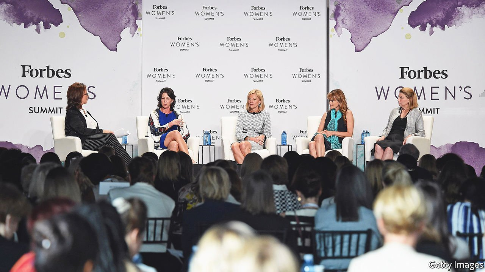
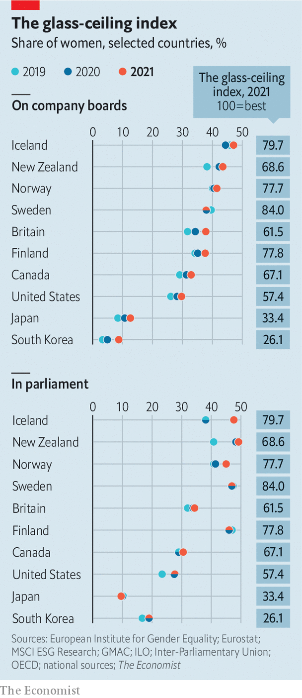

###### The glass-ceiling index

# How the pandemic has affected working women 

##### More women are climbing the corporate ladder. But more are also dropping off it 

 

> Mar 12th 2022 

WOMEN IN BUSINESS have broken three records of late. The number of female bosses at the helm of Fortune 500 companies in America is at an all-time high of 41. In 2021 CVS Health, the country’s fourth-biggest firm by revenue, became the largest to be run by a woman, Karen Lynch (pictured). And for the first time, two giant businesses—Walgreens Boots Alliance, another chemist, and TIAA, a financial-services firm—are run by black women.

In America and other well-off places businesswomen are making strides, according to The Economist’s , an annual snapshot of female empowerment. Their share of board seats is rising in most places (though it has dipped since 2019 in progressive Sweden). Female boardroom representation surged in the Netherlands and Germany after they introduced mandatory quotas. But laws aren’t everything. The British government’s voluntary targets have also boosted the share of women on the boards of FTSE 100 companies, from 12.5% a decade ago to nearly 40%. Investors who care about environmental, social and governance factors are increasingly pressing firms to treat male and female employees equally.


 


Still, businesswomen have a long way to go before they catch up with their male counterparts, especially in the upper reaches of corporate hierarchies, and in some respects trail their female colleagues in politics (see chart). Men still occupy more than two in three boardroom seats in America. In South Korea, they hog more than nine in ten. Women continue to earn less than their male colleagues (never mind that girls outperform boys at school across the OECD, a club of mostly rich countries). In America outcomes are worse still for women of colour, who make less than white women and are even more under represented in senior roles.

More troubling still, too many women are dropping off the corporate ladder altogether. Although remote work made it easier for some women to combine work with family chores (still performed mostly by mothers and wives), the pandemic has pushed a disproportionate number of them out of the workforce. Women’s labour-force participation in OECD countries declined from 65% before covid-19 first hit to 63.8% a year later. Stymying female advancement may be yet another insidious consequence of the virus. ■

For more expert analysis of the biggest stories in economics, business and markets, , our weekly newsletter.

