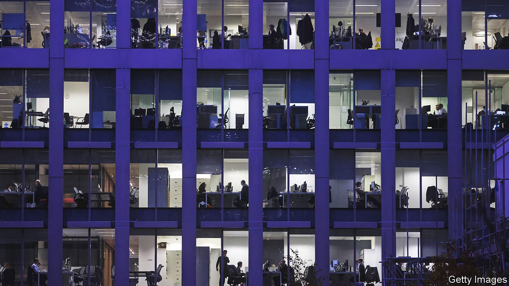
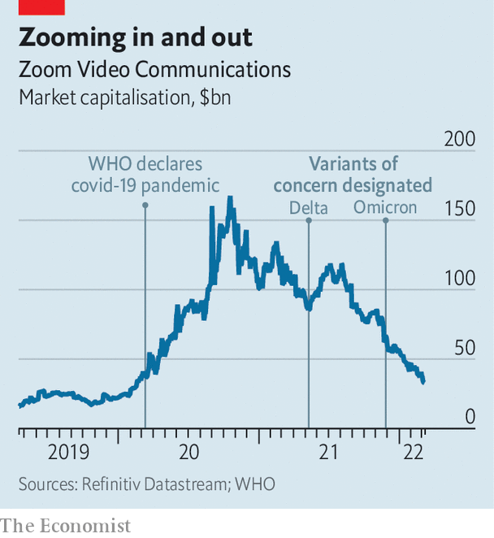

###### Work life in balance

# Is hybrid work the worst of both worlds? 

##### Evidence is piling up that it might not be 

 

> Mar 12th 2022 

AFTER SEVERAL false starts, office workers are returning to their desks—for good this time, employers hope. As covid-19 restrictions are scaled back, . Financial giants such Wells Fargo have joined Wall Street titans such as JPMorgan Chase and Morgan Stanley in urging people back to the office. The great return is afoot in big tech, too. Meta and Microsoft are asking employees to return by late March. Most big Silicon Valley campuses will be fuller from April. Many bosses share the sentiment of James Gorman, Morgan Stanley’s chief executive: if you can eat out, you can come to the office.

For purveyors of remote-working tech, the gradual unwinding of the grand work-from-home experiment is already proving rough. Slack, a corporate-chat app owned by Salesforce, a software giant, projects slowing sales growth to 20% in the next quarter, year on year, down from 50% at the height of the pandemic. In February Zoom reported that growth had slowed globally, with revenues in Europe, the Middle East and Africa down by 9%, compared with a year earlier, and the number of its video-conferencing clients had declined relative to the previous quarter. Its market value has sunk as a result (see chart).


 


The return to the office will be no picnic for employers, either. Most are scrambling to figure out what the future of work will look like. For many, the most pressing question is: how hybrid will that future be? In the short run, almost certainly pretty hybrid. Apple is bringing staff back to the office one day a week to start. By May 23rd, the iPhone-maker will require them to come in three days a week. Citigroup, HSBC and Standard Chartered let their bankers work from home on some days.

That seems only natural. Combining office and home toil appeared to do wonders for work-life balance. And on the face of it, the past two years have shown that people can work well from anywhere, says Despina Katsikakis of Cushman &amp; Wakefield, a property consultancy. Productivity, collaboration and focus seem to have held up.

The problem, says Ms Katsikakis, is that “all of the other elements are suffering.” In one global survey of more than 600 company leaders and human-resources professionals, for example, more than 80% responded that hybrid set-ups were emotionally exhausting for employees. Many ringing endorsements of it made by bosses and workers in mid-2021 turned into deep reservations just a few months later. As more people return to the office, concerns about hybridisation are likely to become ever more acute. Rather than being the best of both worlds, is hybrid work really a rotten compromise?

The hybrid workplace is failing to live up to expectations in a number of ways. For one thing, it is no substitute for the buzz and the chatter of the pre-pandemic office. Many people hanker after the socialising, camaraderie and shared experience, even if getting used to it again may take time. Even small amounts of remote work can have a big impact on the frequency of face-to-face interactions in the office. By one estimate, spending an average of three days each week in the office can limit encounters between any two workers by 64% compared with pre-pandemic norms. The gap widens to 84% in potential interactions for those in the office two days a week.

As offices fill up, workers who turn up in person may therefore forge closer bonds with their teams and company leaders than remote ones. Proximity bias—the subconscious tendency to value and reward physical presence—may then disadvantage women, minorities and parents of young children, who are keener on home working than other groups.

A related drawback is the decline in casual encounters outside an employee’s inner circle. In the 1970s Thomas Allen, a management scholar, discovered that communication between office workers dropped off exponentially with distance between their desks; those on separate floors or in separate buildings almost never spoke. A study of more than 60,000 employees at Microsoft, a tech giant, in the first half of 2020 showed that virtual workers, too, were less likely to connect with people they were not already close to.

Before the pandemic many companies were going to great lengths to overcome the “Allen curve” and engineer serendipity. Google, which credits spontaneous chats for products such as Gmail and Street View, designed its Silicon Valley headquarters to ensure that any one Googler could reach any other by walking no more than two and a half minutes. Bathrooms at the headquarters for Pixar, an animation studio co-founded by Steve Jobs, Apple’s late boss, were located in the central atrium so that people from different teams would cross paths as they heeded nature’s call.

Some managers have tried to boost connections in the hybrid world by scheduling more virtual meetings, sending more emails or firing off more instant messages. This, though, leaves workers feeling drained as a result of virtual overload. Video calls leave people feeling tired and uneasy. That, in turn, makes them likelier to avoid social interaction, without quite knowing why, according to researchers at Stanford University. (Possible reasons include excessive eye contact, which human brains associate with either conflict or mating; staring at yourself, which can lead to feelings of insecurity; or the difficulty of interpreting non-verbal cues on screen.) Electronic communication limits physical movement, which impairs cognitive performance. And constant chat notifications are a distraction.

Providers of virtual workspaces believe that these shortcomings can be fixed with better technology. Microsoft’s Outlook platform now allows employers to tailor their employees’ scheduling settings by inserting breaks between video calls and, the tech giant claims, helps bosses spot underlings at risk of burnout. It even offers a “virtual commute” for those hybrid workers who struggle to separate work and home life. Users are reminded to wrap up their tasks, prepare for the next day, log their emotions and unwind with Headspace, a meditation app. To make online communication more seamless and less exhausting, Zoom has launched a digital whiteboard, real-time automated translations and desk-phone software.

Not all employers are convinced. Some cannot reinstate pre-covid working patterns fast enough. Wall Street is the prime example. Blackstone, a private-equity firm, has asked key staff to return to the office full-time. Jamie Dimon, chief executive of JPMorgan Chase, has argued that remote working kills creativity, hurts new employees and slows down decision-making. Fears that forcing employees back to the office will drive them away may be overblown, bankers say. Mr Gorman has reported that Morgan Stanley received about 500,000 job applications last year despite its strict return-to-work policy.

Other companies are dealing with the pitfalls of hybridisation by going even more remote. Dropbox, a cloud-storage firm, is adopting a “virtual first” approach to avoid the problem of remote workers becoming second-class citizens (though it maintains collaborative physical spaces where workers can meet in person). Other technology companies, from Robinhood to Shopify and Spotify, have gone largely virtual for similar reasons.

Hybrid work’s flaws notwithstanding, most companies will fall somewhere between those two extremes, hoping to strike a balance between the convenience of remote work and the camaraderie of the office. Some may even succeed. But in trying to win over both sides of the debate, many risk satisfying neither. ■


All our stories relating to the pandemic can be found on our . You can also find trackers showing ,  and the virus’s spread across .

