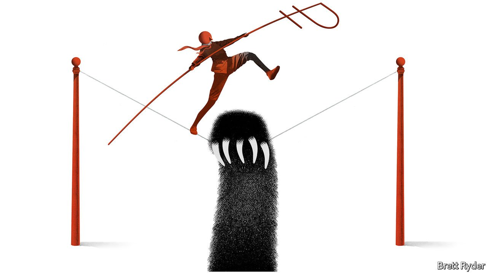

###### Schumpeter

# It’s not easy being an oligarch 

##### What makes you a plutocrat can also bring you down 

 

> Mar 12th 2022 

RUSSIA IS KNOWN for its trapeze artists. Few have mastered the art as well as Vladimir Potanin, Russia’s richest businessman, a stocky 61-year-old with a fortune of about $23bn. Born into the Soviet nomenklatura, he survived the fall of communism and then played a role in designing Boris Yeltsin’s “loans for shares” scheme, through which Russia’s late president hoped to put the country’s assets in private hands. Mr Potanin used this scheme to take ownership of natural resources. He is one of only a few Yeltsin-era oligarchs to have thrived under Vladimir Putin; the two are ice-hockey chums. He retains the biggest stake in Norilsk Nickel, one of the world’s largest nickel and palladium producers, though for years he and fellow moguls squabbled over its ownership. Unlike other Kremlin-linked oligarchs, neither he nor his business is subject to Western sanctions levied after Russia invaded Ukraine. But the war has cost him. His wealth has fallen by about a quarter this year, even as the prices of nickel and palladium have soared.

Such is life for tycoons in an increasingly tyrannical world. It is one of the strange features of globalisation that autocracies, such as Russia and China, are breeding grounds for billionaires. For a while, Moscow minted more of them than any other city on Earth. Now three Chinese cities, Beijing, Shanghai and Shenzhen, outstrip liberal honeypots like New York. The collapse of the Soviet Union and the opening up of communist China have done as much to spur a new gilded age for the super-rich as all the technological wizardry of Silicon Valley. The early years of freewheeling capitalism in both Russia and China unleashed a shift in wealth—both from genuine enterprise and the transfer of public assets into private hands—perhaps unparalleled in human history.


And yet such fortunes can fall as fast as they rise. The same cocktail of opportunism and risk that generates the bonanzas also makes them vulnerable. That is the biggest lesson from the $100bn or so that the Bloomberg Billionaires Index reckons the top 20 Russian ultra-rich have lost since the start of the year. But it is not unique to Russia. Tycoons in China, subject to the whim of President Xi Jinping, would have similarly bruising tales to tell were they not, like their Russian counterparts, forced to stay silent. The same is true of Saudi billionaires locked up by Muhammad bin Salman, the kingdom’s crown prince, in late 2017.

The original sin of these regimes is the fluid laws—or sheer lawlessness—that existed when market forces were unleashed. In Russia’s case, it started with the privatisations of the mid-1990s in which assets like Norilsk Nickel, based in a former gulag in the Russian Arctic, were auctioned for a song. The first-generation oligarchs wielded influence in the Kremlin until Mr Putin changed tack. Under him, a new wave of tycoons were given lucrative state contracts. The deal was that as long as they stayed out of politics, the Kremlin would keep out of their hair. Mr Putin, though, keeps a heavy cudgel over their heads.

In China, Rupert Hoogewerf of the Hurun Report, a publisher of global rich lists, recalls the “five colours” reportedly used in the 1990s to describe the provenance of plutocratic wealth: red for the Communist Party, green for the army, blue for customs, white for drugs, black for the black market. After that, says Minxin Pei, the Chinese-American author of “China’s Crony Capitalism”, dirty money turned into easy money. Property developers received land and access to credit from the state. China’s self-made tech tycoons, such as Jack Ma of Alibaba and (unrelated) Pony Ma of Tencent, also took advantage of non-existent regulation and used their own skill to forge a dazzling digital duopoly. When an antitrust blitzkrieg started last year, it may have been economically justified. But it had the hallmarks of a political vendetta, too.

To sidestep the autocrats, the plutocrats sometimes try to win the public’s support. That is a dangerous gambit. Mikhail Khodorkovsky, a former oligarch, spent a decade behind bars from 2003, ostensibly for tax fraud. His main crime was daring to contemplate running against Mr Putin for president. Alibaba’s Mr Ma made the mistake of acquiring rock-star status just as Mr Xi’s regime was becoming more paranoid. In its eyes, the tech sector had strayed too far from core Communist Party values. Its fintech aspirations represented a threat to state-owned banks. Most sinful of all, it represented a rival source of power. So Mr Ma was rebuked by the party and is now rarely seen in public.

Another potential escape route is overseas. For years, a global supporters club of lawyers, flacks and other hangers-on have helped Russia’s oligarchs hide their wealth in offshore tax shelters and fluff up their reputations. While Russian firms flocked to the London Stock Exchange, Chinese ones preferred New York and Hong Kong, often using complex financial structures that enabled them to get around China’s curbs on foreign capital.

But geopolitics has made that tougher, too. The West’s response to Russia’s aggression is to shine a spotlight on the oligarchs’ hidden wealth, including yachts, homes and private jets. The sanctions will hurt some of them, but so may a growing aversion to touching anything Russian. China has witnessed the same assault on Huawei, its telecoms-equipment giant. It leaves the plutocrats few alternatives than to cosy up to the rulers back home—whatever the cost.

Belle Époque or Apocalypse Now?

None of this looks likely to end the gilded age. According to Hurun, its upcoming global rich list will contain 200 more billionaires than a year ago, and reach a new record. Chinese ones are multiplying. Many, though, are ditching ostentation for a new trait: humility. “In China, the very top entrepreneurs are almost never in the public eye,” says Mr Hoogewerf. Mr Potanin’s survival instinct is also to keep his head down. When interviewed by the Financial Times in 2018, he was living in his own country club outside Moscow. Hiding away, he professed. “From everybody.” ■

For more expert analysis of the biggest stories in economics, business and markets, , our weekly newsletter.

Read more from Schumpeter, our columnist on global business:

 (Mar 5th)

 (Feb 26th)

 (Feb 19th)

