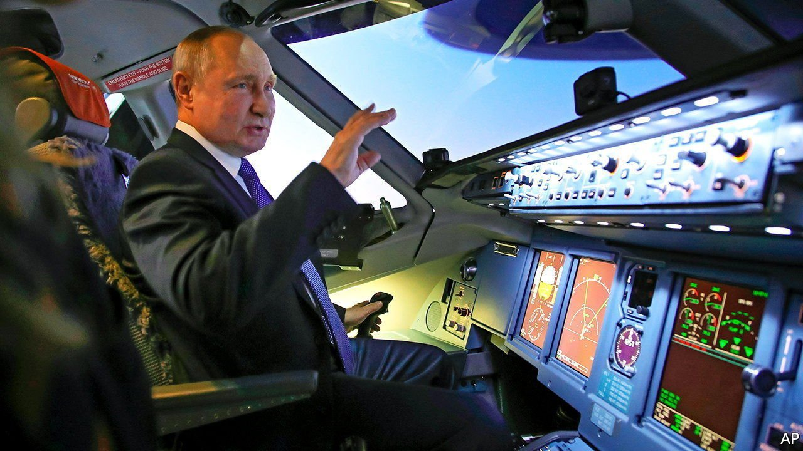
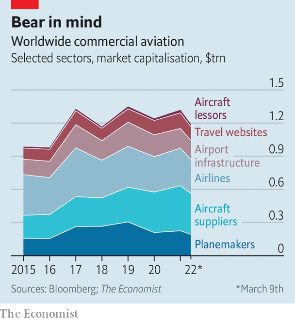

###### Flight risk

# Sanctions on Russian aviation are a burden for Western firms 

##### And could prove devastating for Aeroflot and other Russian airlines 

 

> Mar 12th 2022 

AS VLADIMIR PUTIN’S troops continued to lay waste to Ukraine on March 5th, Russia’s president surrounded himself with bouquet-wielding young women training as cabin crew for Aeroflot, the state-controlled airline. Aviation is vital for connecting the vast country. The uneasy grins on the faces of the ladies to whom he explained that Western sanctions were an act of war hinted that they understood the implications for their long-term career prospects. The same day that Mr Putin met its trainees, Aeroflot suspended all its international flights. By then the carrier had few places to fly. Britain was the first to ban Russian planes in reaction to the invasion of Ukraine. They are now also barred from skies above America, Canada, the EU and several other places. Western carriers, meanwhile, are no longer welcome in Russia airspace.

Anti-aircraft warfare


The direct impact on non-Russian airlines is “no big deal”, says Keith McMullan of Aviation Strategy, a consultancy. Flights to Mr Putin’s realm are a sliver of business for the world’s large airline groups. The closure of Russian airspace is an inconvenience for European ones serving north-east Asia, which will have to divert flights to more southerly routes, adding up to two hours to flying time to Beijing. But with China still in lockdown such flights are not as numerous as before. It is the knock-on effects of Russia’s invasion that investors in the global airline-industrial complex worry about. Rather than continue their rebound as covid clouds clear, airlines, airport operators, travel websites, planemakers, other suppliers and aircraft lessors have lost nearly $120bn in combined market value so far this year (see chart).

 


The most immediate problem is the . The cost of crude, already near a 14-year high, surged again on March 8th after America announced a ban on imports from Russia, the world’s third-biggest producer. IATA, an industry body, forecast in October that airlines’ fuel bill in 2022 would hit $132bn, accounting for nearly 20% of operating expenses, with a barrel of Brent at $67. It now costs nearly twice as much. Airline shares have lost around 15% of their value in the past two weeks. Those carriers that do not hedge fuel costs were hit hardest; some have already added surcharges on tickets.

Other Western measures will also take a toll. America and the EU have targeted Russian aviation by banning the sale or purchase of planes and parts, financing and technical assistance. Britain joined in on March 9th. Russia is not a huge market for the world’s planemaking duopoly of Airbus and Boeing. Only 62 jets out of the their combined order book of 12,000 are destined for the country. But even a relatively small knock is unwelcome as the industry tries to lift itself up after two years of covid-19 upheaval.

Moreover, the planemakers may, like other Western businesses, feel the need to distance themselves from Russia in other ways. Boeing has already ended a contract to acquire Russian titanium for its planes; finding alternative supplies may be a problem given that Russia is the metal’s third-biggest producer. Russia’s big role in other commodities markets, from nickel to palladium, may also ripple through aero space supply chains.

Another collateral victim of Russia’s aggression, and the West’s response to it, is the aircraft-leasing industry. Around half of Russia’s fleet is owned by non-Russian lessors. Those 500 or so planes are valued at some $10bn, according to IBA, a consultancy. To comply with Western sanctions, such leases must be terminated by March 28th. After that, in theory, Russian airlines must return the jets to their owners. Repossession is, however, made considerably harder by the closure of Russian airspace and the difficulty of getting the repo men into Russia. The fact that no planes are leaving the country hints at a possibility of expropriation.

As with planemakers, the lessors’ business with Russia is not huge. AerCap, the world’s biggest such firm with the highest exposure to Russia, leases 5% of its fleet by value to Russian carriers. And although Mr Putin may force state-run Aeroflot to deny Western lessors their planes, private carriers may prefer to hand theirs back, lest they be frozen out of aircraft financing for years after the crisis abates. In any case, leasing firms insist they are insured against this type of loss. Investors are not so sure. AerCap’s share price dropped by nearly a third in the week after the sanctions were announced (though they have rebounded a bit since).

All these problems, though real, pale in comparison with the woes of Russia’s airlines. Its vast domestic market, accounting for 4.5% of global demand, was one of the most resilient throughout the pandemic. Last year it exceeded pre-covid levels. Now Russian carriers are flying on borrowed time. Even if the lessors do not reclaim their aircraft, other sanctions prevent Western firms from providing parts or technical support. Two-thirds of planes in Russia come from Airbus and Boeing. The Sukhoi Superjet, a Russian-made regional jet, has a Western engine and avionics. Cannibalising, engineering or acquiring uncertified spares from dodgy third parties may work for a while but is unsustainable in the longer run.

Regular maintenance to accepted international standards may soon become impossible, too. So will insuring Russian planes, most of which are covered through Lloyd’s of London, a marketplace for brokers and underwriters. Even booking and payment systems, mostly outsourced to Western technology firms, may no longer function. It is back to “spreadsheets and pencils”, says Andrew Charlton of Aviation Advocacy, another consultancy. In just a few months Russian airlines could grind to a halt, says Mr McMullan. Before then passengers may have to board planes that have missed maintenance, are fitted with suspect spares and are uninsured. Many may opt for the train instead. ■


