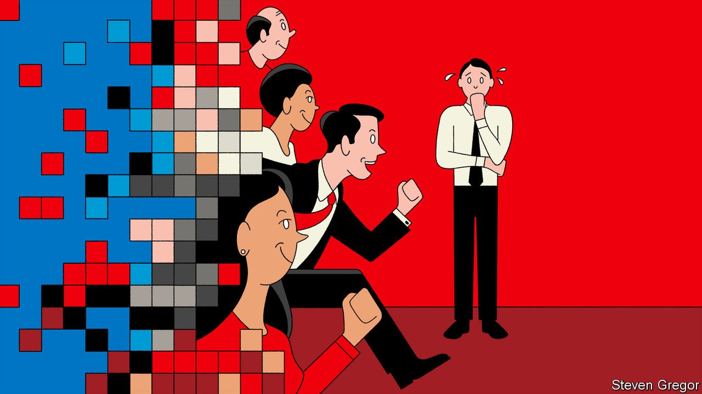

###### Bartleby

# The return of the crowded office 

##### It will take time to readjust to the presence of real-life colleagues 

 

> Mar 12th 2022 

TWO YEARS ago this month the era of remote working abruptly began. As the first wave of covid-19 cases prompted lockdowns in the West, white-collar workers had to get used to new ways of conducting themselves. Unmuting was not yet a reflex movement, Zoom fatigue not yet a common affliction.

Now another era is getting under way. Unless a new variant of the virus again intervenes, more and more workers will go to the office for at least a portion of their working week. Guidance to work from home was lifted in Britain in January. American Express expects to see people back in its offices in America from March 15th; employees of Citigroup, Google and Apple have been given return dates of March 21st, April 4th and April 11th, respectively.


Another period of adjustment is unfolding, and not just to the novel demands of . People also have to get used to the physical reality of once again being surrounded by three-dimensional colleagues—people who gaze, chatter, slurp, wheeze, clatter, rustle and fidget.

Some readjustments are clear: wearing trousers is a requirement, not a lifestyle choice. Others are less obvious. Making eye contact with someone else’s actual eyes is a skill that needs to be relearned as the office fills up again. Too little, and you come across as uninterested. Too much, and you seem uncomfortably intense. A study in 2016 found that three seconds of mutual eye contact was about right for the average person (just don’t count out loud).

Small talk is another lost skill. You do not have to politely nod and smile at people when working from home. Asking after the family is just weird when you are speaking to your spouse and children. By contrast, a crowded office demands endless casual pleasantries, whether bumping into someone in the corridor and clustering at the coffee machine or holding doors open and waiting for the lift. There is a pay-off to platitudes: researchers from Rutgers University and the University of Exeter found in 2020 that small talk enhanced workers’ sense of well-being and connectedness. But chatting about nothing requires practice, even for extroverts.

Meetings are entirely different in the offline world, in good ways and bad. The good includes greater spontaneity and the fact that no one freezes mid-speech, their face contorted into a hideous rictus. The bad is that many habits developed at home must quickly be unlearned upon returning to the office.

You cannot openly do other work: tapping away on a laptop while someone drones on is perfectly acceptable on Zoom, but not in the same room. You cannot magically disguise yourself from view by turning off a camera. Any eye-rolling you do will be seen; headbanging the table in exasperation will be noticed.

In theory you could ask all the attendees of a real-life meeting to come with you while you root around in a cupboard for a biscuit, but it is so much simpler to go foraging when you are Zooming. You cannot leave pointless meetings as easily in the office, either. In the virtual world, salvation is just a click and an insincere-apology-in-the-chat away; in the physical world you have to move chairs, mutter excuses and negotiate the door handle. Exit, pursued by a stare.

The realities of corporeal colleagues show up in other ways, too. Take seating. Rarely do you amble into your own living room to find Malcolm from marketing there. In newly crowded offices you will be competing with him to book a desk; worse, he may be your neighbour. Heating is another example. Women are more productive at temperatures warmer than those men prefer, but they are less likely to have control of the thermostat in the office than in their homes.

And this is to say nothing of the underlying concerns that drove people to vacate their offices in the first place—the infectiousness and virulence of covid-19. Company by company, new norms of physical interaction will emerge and change over the coming months. Handshake, fistbump or simple “hello”? Masks on, off or slung under the chin, ready to be deployed at a moment’s notice? Socially distanced or just social?

The start of the hybrid era is good news. It means that the pandemic has moved into a new and less threatening phase. Companies can now try to blend the benefits of in-person interaction with the flexibility to work remotely that many employees crave. But the proximity of people will still take time to get used to again.

Read more from Bartleby, our columnist on management and work:

 (Mar 5th)

 (Feb 26th) (Feb 19th)

All our stories relating to the pandemic can be found on our . You can also find trackers showing ,  and the virus’s spread across .

