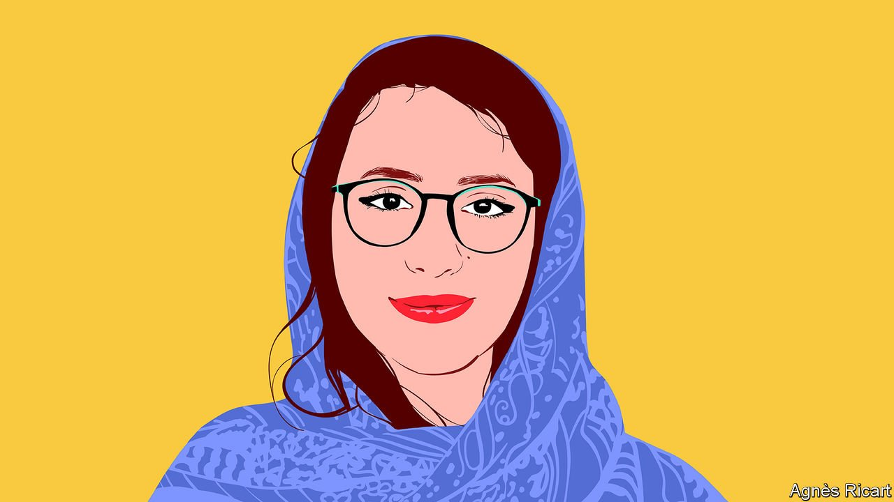

###### International Women’s Day

# Freshta Karim on how to change the lives of Afghanistan’s women 

##### The children’s rights activist writes at the invitation of Malala Yousafzai 

 

> Mar 8th 2022 

THIS IS THE first International Women’s Day in years that I will not be home in Afghanistan. I am writing to mark it instead from the Bodleian Library at the University of Oxford. I am here not as a scholar, but as an exiled alumna, exhausted by conflict and violence, seeking solace. It reminds me of the chain of mobile libraries named “Charmaghz”' which I run in Kabul. Charmaghz means walnut in Farsi; it represents the brain and the importance of fostering critical thinking. Children visit our libraries with excitement, eager to dive into new stories and imagine a world beyond war. There is not a day when I don’t fear for their future.

In Afghanistan, 97% of the population is at risk of dropping below the poverty line according to the United Nations Development Programme. Our institutions and systems—from education to health care to banking—are on the verge of collapse, after two decades of progress. There is still a de facto ban on girls’ secondary education; women’s right to work in public office as civil servants or politicians has been suspended. The world paid attention to the immediate details of the Taliban’s victory in Afghanistan. But there is too little discussion about what happened afterwards. We need political stability, economic recovery and respect for human rights.


Afghan women are making brave decisions every day. They are leading a non-violent movement and at protests shout: “Education, work, freedom!” Some have been detained; others are now missing. Yet the protests continue. Other young women are sharing their stories anonymously in news outlets and online, as Malala Yousafzai did many years ago.

Realising every girl’s right to education is vital to the future of Afghanistan. Without it the country will dive deeper into poverty and a never-ending cycle of war and oppression. If we want a better future, we must advocate for education for girls and women’s right to work. Banning them is not only a violation of their Islamic and human rights, it also has huge economic and developmental costs. Afghanistan is one of the poorest countries in the world. We need educated women to contribute if we hope to thrive. To guarantee these rights and ensure they are upheld in the long term, requires securing peace and obtaining better political representation and greater political stability. Four actions are critical if we are to secure Afghanistan’s future.


First, the Taliban must make good on their promises. On August 17th 2021, the group announced a commitment to women’s right to work, study and participate as active members of society. They should honour this by reopening secondary schools unconditionally to girls, as they have promised, in time for the start of the new school year on March 21st.

If girls’ schools do reopen, the international community should help ensure that education is adequately financed. An estimated $900m is needed to prevent the Afghan education system from collapsing, according to the UN’s Transitional Engagement Framework for Afghanistan. The framework outlines critical tools including community-based education, teacher stipends and cash transfers. Afghanistan’s education system has depended on aid for so long that it cannot be expected to sustain itself during a crisis of this magnitude. And investment in it is worthwhile. Over the past 20 years, aid has supported a ten-fold increase in school enrolments and contributed to a doubling of the female literacy rate between 2011 and 2018. It also facilitated the recruitment and training of over 80,000 new female teachers.

Second, Afghanistan’s economy needs immediate assistance. Afghans don’t want to live on aid for ever. The country’s assets held in foreign banks should be unfrozen and donor governments should find ways to return them to the Afghan people, supporting the economy and the central bank. On February 11th, President Biden’s administration announced an executive order to facilitate access to $3.5bn in Afghan funds for humanitarian aid, but the reminder of the $7bn fund could be awarded to 9/11 victims’ families pending judicial review. But the reserves belong to the Afghan people, not the Taliban or the foreign countries where they are held. International Crisis Group, a global think-tank focused on preventing conflict, has identified a number of ways to ease Afghanistan’s liquidity crisis while keeping reserves out of the hands of the Taliban. These include: releasing and monitoring small amounts of funds to independent technocrats at the central bank; to facilitate auctioning of US dollars and strengthening the Afghan currency; and currency swaps managed by an international entity such as the World Bank or a UN agency. Unfreezing and redirecting Afghanistan’s assets to support the economy and Afghan livelihoods is not only the right move for longer-term recovery—it is also just.

Third, the United Nations needs to create space for dialogue between the Taliban and other political stakeholders. The current political set-up is highly centralised. It favours the Taliban, who represent a narrow section of a single ethnic group. This leaves no space for other ethnic communities, women and former political parties to speak out or influence the country’s politics through non-violent means. To address this, Afghanistan must have a decentralised administrative and political structure. Parts of the Taliban recognise that listening to other voices has advantages for them: it would help them earn greater national legitimacy and international recognition and pave the way for sanctions to be lifted. The UN could therefore use its financial and moral influence to facilitate talks. As a finalist for the European Parliament's Sakharov Prize for Freedom of Thought, I recently joined fellow female Afghan activists in urging the international community not to recognise the Taliban. But this does not mean that we should not engage with them in the interests of promoting human rights and pursuing peace. All stakeholders inside and outside Afghanistan should engage in dialogue and other non-violent paths to end conflict.

Fourth, global leaders should support a process of transitional justice to deal with past atrocities. Since 2001, almost 150,000 Afghans have been killed, including many civilians. Many more Afghan lives were lost in the two decades before that, during the Soviet occupation, civil war and the first Taliban government. Without justice, Afghan people will continue to suffer under a culture of impunity. Afghans see justice as a prerequisite for building a more stable and peaceful society. Mechanisms to encourage it would constitute crucial steps in securing Afghanistan’s future and in breaking the cycle of violence. But they have not yet been taken—and perpetrators have yet to be held to account. All parties should therefore support the establishment of public forums in which victims’ voices can be heard and survivors of the war compensated through projects designed with their input, as we have seen in places such as Guinea. The International Criminal Court investigation is one step in the right direction.

The current dialogue on Afghanistan is focused on providing immediate humanitarian aid and basic rights. But the international community must think long-term and address broader issues of justice, political stability and economic recovery if it is to secure the rights of Afghanistan’s women and girls. How much humanitarian aid can be given, if the country’s economy does not recover? How will girls’ education be sustained if girls’ schools are open but there is no stable political system in place and a continued threat of internal conflict?

It’s time for the international community to be brave if it is to help secure Afghanistan’s future. It holds the diplomatic power to apply pressure, advocate the reopening of schools, finance education and support the recovery of Afghanistan’s economy. Each one of us has the chance to make a difference, too. Amplify the calls of Afghan activists and help us push for an end to this crisis—call for peace, education and equality for women’s rights. It is in our darkest times that we must make the bravest decisions.

_______________

Freshta Karim is a children’s rights activist, adviser to Malala Fund and the founder of , a chain of mobile libraries for children in Afghanistan.


