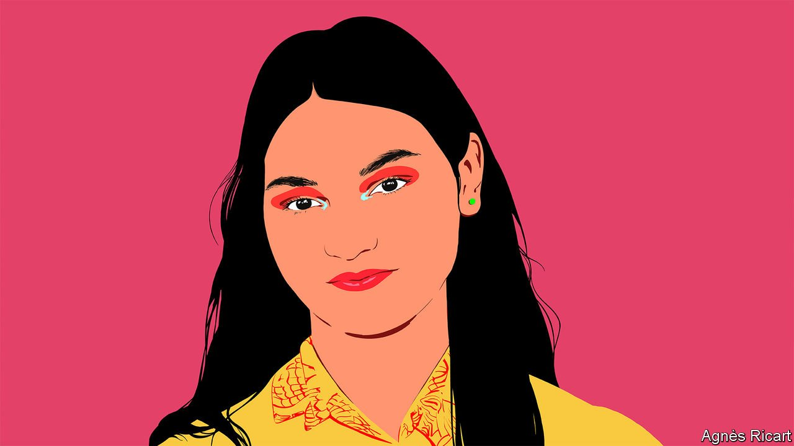

###### International Women’s Day

# Kiara Nirghin on the gender divide in science, technology, engineering and mathematics 

##### The inventor writes at the invitation of Malala Yousafzai 

 

> Mar 8th 2022 

WHEN I WAS 16 years old I had an idea to help South Africa’s drought-plagued crops: a new material created from orange peels and avocado skins that could hold up to 300 times its weight in water. Inspired by waste products from the juice-manufacturing industry, I developed this new superabsorbent polymer after seeing how the water crisis was affecting my country on a month-long road trip with my family. In 2016 I won the Google Science Fair with it.

Using my high school education, online research journals and specialist publications like Scientific American, I was able to come up with my polymer. Not all girls can get access to such materials. Young women and girls around the world are disproportionately discouraged from studying subjects like science, technology, engineering and mathematics (STEM) or pursuing careers in these fields as adults. The gender divide is stark in the workplace. In America men vastly outnumber women majoring in most STEM courses in college and women make up only 28% of the workforce in STEM fields.


Closing this gender divide is key to a better future. Solutions to some of our world’s most pressing problems could be out there in the minds of girls around the world. But if they can’t gain access to a quality education in these fields, the world is never going to know about them. In recent years, I’ve campaigned to close the gender divide in STEM and to encourage girls to study these subjects. What excites me most about this advocacy is that every day I might be helping to beat cancer, combat climate change or design more efficient, low-cost medical imaging devices—all by encouraging other young women to pursue these fields.

In my book “Youth Revolution”, published in 2019, I highlighted that failing to tackle gender inequality in STEM would hinder humanity’s efforts to innovate and solve society’s biggest challenges. The covid-19 pandemic began just a few months later, revealing the urgency of this issue and how gender inequality in STEM has fatal consequences.

Gender-responsive research isn't a new idea, but is definitely lacking in many modern health studies. Proponents argue it helps us to understand susceptibility and to optimise care and results for patients. During the pandemic, research found that to improve care for covid-19 patients, prophylactic and therapeutic studies should include sex-specific design and analyses based on historical disparities between men and women in outcomes of infectious diseases. Yet in a paper in 2020 researchers from institutions including Maastricht University Medical Centre in the Netherlands found that of 30 eligible pharmaceutical studies, none investigated how or why the effects of covid-19 pharmacological treatments varied by sex and a quarter of them included twice as many male participants as female ones.


Interestingly, a large proportion of covid-19 treatment studies specifically excluded pregnant women. Clinical-trial registration sites don’t offer the exact reasons for these exclusions, but it might be due to the perceived risks to pregnant women or their unborn children. This is a fair concern and not an easy one to solve. However, the continuing exclusion of pregnant women from therapeutic trials for covid-19 will result in missed opportunities to identify efficacious and safe treatments to prevent adverse maternal, pregnancy and birth outcomes. Consideration of the risks and benefits of inclusion should not preclude participation of pregnant women in clinical treatment trials.

If more women were part of research teams—just a third of the world’s researchers are women—I believe we would see a greater push for more representative data and female participation in research and treatment trials. This would result in not just fairer, but better scientific solutions. Consider that hip implants are more likely to fail in women than men since such devices are often designed for male bodies rather than female ones. A deep personal concern of mine is making sure that bias does not make its way into algorithms that are increasingly being used for medical purposes.

Health-care professions also suffer from a lack of female leadership. Around the world 73% of health-care executives are men, while women make up 70% of health workers. This lack of female leadership puts women at risk. Less than 20% of female frontline health workers say protective clothing fitted them properly in the pandemic according to a survey conducted in 2021 by the Women in Global Health network, which supports women working in the sector. Women’s health issues are also less likely to secure research funding. More female health-care leaders could also help address the gender pay-gap, improve patient outcomes and stop the cycle of inequality.

In order to achieve gender equality in science we need the support of parents, educators and leaders in order to create a pipeline of female talent into STEM fields. Teachers can help by emphasising the importance of trial-and-error in the classroom. This is more important than ever considering that young girls become interested in STEM subjects around the age of 11 and then quickly lose interest when they are 15, according to a study from 2017 commissioned by Microsoft. More girls than boys experience this dropoff because of social pressure, lack of mentors or access to hands-on learning. The enthusiasm does not return.

Setbacks are central to scientific advancement, but girls are often more cautious about failure than boys. Teaching girls how to use failure is critical to their progress in STEM fields and, later, in their own research projects. Lawmakers should boost funding to develop, or improve, learning opportunities (such as scholarships, grants and clubs) for girls at both the local and national levels. Companies and other organisations should consider offering more special programmes or summer internships for women and girls so they can discover the different career possibilities open in STEM.

Parents can help enormously at home by highlighting role models and their success to both their young daughters and sons. Research has demonstrated that when girls encounter eminent scientific professionals of the same sex, their conceptions of STEM, attitudes towards the fields and motivation to pursue related careers all change for the better. This was certainly true for me. I have admired Susan Wojcicki for years. She was involved in Google’s founding and is now the CEO of YouTube. She was one of the reasons I was so obsessed with using the search engine to find research articles. She was also the reason why I entered the Google Science Fair in the first place.

_______________

Kiara Nirghin is an award-winning inventor, technologist and author.


