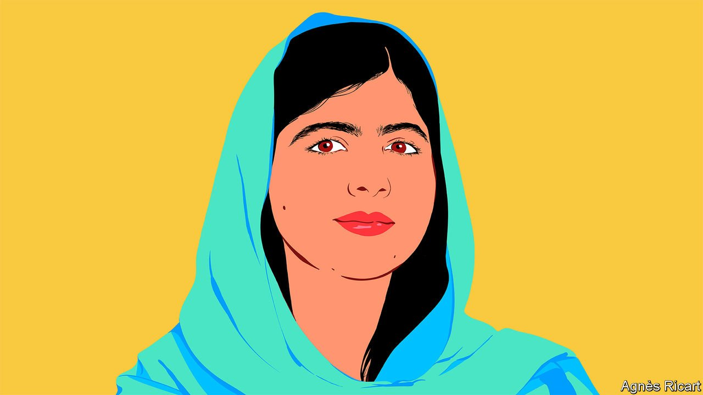

###### International Women’s Day

# Malala Yousafzai explains why girls must be free to learn—and to lead 

##### The Nobel peace-prize laureate is By Invitation’s first guest editor. She introduces her series on girls’ education 

 

> Mar 8th 2022 

YOUNG WOMEN want equal access to education. We want leaders to invest in our future. We also want our perspectives to inform the plans and policies that affect us. In honour of International Women’s Day, I’m excited to collaborate with The Economist to expand my work to amplify young women’s voices as By Invitation’s first guest editor.

I have invited four young women to each contribute a guest essay to By Invitation on issues that are deeply connected to girls’ education: conflict, climate, digital inclusion and discrimination. , an Afghan women’s rights activist, writes about her experience fleeing her home and about the future for Afghanistan’s women and girls. , an inventor from South Africa, considers how the pandemic has widened gender gaps in science and the value of getting more girls involved in technical subjects. , an anti-colourism advocate from Sierra Leone, reflects on the ways in which racism and gender discrimination affect girls’ learning and how teachers can help. , a climate activist from Uganda, calls for an inclusive approach to discussing, teaching and legislating on global environmental issues.


I’ve worked with each of these young experts before. They are friends or advisers, or have written for , a digital publication and newsletter from my organisation Malala Fund. On Assembly, girls share stories of their lives and offer analysis on topics they care about, from climate change and racial justice to inclusive feminism and mental health. I believe the world should hear more from these girls and young women, and give them bigger platforms to speak out.

Young women know all too well how the world fails them. From schools in Nigeria to refugee camps in Iraq or arts workshops in Brazil, the girls I meet around the world always share insightful personal stories and astute critiques of power that inform and influence my campaign for girls’ education through Malala Fund. The essays in my guest series demonstrate that. I hope you will reflect on their perspectives, share them and heed their calls to action. I hope they remind you of what girls and women can contribute when given the tools to succeed—and why we must find a way to ensure every girl can complete 12 years of free, safe and quality education.

In the 25 years since the Beijing Declaration, a landmark UN framework for achieving gender equality, momentum for the rights of women and girls has stalled. Nearly 130m girls are out of school, and I fear we are moving further away from a solution. The pandemic, climate change, racism and inequality are exacerbating the problems girls face. This is ushering in an emergency when it comes to their education. But there is little urgency on these issues.

Since the pandemic started, two-thirds of low-income and lower-middle-income countries have cut education spending. Malala Fund estimates that if dropout rates across these countries increase in the same way as they did in Sierra Leone in the 2014-15 Ebola epidemic, the pandemic could force almost 20m girls aged between 11 and 18 out of school.

Some girls leave school to care for sick loved ones and manage household responsibilities. Others, trying to ease their families’ financial burdens, take low-paying, insecure jobs. There are also girls who get pregnant or marry too young. Some education systems are so underfunded that schools are unable to facilitate remote learning using video-calling platforms. In many places, girls can’t learn from home when schools shut anyway as local gender norms limit their access to technology. A pandemic-response survey Malala Fund conducted in marginalised, low-income communities in Pakistan found that, although access to smartphones was fairly high (60%), girls were almost 40% more likely than boys to say that they never have access to a mobile device. Many of these girls reported being too scared to ask.


This often happens in times of crisis. Governments divert attention and funding away from critical services, such as education, to respond to emergencies. But failing to invest in education only exacerbates and extends these crises. We see this in Afghanistan, where the Taliban has imposed a de facto ban on secondary school for girls. In response to its takeover, high-income countries have cut aid and frozen the country’s assets. With so many people starving and out of work or school, donor countries must increase humanitarian aid, and ensure it supports the education system, too. Young Afghans are not going to be able to help create a future that is peaceful, democratic and sustainable without quality education.

There is also a clear link between climate change and girls’ education. Severe storms or flooding can destroy schools. Droughts can mean school bathrooms lack running water, which makes girls more likely to miss school when they are on their periods. By 2025 climate change will be a contributing factor in preventing at least 12.5m girls from completing their education each year—unless urgent climate action is taken now.

The biggest barrier of all is funding. In 2019, 24 low-income and lower-middle-income countries spent more on outstanding debts than on education. Covid-19 has increased pressures for many countries, limiting government spending on education and on welfare programmes. If the international community works to reduce the debt service burden of lower-income countries owed to private lenders and other governments—set to increase from between $700bn-1trn per year to $2.6trn-3.4trn per year owing to the pandemic—it could free up countries’ own resources to invest more in education.

When my father and I started Malala Fund we knew that accelerating progress for girls’ education would be a collective effort. Our model at Malala Fund was built with this in mind. We understood that local teachers, administrators and activists provide the great insight, innovation and energy needed to remove the barriers that keep girls out of school. A global movement for girls’ education will require all of us to take some initiative and seek diverse perspectives. There’s always more to learn from those with direct experiences. I hope more leaders recognise the limits of their experience and start seeking out girls’ viewpoints.

Girls know how these various global issues affect their lives and their education. That’s why, whether it’s through public awareness, fundraising or community organising, girls are—in big and small ways—finding ways to fill the gaps that leaders overlook.

I often feel this work is well received. When young women speak up, we’re brave. When we succeed, we’re inspiring. Yet our voices, though louder and more lauded than ever, remain sidelined. Our youth and enthusiasm get more attention than our expertise. And it’s rare for leaders to offer substantive responses to our demands.

If we want to live in a more equal future, leaders must prioritise quality education. It prepares students to secure future jobs, think critically, solve problems and advocate for themselves. Educating young women can also help to prevent wars, mitigate the effects of climate change and make economies grow. By offering 12 years of quality education to every girl, lifetime earnings for women could increase by between $15trn and $30trn, according to research by the World Bank and Malala Fund. Women with a primary education earn up to 19% more than those with none; those with a secondary education earn almost twice as much.

The world puts a lot of pressure on young women’s shoulders. We put pressure on ourselves to fight for our futures, too. Right now it feels like no one else will. But it is not girls’ sole responsibility to do so. We should all work together for a safer, more equal world. So despite the odds, we are trying our best. Will you?

_______________

Malala Yousafzai is a girls’ education activist and the co-founder and board chair of Malala Fund. In 2014, she received the Nobel peace prize in recognition of her efforts to see every girl complete 12 years of free, safe, quality education.

Ms Yousafzai 

