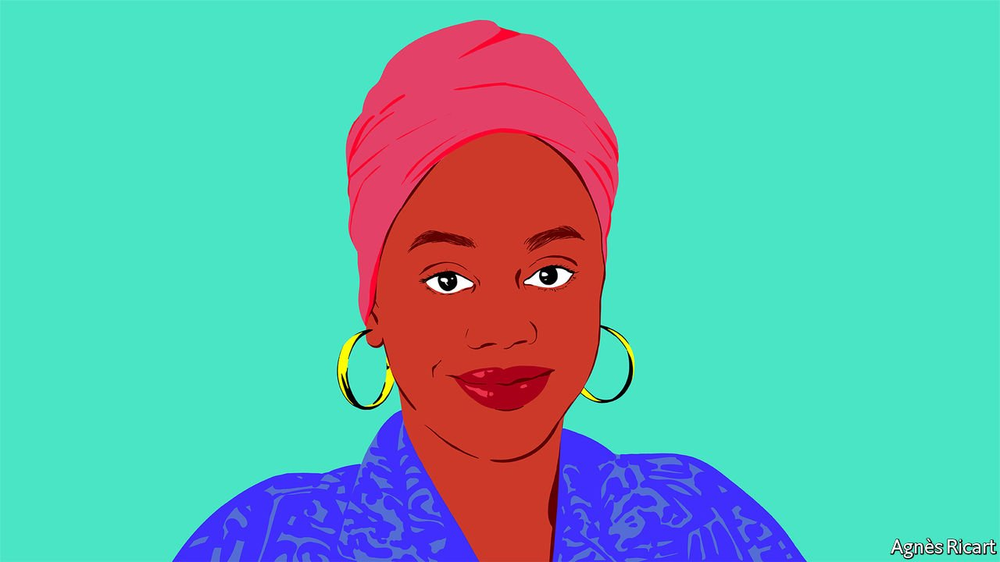

###### International Women’s Day

# Tigidankay “TK” Saccoh on how teachers can address discrimination at school 

##### The anti-colourism activist writes at the invitation of Malala Yousafzai 

 

> Mar 8th 2022 

MY PARENTS LEFT Sierra Leone in 2005 in search of opportunity and safety in the aftermath of our country’s civil war. When we moved to Seattle, Washington, I enrolled in a predominantly white school. On the first day of kindergarten, I sat at my desk wide-eyed and excited to learn everything I could. I felt that finally, I had some stability in my life.

At first, my kindergarten classroom was a refuge from the discrimination my Muslim family endured in post-9/11 America. In public, strangers regularly mocked my parents’ thick accents and glared at my mother’s hijab and traditional headwraps. I noticed how their faces paled at the sound of the Arabic names of my father and brothers. I thought I could reclaim my childhood at school. I could be a kid, submerged in books and play kitchens.


With one racist encounter after another, however, my classroom rapidly transformed into another place that I felt I needed to escape. I vividly remember when my childhood best friend told several of my peers that “black people are so mean” after a black man robbed her house. When I tried to defend myself, my teacher reprimanded me for being disruptive. I struggled to accept that my school was not the haven I had idealised, that the discrimination I experienced beyond its walls would continue in the classroom. With every racist comment, my confidence dwindled and my academic performance waned. To my teachers, this meant that I was not as intelligent as my peers, not that the racism I experienced at school interfered with my learning. I couldn’t imagine yet that in classrooms around the world other girls were experiencing their own versions of this.

When my family moved to Philadelphia in 2008, and I started at a predominantly black school, I experienced a different kind of bullying. This time, it was my dark complexion and status as an immigrant that were targeted, not my race. This sort of discrimination is known as “colourism”. My teachers, mostly white, were not equipped with the sensitivity, nuance and cultural knowledge needed to address the colourism and xenophobia I experienced. I was optimistic when my school launched an anti-bullying programme in the fifth grade. Unfortunately, the programme lacked specificity and did not thoroughly consider the cultural dynamics of my classroom. Colourism and hurtful comments about African students were never addressed, though both were pervasive at my school.

Reflecting on my early experiences with discrimination in school, I was moved to create the type of outlet I needed when I was younger.  is a digital anti-colourism platform I created in June 2020 to amplify the stories of dark-skinned black girls and young women. I publish testimonials from black women and girls in a series called Spotlight about experiences with colourism. Most of the stories on The Darkest Hue underline the many ways teachers are complacent, or even complicit, in creating environments that feel unsafe for their pupils. I am usually left wondering how different these pupils’ lives might have been had their teachers thought to consider experiences outside the classroom or been trained on how to intervene. I know that would have made a difference for me.

Colourism is of course only one of the many ways a girl’s experiences at school can be disrupted by the political, economic or cultural dynamics around her. Whether it’s child marriage, gender-based violence or classism, poverty, social norms and teachers’ own prejudices, many obstacles can interfere with girls’ success at school. If we want to ensure that every girl is able to realise her right to 12 years of free, safe, quality education, teachers and administrators must work with girls to understand the cultural tensions that exist in their classrooms and the structural forces that limit their education.

Depending on where you teach in the world, the issues impacting girls’ focus or success at school look different. In rural Brazil, poverty, long and difficult treks to school and discrimination from non-Indigenous teachers and peers alike prevent Indigenous boys and girls from receiving quality education. “In schools in the city, teachers don’t teach us our history. They don’t talk about our stories. They care more about their experiences,” says 18-year-old Clarisse Alves, an Indigenous education activist in Brazil. When curriculums and teachers fail to acknowledge the history of marginalised groups, it perpetuates inequality and prevents pupils from learning in environments that affirm and acknowledge their full identities.


We risk conflating the unique experiences of girls with boys when we do not examine how they vary by gender. I have been influenced in my thinking by Kimberlé Crenshaw, a law professor at Columbia Law School and a civil-rights activist. She introduced her framework of intersectionality in 1989. It posits that different aspects of our social and political identities interact simultaneously to create unique experiences with stigma and discrimination. Failing to acknowledge that black girls and boys have different experiences may lead to ineffective or even harmful interventions. That is why it is so important that girls directly shape them.

The classroom presents unique possibilities for change. Teachers get to work closely with girls during a critical period for establishing their confidence. Girls’ confidence declines dramatically during puberty, even when they outperform boys in school. A study published in 2018 asked 1,300 pupils in America to rate their confidence from the ages of 8 to 14. Girls’ and boys’ self-reported confidence levels were relatively similar up until 12 years old; however, girls’ confidence plummeted nearly 30% after that, while boys’ confidence held up much better. While it is always important for teachers to affirm girls’ achievements and identities, it is especially important they do this between ages 8 and 14 so that their confidence does not plummet when they are teenagers. The praise I received from my favourite teachers when I was in middle school has stayed with me throughout college. I would not have had the confidence to apply to Columbia University were it not for their persistent encouragement. Sometimes all it takes is one teacher affirming you—especially when your cultural identities are not being affirmed anywhere else.

When teachers have the training and resources to address the social norms limiting girls’ potential, whether it be colourism or another form of discrimination, the impact is extraordinary. In some ways, I am still that little girl who went to school looking for an escape. But now, at 22, I also demand more. I do not just want schools to insulate girls from harms such as racism and colourism. I want schools to be tools that dismantle these forces. When empowered, teachers can lead change in their own classrooms and ensure all girls can realise their right to learn.

___________

Tigidankay “TK” Saccoh is an anti-colourism activist and editorial intern at Malala Fund. She is the founder of The Darkest Hue, a digital space that empowers black women and girls who experience colourism.

, the Nobel peace-prize laureate, has invited , ,  and  to write essays for International Women’s Day. Visit our  to read more.

