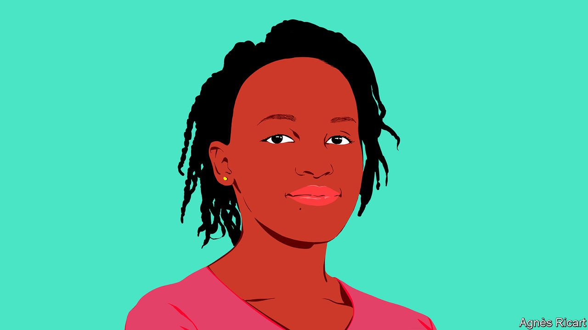

###### International Women’s Day

# Vanessa Nakate on how girls’ education can help solve the climate crisis 

##### The climate activist writes at the invitation of Malala Yousafzai 

 

> Mar 8th 2022 

DEADLY FLOODING and landslides have become a regular threat in my hometown of Kampala, the capital of Uganda. In 2019, we were hit particularly hard: the rains killed more than a dozen people and washed away people’s belongings and businesses. Waters from Lake Albert submerged primary schools in Ntoroko district, leaving about a thousand young pupils unable to go to school.

Unlike many girls in Uganda, I was lucky enough to receive a secondary education and attend university. Thanks to this, I was able to conduct research about the impact of climate change in my country. It was during this process that I came to understand the terrifying challenge that humanity is facing. But an estimate from 2015 suggests that, across sub-Saharan Africa, 9m girls between 6 and 11 years old will never go to school at all. Many more African girls need to be given the opportunities I had.


Historically Africa has been responsible for less than 4% of the world’s greenhouse gas emissions. Although Africans are the least responsible for global warming, it is in countries like Uganda that people are experiencing some of the worst effects of it. The people who suffer most of all often are those whose rights and freedoms are already the most precarious. It is young women around the world, who are less likely to have access to basic education than young men, that are most likely to suffer violence and repression when hard times hit. They have the most to lose from worsening climate impacts.

Without urgent action, by 2025 climate-related events will prevent at least 12.5m girls around the world from completing their education each year, according to the latest research from Malala Fund, a girls’ education charity founded by the Nobel laureate Malala Yousafzai. Extreme weather can damage school facilities, cause migration and increase the reach of disease - girls tend to be the first to be kept home from school in these contexts. There is also evidence that climate-related events are leading to an increase in child marriages and female genital mutilation, as lower crop yields, caused by drought, force desperate families to seek dowry money.

A dearth of education for girls is a crisis itself. It also has implications for the climate because educated young women have the greatest potential to find the most transformative climate solutions. When girls go to school they pick up the skills—especially critical thinking and problem solving—that they need to respond to climate disasters and to acquire green jobs in the future. Such skills will also enable them to help their communities increase resilience to extreme weather events. Education prepares girls to advocate for themselves and to tackle the social-justice issues at the heart of the climate crisis. When girls have access to a quality education and modern contraceptives, it enables women to exercise the choice to have smaller, healthier families, reducing emissions well into the future. This is why Project Drawdown, a charity focused on finding ways to combat climate change, lists girls’ education as one of the most important solutions we have for limiting global heating to 1.5℃ by 2100.


In 2019 I founded Rise Up Movement Africa to draw attention to the effects of the climate crisis in African countries. The continent’s experiences of the climate crisis are often ignored internationally, yet they range far beyond the obvious damage done by extreme weather. Money still floods into Africa to fund fossil-fuel projects, but we need funding for climate solutions instead.

One solution I want world leaders to invest in is gender-equal climate education. This means offering all students a curriculum that does more to investigate the causes of climate change and promote green skills and sustainable values. My generation is passionate about protecting our planet, but many of us aren't equipped with adequate knowledge or skills to handle the problems we’ll soon inherit. Plan International, which advocates for children’s rights, recently surveyed students in 37 countries and 86% of respondents reported they did not get enough information about climate change, nearly half said they did not know anything about the Paris Agreement and only 20% learned about climate activism in school.

I find it hard to trust Western leaders, however, as their countries enact hypocritical policies. Britain, the host of last year’s COP26 UN climate summit, still considers new fossil-fuel projects. The European Union, which likes to call itself a “climate leader,” has labelled gas a “green transition” fuel. And it did not matter to the assembled leaders how loud or persistent young activists were on the streets outside, or how many panels we participated in. When the time came for decision-making, predominantly Western leaders led us to another unsatisfactory outcome.

By investing in girls’ education, more opportunities are created for women to lead. Role models such as Christiana Figueres, who helped run the UN climate talks which led to the Paris agreement of 2015, and Amina Mohammed, who is the UN’s deputy secretary-general, and many others have been trying for years to persuade governments at the COP to be more ambitious. In a study of 130 countries in 2005, researchers found those with a higher proportion of female political leaders were more likely to ratify environmental treaties. Perhaps this is because women understand what is at stake: they know that their rights are more likely to disappear as temperatures rise. Educating a girl will provide her with a brighter future. Empowering young women will provide us all with a lifeline.

_______________

Vanessa Nakate is a climate activist and founder of the Rise Up Movement Africa, which campaigns for environmental action.


