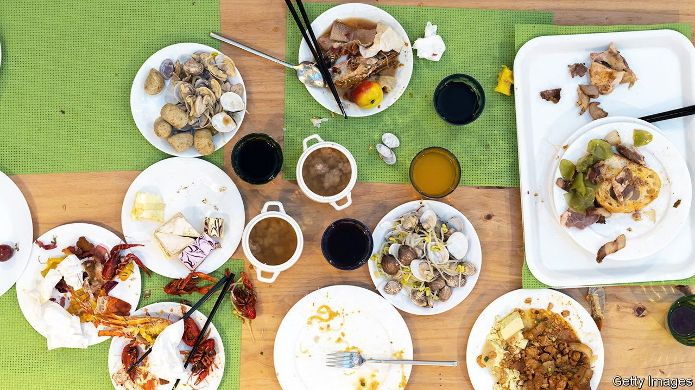

###### About face

# China is clamping down on food waste 

##### Clean your plate, says the state 

 

> Mar 12th 2022 

NO BANQUET IN China is complete without the host loudly calling for more food, even when it is clear that no one can eat another bite. Whether at business meals or family gatherings, to leave a clean plate is to imply that the host provided too little. Cultural issues of “face” also lead to big servings: everyone wants to be more generous than their neighbour. Now, though, these deep-rooted norms are being challenged from the top.

Soon after he came to power in 2013, China’s president, Xi Jinping, recounted his own experience of hunger during China’s Great Famine of 1959-61. Even at his elite boarding school, dinner meant only soup. He also spoke of lean times during the Cultural Revolution from 1966-76, when he went months without “knowing the taste of meat”. Such hardship bred frugal habits in people of his generation.


But after 40 years of economic reform, China is now the land of plenty—and the land of waste. Precise measurement is hard and estimates vary widely. Speaking at a conference in 2020, Chen Shaofeng, an expert at the Chinese Academy of Sciences, reckoned that the country’s net annual food loss comprised around a third of the world’s total. A study published last year in Nature, a leading scientific journal, said it amounted to 350m tonnes (though it said that accounted for just over a quarter of the world’s total). Even at the lower range of the estimates, waste in the food-service industry (meaning restaurants, canteens and dining halls) would amount to 17m-18m tonnes annually, enough to feed tens of millions of people.

In 2020 Mr Xi called China’s food-waste problem “shocking and distressing”, framing it in terms of food security. A year later his government enacted an “anti-food waste” law. It is a mish-mash of worthy edicts, such as rules on grain storage, and wacky ones, such as a ban on streaming mukbang (binge-eating performances), a phenomenon that originated in South Korea. Violators may be fined as much as 100,000 yuan ($15,800) and slapped with administrative punishments.

Much of the law is designed to cajole the public into better habits, such as ordering “in moderation” and eating “in a civilised and healthy” way, particularly at special occasions. A survey by government researchers reported in 2020 that around 40% of the food served at wedding banquets, business meals and social dinners was wasted. The banqueting culture displays “a bad atmosphere of ostentatiousness, lavishness, and concern for face”, said the People’s Daily, the official organ of the Communist Party.

Mr Xi and other officials have started promoting what they call “clean plate” behaviour. The new law calls on restaurants to make it easier for guests to take leftovers home. It gives businesses cover to hit wasteful diners with extra charges or reward frugal ones, for example with discounts or parking vouchers.

Among the first to fall foul of the law, just weeks after it took effect, was a popular streaming service called iQiyi. One of its talent shows encouraged fans to vote for their favourite performers using codes printed inside the bottle caps of a milk drink. This led to an outcry over those who, in pursuit of the caps, bought and dumped the drink in large quantities. The show was ordered to stop production.

While much of the public attention around the law has focused on getting consumers to waste less, efforts to improve practice among suppliers will be just as important. According to the study in Nature, half of China’s food waste occurs not long after harvest, when it is first processed and stored. Food waste, the authors write, is a “farm-to-fork” problem. ■

