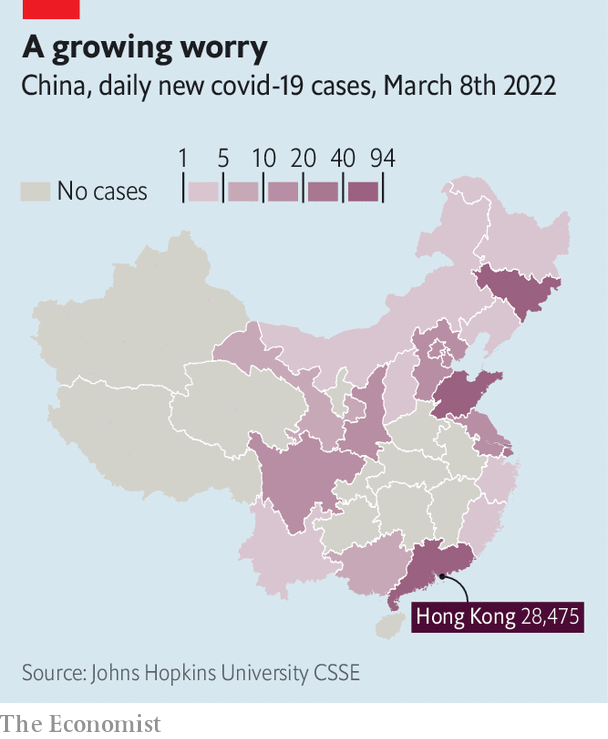

###### Redefining zero

# China’s scientists are looking for a way out of the zero-covid policy 

##### Politicians will have the ultimate say. Omicron may force them to act 

 

> Mar 10th 2022 

NOT SINCE the early days of the pandemic has China seen so many new, locally transmitted cases of covid-19. More than 400 were reported on March 9th (counting only those that were symptomatic). Clusters have been found in most of China’s provinces (see map). A surge of this size would not trouble most countries. Indeed, many are learning to live with the virus. But in China the new cases are testing the government’s “zero-covid” strategy, which uses mass testing and lockdowns to crush any hint of an outbreak.

Many foreign experts are questioning the strategy. Can it work, they ask, against the highly transmissible Omicron variant? Michael Osterholm, an American epidemiologist, calls Omicron unstoppable. In January he co-wrote an op-ed warning that China had set itself up for disaster. Its vaccines offer limited protection against Omicron, relatively few people have natural immunity and China’s health system is not equipped to handle a large wave. Hong Kong is a harbinger of what will come if China does not change tack, says Dr Osterholm. Omicron has overwhelmed the city, where hundreds of mostly unvaccinated and old people are dying each day.


 


It is one thing for foreigners to call for change, but lately China’s doctors and epidemiologists have also hinted that a new approach is needed. Though they continue to swear by the zero-covid policy in public, they are quietly changing what “zero” means. Since late last year Liang Wannian, a top Chinese epidemiologist, has been telling state media that China’s new “dynamic zero” policy does not mean zero infections and that the most stringent measures will not last forever. The policy means having zero tolerance for slow responses to outbreaks, he says.

Learning to coexist

The long-term goal is to live with the virus, wrote Zeng Guang, the former chief scientist of the Chinese Centre for Disease Control and Prevention, on Weibo, China's version of Twitter, last month. He said a “Chinese roadmap to coexistence with the virus” would soon be revealed. For such a strategy to work, China would have to produce better mRNA vaccines of its own, or end its apparently political refusal to authorise effective, foreign-made jabs. Improved treatments would also help. And the government would have to worry less about mild infections. That is broadly in line with the change in mindset suggested by Zhang Wenhong, a respected doctor who runs Shanghai’s covid response. Officials should be more precise, more scientific, striking a balance between preventing virus resurgence and protecting the economy, he wrote on Weibo.

The politics of all this are complicated. China has taken great pride in its covid strategy, which has seen it do better, in terms both of avoiding deaths and of preserving economic growth, than any other large country. Politicians may be loth to ease restrictions in the months leading up to an all-important Communist Party meeting later this year, when President Xi Jinping is expected to extend his rule. In Shanghai even the contacts of contacts of those infected are being made to quarantine for two weeks. That is not a wise use of medical resources. But it is in line with Mr Xi’s orders to guard against “a large-scale epidemic rebound”.

Dr Zeng’s post about the Chinese road map to coexistence has disappeared. But there are indications that attitudes towards covid are changing in the country. Last summer Dr Zhang was attacked online by nationalists when he wrote that China would eventually have to live with the virus. They accused him of pandering to Western ideas and wanting to see people die. His latest post, though, drew many supportive comments. Scholars in touch with Chinese scientists say some are writing internal advisories on how the country could safely drop the zero-covid policy. Ultimately politicians will decide if and when a change is needed. Omicron may force their hand. ■

Dig deeper

All our stories relating to the pandemic can be found on our . You can also find trackers showing ,  and the virus’s spread across .

