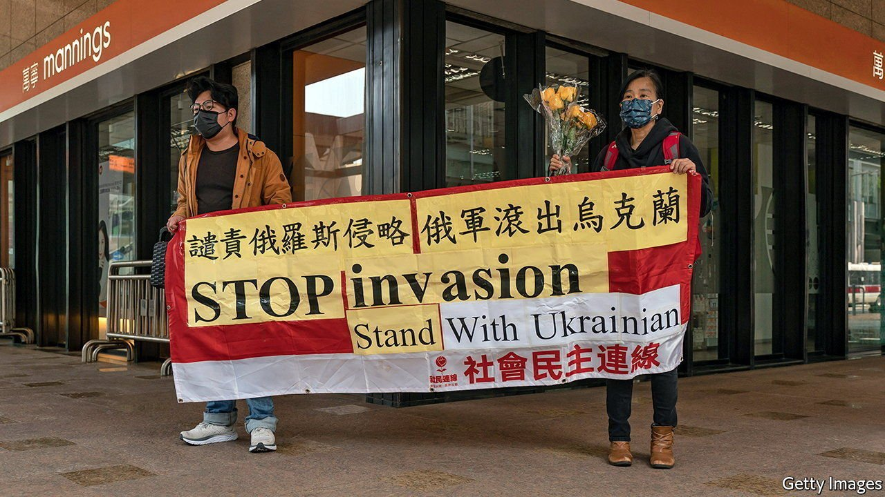

###### Brave voices

# Some Chinese are daring to criticise Russia 

##### Nationalist trolls and a stifling state would rather they did not 

 

> Mar 10th 2022 

IT IS IMPOSSIBLE to acquire a mass following on Weibo, China’s Twitter-like service, while being politically careless. A post that annoys the government can result in an account’s sudden closure and with it painful severance from millions of fans. Take Jin Xing, a transgender dancer who was once a colonel in an army entertainment troupe. She had been keeping her page updated with news of her travels in Europe when she took a risk that plunged her into digital darkness.

On March 1st Ms Jin published a post on Weibo that referred to two of the platform’s hottest topics: Vladimir Putin’s invasion of Ukraine and the story of a woman in eastern China who had been sold into marriage and was found in chains in a shed. “The most horrifying things of 2022 have been a Chinese woman with an iron chain around her neck saying this world doesn’t want me,” Ms Jin wrote to her more than 13m followers. “The other is a Russian madman saying if you don’t want me to continue as president, I don’t want this world.”


Ms Jin’s post was quickly deleted. She sent another saying Weibo had removed it. That was her last. Her account now carries a message at the top: “For violating relevant laws and regulations, this user is now in a state of being forbidden to speak.” But comments are still possible. Netizens have dived into a post showing a picture of her German mother-in-law’s home. Some have expressed support for Ms Jin. “Brave person,” said one. Others have hurled insults, laced with transphobia.

In online debate in China about the war, by far the most common voices are of anti-Western backers of Mr Putin (contempt for the West is rife in China’s offline world, too). Their cheers for Russia are amplified by censors whose eagle eyes and algorithms help to suppress other views. On politically sensitive topics, many dissenters do not even try to speak, fearful of being kicked off social media, vilified by trolls or confronted (in person) by the police.

But some supporters of Ukraine have piped up. Freeweibo, a website outside China that automatically publishes censored posts from selected Weibo accounts, shows that some users with many thousands of followers have posted pro-Ukraine messages. Five academics—one in Hong Kong and the others from prestigious mainland universities—published an open letter on WeChat, a messaging service, denouncing the invasion. “Ukraine’s wounds have hurt us deeply,” they wrote. The trolls fired back, calling them “traitors” and America’s “running dogs”. Censors swiftly deleted the letter.

Some anti-Russia posts dig at the nationalists by reminding them of land that was wrested from Chinese control by Russia in the 19th century, and to which China has not pursued claims . The territory includes the city of Vladivostok. “A bunch of people spread information about the history of Ukraine,” wrote one user on Weibo. “But if you try searching for Vladivostok on Weibo you can’t find much of anything.”

The government stops short of echoing the nationalists’ full-throated support of the invasion. But at a press conference on March 7th, China’s foreign minister, Wang Yi, said his country’s ties with Russia were “rock solid”. In a clear reference to America and NATO, he accused a “major country” of stoking “bloc confrontation”.

Most netizens brimmed with delight at his eloquence (and praised his “handsome” appearance—Mr Wang is popular among “little pinks”, as young nationalists are commonly called in China). But among more than 2,000 comments on the event that were posted on state television’s Weibo account, there was barely a mention of Ukraine. That, no doubt, is just as the government would like it. ■

