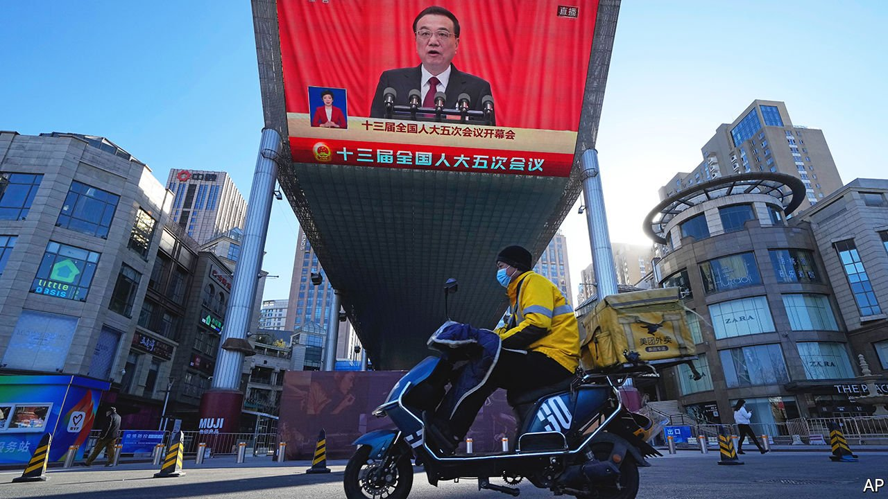
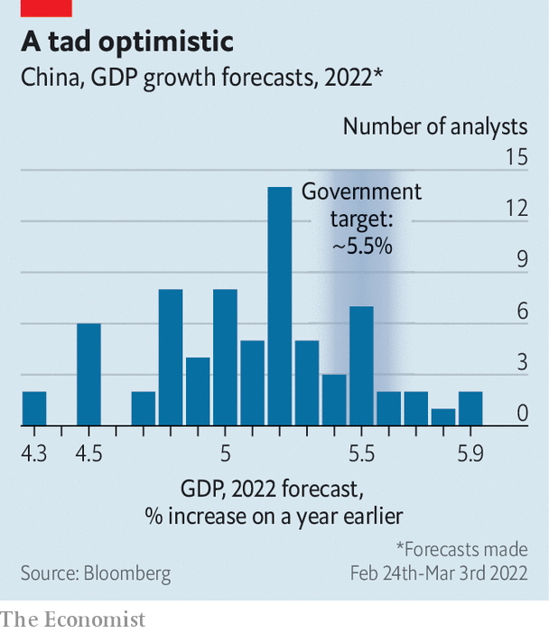

###### Shaking the money tree

# To meet its ambitious growth target, China turns to stimulus 

##### But it’s the stealthy sort 

 

> Mar 12th 2022 

THE CHINESE people have the “courage, vision and strength to overcome any obstacle”, said Li Keqiang, the country’s prime minister (pictured), on March 5th in his annual speech to the National People’s Congress, China’s rubber-stamp parliament. Even so, not all of them will have the fortitude to digest his full report on the work of the government, which runs to more than 12,000 words in translation. For their benefit, the government has distilled its message into a 150-second rap video.

The film features three animated characters: a woman in Sichuan province, who sells tasty noodles for 13 yuan ($2); a “handsome” southern entrepreneur who employs 200 people in a factory making electric toothbrushes; and a raspy farmer from the snowy north-east whose clever son uses a drone to spray the crops. All three were, the rap maintains, eager to discover what Mr Li’s report had in store for them.


China’s farmers in the north-east and elsewhere will draw comfort from the report’s emphasis on food security. That concern has been intensified by the pandemic, last year’s floods, which delayed the planting of wheat, and now the war between Russia and Ukraine, which otherwise passed unmentioned in the report. (Soon after the war began, China dropped import barriers for Russian wheat.) “The Chinese people must hold their rice bowls firmly in their own hands,” said Tang Renjian, the minister of agriculture.

Food is not the only thing China wants to keep a close grip on. The same emphasis on security extended to energy and industry. Mr Li promised to help leading firms play their role in “safeguarding the stability and security of industrial supply chains”. That includes encouraging home-grown production of semiconductors. Huawei, for example, has invested in dozens of firms in the chipmaking supply chain, according to the Wall Street Journal, since America barred it from buying chips made with American equipment.

The government is also keen to avoid a repeat of last year’s energy shortages. Mr Li did not announce a hard target for reducing the economy’s energy intensity this year, noting merely that consumption per unit of GDP would be kept in line with the country’s five-year plan. That may further delay China’s decarbonisation efforts. Coal production is on the rise and the government says cleaner sources of energy must be in place before it decommissions dirtier plants (what it calls “establishing the new before abolishing the old”).

Small businesses, whether they make noodles or toothbrushes, will also have found some solace in the report. Mr Li noted that the pandemic had “severely affected” firms in catering, hospitality, retail, tourism and passenger transport. He announced an unusually large cut in taxes and fees for smaller firms and manufacturing enterprises. Corporate income tax for smaller firms will be lowered to just 5% and value-added tax will be eased for many. In total, these cuts may amount to 2.5trn yuan or about 2% of China’s expected GDP in 2021. This will “help strongly boost market confidence”, Mr Li argued.

As well as cutting taxes, the government will increase spending, broadly measured, by 12.8%. It will embark on some of the 102 “mega-projects” outlined in the five-year plan, which can be unpacked, like a “matryoshka doll”, into over 2,600 smaller projects, according to He Lifeng, the head of China’s planning agency. It will also spend more on unglamorous but necessary social infrastructure, such as day-care centres. About 9.8trn yuan will be transferred to cash-strapped local governments, 18% more than last year. They will need all the help they can get to cope with China’s property downturn, which has deprived them of revenue from land sales.

 


A big fiscal push will be necessary if the economy is to fulfil the government’s growth target of “around 5.5%”. That pace of growth would set the stage nicely for President Xi Jinping’s confirmation for a third term as party chief late in the year. It is, however, higher than many private-sector forecasts (see chart). An expansionary budget is also hard to square with Mr Li’s insistence on fiscal prudence. He said the budget deficit this year would narrow to only 2.8% of GDP, from 3.2% last year.

That number is, however, misleading. Much of this year’s additional spending will be undertaken by government “funds” that are not included in the headline budget figures. Local governments will also tap money raised in 2021 that was not spent before the year’s end. And state coffers will benefit from 1.65trn yuan of “surplus profits” handed over by state-owned financial institutions and state monopolies, such as China Tobacco, which have not paid dividends to the government since the pandemic struck. (Wei He of Gavekal Dragonomics, a consultancy in Beijing, calls it a “special fiscal operation”.) The largest contributor to this windfall is the central bank, which will transfer to the government about 1trn yuan of profits it has earned on its foreign-exchange reserves. As another rapper once put it, “Money trees is the perfect place for shade.” ■

