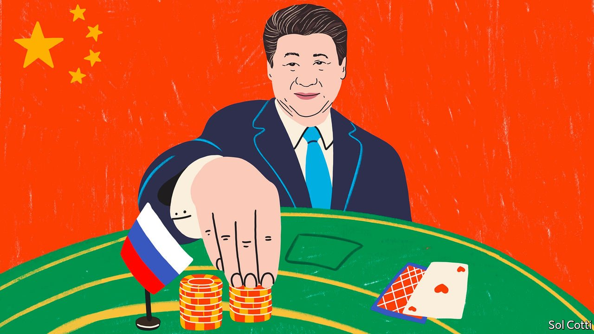

###### Chaguan

# Xi Jinping places a bet on Russia 

##### China’s backing for Vladimir Putin’s war is all about its contest with America 

 

> Mar 12th 2022 

CHINESE COMMUNIST PARTY elites can picture an endgame to the Ukraine war that suits China very well. In Beijing, scholars and high-ranking government advisers predict that today’s shows of Western unity will fade sooner or later, as sanctions fail to break Russia and instead send energy prices soaring. In their telling the conflict will hasten America’s decline and slow retreat from the world. A crumbling of American-led alliances will then usher in a new global order, involving spheres of influence dominated by a few, iron-willed autocracies, China chief among them.

As for liberal democracies that have taken the lead in writing global trade rules or defining universal values and human rights since the second world war, their sway is being ended by a form of majority rule, Chinese analysts boast. Western envoys in Beijing note that 141 countries voted to condemn Russia’s invasion of Ukraine at the UN General Assembly. Chinese scholars retort that the 40 countries that abstained or backed Russia—among them China and India—account for most of the world’s population.


The tricky part for China involves the war in Ukraine before that longed-for endgame. China hates to side with losers, and for now at least, Russia’s president, Vladimir Putin, is not winning the fight that he picked in Ukraine. That is awkward for China’s supreme leader, President Xi Jinping, who less than a month before the invasion signed a remarkable statement with Mr Putin on the margins of the Beijing Winter Olympics. In it China and Russia stood side-by-side in rejecting NATO expansion in Europe and American alliance-building in Asia. They agreed that the promotion of democracy is a Western plot.

In the diplomatic drawing rooms of Beijing, there is debate about whether Mr Putin told his host, Mr Xi, that he was going to launch a war with Ukraine less than three weeks after that agreement. A popular view is that Mr Xi knew that Russian forces were massing for a possible invasion—not least because China spies assiduously on Russia—but may have accepted assurances from Mr Putin that any war would be over in as little as a week. Envoys argue that neither the Russian nor the Chinese leader expected such resistance from Ukraine, such ineptitude from Russia’s army, such unity from Europe nor such resolve from members of the NATO security alliance, including previously unthinkable deliveries of lethal aid from such conflict-avoiding powers as Germany. “They thought the West was decadent, and that Europe is a giant Disneyland where Chinese couples go on honeymoon,” says a diplomat based in Beijing, in pithy summary. In a country with normal opposition politics, Mr Xi’s mistakes would be dangerously ill-timed. In late 2022 he is expected to challenge long-standing norms and seek a third five-year term as supreme leader at the 20th Party Congress, the party’s highest decision-making body.

China’s diplomats initially waffled about Ukraine. Russia’s invasion tramples supposedly sacred Chinese principles about national sovereignty and territorial integrity. Heeding those principles, China declined to recognise Russia’s annexation of bits of Georgia in 2008 and of Crimea in 2014. In 2022 China’s diplomats took a day to adopt a stance of pro-Russian pseudo-neutrality, blaming America for cornering Russia by letting former Soviet satellite states into NATO. Some Europeans thought they heard China moderating its tone, and voiced hopes that China might mediate in Ukraine. Alas, with Mr Xi’s prestige in play, China has little incentive to push Mr Putin to accept anything resembling defeat.

On March 7th Mr Xi redoubled his bet on Mr Putin. The foreign minister, Wang Yi, told journalists at the annual session of parliament that China’s and Russia’s “rock solid” friendship is a strategic partnership against American attempts to suppress China, and what is more brings peace and stability to the world. Mr Wang was delivering a message from Mr Xi, diplomats say. Scholars tell foreign contacts that China cannot debate the justness of Russia’s war, because to defend Ukraine is to side with America.

Christoph Heusgen, chief foreign policy adviser to Germany’s then-chancellor Angela Merkel from 2005 to 2017, has spent many hours in meetings with Mr Xi. Speaking from Germany, he recalls that China’s policies became markedly more self-confident and assertive when the “forceful” Mr Xi became party chief in 2012, in contrast with his predecessor Hu Jintao, a cautious party bureaucrat. Still, he calls Mr Xi a calculated risk-taker. “The Chinese take a risk when they think they can get away with it,” says Mr Heusgen, giving the example of China’s crushing of democracy in Hong Kong, which ultimately generated limited international protests and sanctions, reflecting the economic importance of that financial centre. He contrasts China’s loathing of foreign criticism with Russia’s indifference when it is isolated at the UN.

For China, it is always about Chinese interests

To outsiders, it is obvious that embracing Mr Putin is harming China’s reputation, especially when Chinese state media and foreign-ministry spokesmen repeat vicious Russian disinformation about Ukraine without blushing, while refusing to name Mr Putin as an aggressor. Mr Xi seems unperturbed. The dismaying explanation may be that he believes confrontation to be a prudent choice. China’s leader has reportedly told officials calling for a cautious stance over Ukraine that they are deluded if they think that America will ever tolerate China’s rise. In public Mr Xi likes to give his people the impression that China’s rise is unstoppable. He told a consultative assembly on March 6th, “The contrast between governance in China and chaos in the West has grown more notable.” If Mr Xi believes his own rhetoric and is sure that China will secure the might-is-right world order he seeks, then Ukraine’s agonies matter less to China than might be supposed—as long as Chinese firms are not hit by sanctions on Russia, and trade ties with Europe remain intact. Such self-absorption is good for domestic morale. It is a perilous way to calculate risks. ■

Read more from Chaguan, our columnist on China:

 (Mar 5th) 


