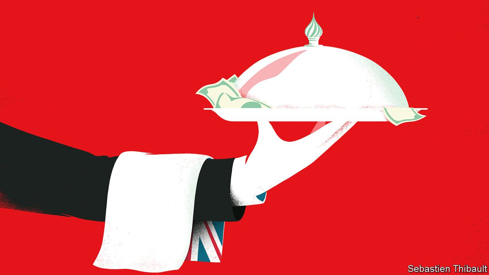

###### A brief history of Londongrad

# A new book shows how Britain came to welcome dirty money 

##### In “Butler to the World”, Oliver Bullough calls for principles over profit 

 

> Mar 12th 2022 

Butler to the World. By Oliver Bullough. St Martin’s Press; 288 pages; $28.99. Profile Books; £20

EVEN AFTER the annexation of Crimea in 2014, the leak of the Panama Papers in 2016 and the poisoning of Sergei Skripal two years later, London remained a haven for “Moscow gold”. Britain has been hospitable to Russian money, much of it tainted, since the Soviet Union collapsed. What, wondered anti-corruption campaigners and concerned MPs, would it take for their country to get tough on the oligarchs and Kremlin cronies whose acquisition of mansions and football clubs had earned the capital the nickname Londongrad?


Just possibly, the answer is a big war in Europe. After Russia’s latest invasion of Ukraine, Boris Johnson’s government has piled sanctions on the Russian companies, banks and tycoons it sees as supporters of Vladimir Putin. After years of delay, a new economic-crime bill that will, for instance, make foreign owners of British property reveal their identities, is being rushed into law. Even now, though, questions linger about the clean-up’s thoroughness.

One of the best-informed sceptics is Oliver Bullough. His new book is an urgent account of Britain’s history of welcoming corrupt capital. By the end, readers will sneer at the claim of successive British governments that, as Mr Johnson has put it, no country “could conceivably be doing more to root out corrupt Russian money”. The gulf between rhetoric and reality has been chasmic.

Mr Bullough’s thesis is that London became a favoured destination for dodgy dough not by chance but by design. For over half a century, Britain’s business model has been to act as the butler of his title to oligarchs, gangsters and kleptocrats looking for a safe place to park their often ill-gotten gains and enjoy the high life.

Like the versatile and creative Jeeves of the P.G. Wodehouse stories, the British have developed an impressive range of apt skills. The National Crime Agency reckons Britain has a £100bn-a-year money-laundering problem; London’s luxury-property market serves as storage for much of this loot. Should anyone ask awkward questions, reassuringly expensive lawyers and public-relations firms have been only too happy to shoo them away, aided by plaintiff-friendly libel and privacy laws. Foreign billionaires with chequered pasts have worked hard and spent big to penetrate the British establishment. It has embraced many of them, even doling out the odd knighthood or peerage.

To understand all this, argues Mr Bullough, you have to go back to 1956, and the Suez fiasco. It worsened a sterling crisis that led to the development of “euromarkets”, unregulated finance in dollars and other currencies outside their home countries. In turn those led to the blossoming of what has been called “Britain’s second empire”: a network of secretive offshore financial centres hosted by British overseas territories, such as the British Virgin Islands (BVI) and Cayman Islands, which by the 1980s were feeding big sums into the City. The British seemed to understand better than anyone that if you wanted to attract footloose capital, you had to treat its owners well—which meant being discreet.

Mr Bullough’s previous book, “Moneyland”, gave an eye-opening and entertaining tour of the world’s hubs for tax-dodgers and money-rinsers. Focusing on Britain in his follow-up is a statement in itself. Most of his chapters are devoted to a particular butlering characteristic. One covers the BVI’s rise from a backwater largely reliant on sales of postage stamps to a mass-producer of shell companies for Russian and Chinese clients. Another dissects the mysterious purchase of a disused Tube station in London by a Ukrainian tycoon; he became pally with British luminaries before moving to Vienna, where he is fighting extradition to America for alleged corruption (Britain has filed no charges).

The most revealing chapter is on the “Scottish limited partnership” (SLP). This arcane corporate form has featured in some of the most notorious “laundromat” cases, involving industrial-scale washing of money from former Soviet countries; in one, a criminal group stole $1bn from banks in Moldova, more than an eighth of the country’s GDP. The wheeze owes its popularity to a single sentence in a law of 1890, which defines the SLP as “a legal person distinct from the partners of whom it is composed”. It thus provides a buffer between miscreant and misdeed that is unavailable in regular partnerships—should anyone be so indelicate as to pry.

One of the few who did pry was David Leask, a journalist with the Herald, a Scottish newspaper. His work led to calls from Westminster MPs to end the ruse; the government vowed action. Business had other ideas. Associations representing lawyers and estate agents cautioned that a crackdown would create bad publicity and impose extra burdens on legitimate businesses. Moneymen warned it could harm the City’s competitiveness. An umbrella group for private equity, which had long used SLPs in its (legal) tax-avoidance arrangements, counselled against a “needless act of national self harm”. All this played on ministers’ fears of blunting Britain’s financial edge and, as often before, it worked: it is still possible to own SLPs anonymously and avoid filing accounts.

To be fair, British politicians have had their moments in the fight against dirty money. One came when, as prime minister, David Cameron hosted a global anti-corruption summit in 2016. He also pushed through reforms including a public register of company owners, the first in a G20 economy. But momentum stalled with the distractions of Brexit and covid-19.

Closing the laundry

Britain’s perennial trouble is less shoddy laws than a lack of resources to enforce them vigorously. Mr Cameron’s ownership register is an example. Companies House, which runs it, cannot afford to vet the information submitted, let alone go after those who file fibs. The combined budget of national agencies that fight economic crime is a paltry £850m ($1.12bn), says a watchdog—less than 1% of the amount estimated to be laundered through the country annually. Ministers have announced various anti-corruption outfits and initiatives but failed to provide the funding to give them real clout. The country has no credible equivalent to the punch-packing units in several American agencies.

On the rare occasions when British prosecutors get the bit between their teeth in white-collar cases, they are more likely to involve corporate fraud than cross-border corruption. When they do pursue big-time graft, they are typically outgunned by the blue-chip lawyers hired by their deep-pocketed targets. Witness “unexplained wealth orders”, a sensible legal innovation introduced in Britain in 2018, which allow assets to be seized if their owners cannot prove they were bought with legitimate funds. Of the four cases so far, one has already been overturned. Prosecutors are hamstrung by the high legal bar for the confiscation of assets. According to an index of property rights, they enjoy stronger protection in Britain than in any other European country—one reason why oligarchs are so fond of English courts.

Ultimately, Mr Bullough sees a mystery at the core of the servile business model. What does the country get out of it? True, some lawyers, PR consultants and estate agents do very nicely. But the earnings from oligarchs and other foreign patrons of London’s offshore machinery and swankiest neighbourhoods are tiny compared with the overall revenues of the City. Meanwhile, the reputational risks of a model that sucks in cash from benighted kleptocracies have never been clearer.

Beggaring your neighbours for relatively little gain—call it Cruel Britannia—is not a good look. Whether the efforts of campaigners, combined with the stench around Londongrad since the assault on Ukraine, help put an end to Butler Britain remains to be seen. Mr Bullough argues compellingly that though more anti-corruption funds and tougher enforcement are welcome, what is really needed is a change of philosophy: for principles to take precedence over the profits of a few. ■

