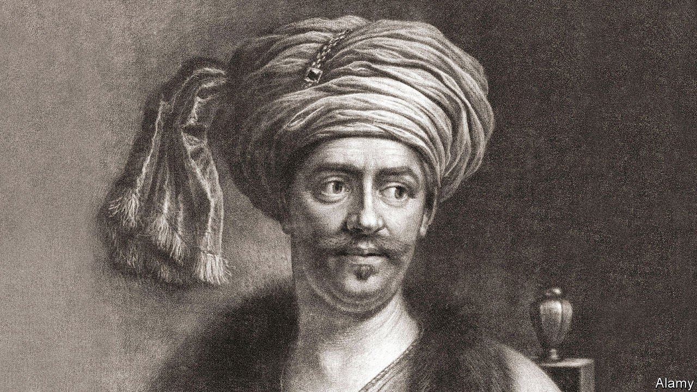

###### Ottoman history

# In “The Lion House”, Suleiman the Magnificent comes to life 

##### Christopher de Bellaigue’s book reveals the allure and burden of power 

 

> Mar 12th 2022 

The Lion House. By Christopher de Bellaigue. Vintage; 304 pages; £20. To be published in America by Farrar, Straus and Giroux in November; $28

NOT FOR the first or last time in history, the master of an authoritarian power straddling Europe and Asia looked west—and was reassured to find his adversaries divided. Squabbles among the rulers of western Christendom, theological, commercial and personal, made it easier for Sultan Suleiman to achieve his grand aim.


He led his vast, multi-ethnic armies deep into European territory, in 1529 (and again in 1532) stopping only at the gates of Vienna. He had established Islam’s place on the continent. In the five centuries since, the personality and achievements of Suleiman the Magnificent have never ceased to puzzle and fascinate. Christopher de Bellaigue approaches him from an unusual and intriguing angle.

Despite his dazzling charisma, aspects of Suleiman’s life suggest a vulnerable, even lamentable figure: a ruler who tried to be fractionally more lenient than his predecessors but was caught up in the murderous calculus of palace politics. He loved and trusted two individuals, both of Orthodox Christian background. One was his erstwhile servant and falconer, Ibrahim, whom Suleiman met when they were both around 20, and who proved to be a master of statecraft. The other was his favourite consort and wife, Hurrem.

But this was not a happy trio. Hurrem helped persuade Suleiman (perhaps correctly) that Ibrahim was flying too high and could become a rival. One morning in 1536, in the bedroom next to the sultan’s, Ibrahim was found strangled. (Much later, it seems, Hurrem induced Suleiman to kill his beloved son, born by another woman.) Suleiman’s reign, up to Ibrahim’s death, provides the framework for Mr de Bellaigue’s vivid and compelling narrative.

This is a new genre for an author who has written, in a journalistic and scholarly vein, about the contemporary and early-modern histories of Iran, Turkey and the wider Middle East (and has reported for The Economist from that region). He presents his story like a novel, but it is not fiction; every detail has been diligently researched, for example by perusing diaries in difficult Venetian dialect. To learn about Suleiman’s accession ceremony, he studied an artwork by a master miniaturist in the Topkapi Palace Museum.

Indeed it might be said that ceremonies in all their variety are Mr de Bellaigue’s favourite thing. Obsessively but infectiously, he relates the finer points of political, social and military rituals. Whether he is describing a lavish dinner for Italian merchants on the Bosporus, the stately progress of Suleiman’s armies through the Balkans or a mass circumcision, he has an eye for the colourful, absurd and ironic.

Holding up a mirror to Suleiman and his court, the narrative opens in the contrasting, but no less ritualistic, world of Venice—a power destined to compete with the Ottomans, but also to interact with them in mutually beneficial ways. As the epitome of that ambivalent relationship, Mr de Bellaigue introduces Andrea Gritti, who became doge (or ruler) of Venice in 1523. He had spent more than 20 years in the Ottoman capital, first as a merchant, then as a diplomat, then as an incarcerated espionage suspect, and finally as the broker of a Venetian-Ottoman peace treaty.

The book describes how one of his sons, Alvise Gritti, settled in what today is Istanbul and befriended both Suleiman and Ibrahim. Eventually, in 1534, Alvise was captured and killed during a shady military assault on Transylvania. Before that, it could be said that a single, sophisticated family enjoyed influence in both great maritime powers.

By flashing between the Adriatic and the Bosporus, Mr de Bellaigue brings home many such links, comparisons and commonalities. Both of the port cities that he evokes brimmed with ostentatious wealth extracted from distant lands. But for all the cynicism of its governance, Venice was a law-based state where the election of the doge, for example, involved elaborate rules. The winner had to pledge respect for the established system.

The sultan, by contrast, was not subject to any earthly checks or balances. As a representative of God he could make his own laws, and no man-made statute could constrain him. As this book shows, living in the penumbra of such supreme power can be seductive and intoxicating. But the end of the story is often tragic. ■

