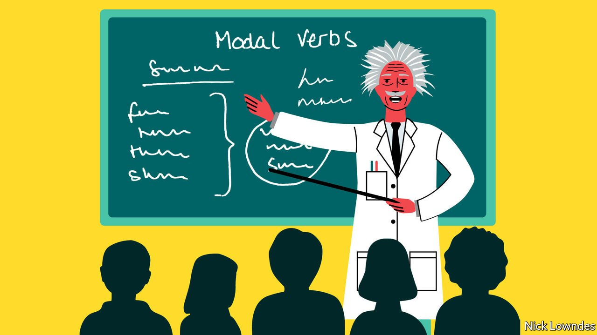

###### Johnson

# Rules for teaching grammar in schools 

##### It may not make children better writers. But it is valuable all the same 

 

> Mar 12th 2022 

ABSENCE OF EVIDENCE is not, as the saying goes, the same thing as evidence of absence. But if you continue looking for something intently, and keep failing to find it, you can be forgiven for starting to worry. And so it is with the vexed—and in Britain, highly politicised—subject of explicit grammar teaching in schools, and its link or otherwise with improved writing ability.

Another study, in this case a large randomised controlled trial, has recently been added to the expansive literature on the subject. Like nearly all its predecessors, it found that teaching kids how to label the bits and pieces in a sentence does not make them better writers. It was novel in that it tested six- and seven-year-olds who used a digital platform called Englicious to take grammar lessons, alongside the rote classroom teaching of grammatical particulars and their functions. The Englicious group did no better than those receiving ordinary instruction when it came to writing narrative passages. (The extra help slightly improved their performance on a task called “sentence combining”, which requires pupils to turn two sentences into one in logical ways, such as the addition of “because”. But even this effect was not statistically significant.)


Bas Aarts, one of the researchers on the project and one of the scholars behind Englicious, holds out hope that with longer exposure, or a study of older students, an improvement in writing skills might be detected. Other observers may begin to wonder whether the National Curriculum in England, which since 2014 has made grammar such a central part of its English programme, might have gone down a blind alley.

The force behind the reforms, Michael Gove, a Conservative former secretary of education, is sometimes maligned for other political reasons (especially among opponents of Brexit, which he championed). He is said to have insisted on the insertion of personal bugbears into the grammar curriculum, notably the subjunctive form, “If I were”. Mention of his name alone wrinkles many teachers’ noses—partly because some of them were hardly prepared to teach the new material themselves, after decades in which grammar was largely absent from classrooms.

In retrospect it scarcely seems surprising that learning to underline a modal verb, such as “can”, “should” and “may”, does little to help students use them effectively in their own writing. These words are anyway grasped by tiny children without the need to know what they are called. This may tempt the conclusion that the teaching of grammar should be shelved altogether. But there are reasons to reform it rather than scrap it.

Understanding of language is part of a wider education in what makes human beings human. How concepts are turned into sounds, and how those sounds combine to form propositions, commands or questions, are issues that have occupied many linguists in philosophy departments. What they reveal about the mind has exercised psychologists and cognitive scientists.

There are practical reasons to ask children to grapple with grammar, too. One is that an explicit knowledge of it will make learning a foreign language easier. Even if you did intuit how to make subordinate clauses in your native languages as a toddler—just without instruction—getting to grips with them in German or Russian in later years is simpler if you know how to define and spot them. As it is, many English-speakers come to understand grammar by studying a foreign language, rather than the other way round.

For grammarians keen on the jobs of the future, the field of natural-language processing is booming. After many years of poor results, technological wizards have devised programs for automated translation, speech recognition (as in dictation software) and other services that are actually usable, if far from perfect. These tools may rely more on knowledge of artificial intelligence than of the subjunctive, but linguistic expertise still matters, and may give budding programmers an edge over rivals whose best language is Python.

Grammar could still be taught better. One small study showed improvement in some students when concepts are linked concretely to writing tasks. Even so, it may never be easy to point to a widget-output increase that results directly from improved tuition. A cook does not need to know chemistry to make a delicious sauce. But the science of how words combine to make meaning is fascinating as well as fundamental.

