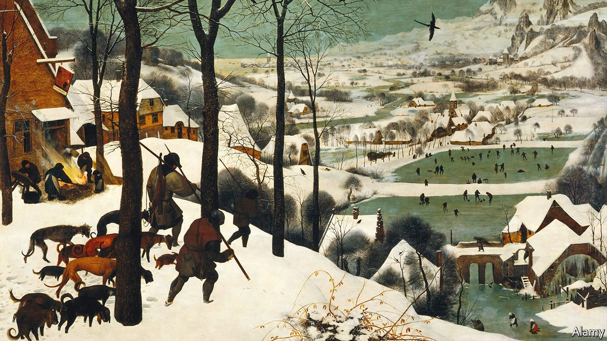

###### Home Entertainment

# “Hunters in the Snow” is an immortal depiction of winter 

##### Pieter Bruegel’s painting is at once icy and vibrant 

 

> Mar 12th 2022 

SPELLBOUND BY COLD yet somehow cosy too, the most famous winter landscape in art history adorns book covers, cards, calendars, posters and tea towels. Pieter Bruegel’s painting “The Hunters in the Snow” has featured in a clutch of films, novels and poems, too. In Andrei Tarkovsky’s visionary science-fiction movie of 1972, “Solaris”, the familiar snowscape decorates a space station. In the witty, Bruegel-inspired thriller “Headlong” that he published in 1999, Michael Frayn, an English novelist and dramatist, writes:


Heads bowed, the three hunters, with their 13 dogs, have only a single scrawny fox to show for their shivering day. Oblivious cooks prepare a pig around a fire, beneath the broken sign of the Stag Inn; in the distance skaters, curlers and ice-hockey players enjoy a pair of frozen ponds. Beyond, mountains rise into jagged peaks never seen in the artist’s native Netherlands. A poem by William Carlos Williams notes that “Bruegel the painter…has chosen/a winter-struck bush for his/ foreground to/complete the picture”.

From that skeletal bush to the ominous crows and magpie above this frigid domain, Bruegel’s minute details build into a scene that captures the essence of a European winter. Painted in 1565 and now in the Bruegel Gallery of Vienna’s Kunsthistorischesmuseum, after earlier stays in Brussels and Prague, this fabled image of a season began as one of a series of works about the times of the year painted for Nicolaes Jonghelinck, an Antwerp banker. Five survive; Mr Frayn’s ingenious plot turns on the alleged discovery of a lost spring scene.

It is hard to stop looking at “The Hunters in the Snow”. At once vibrantly and icily, it tells viewers about the harsh winter of 1564-65 that led to a dismal harvest in the subsequent summer. Some historians now treat Bruegel’s fantastic realism as evidence of the “Little Ice Age” that began to bite in the late 16th century as European temperatures fell.

It is remarkable also for what it doesn’t show. Many in the Low Countries, particularly the nobility, resented their Habsburg overlords. Calvinist leaders stirred up anger against their Catholic counterparts. Hunger and the social stress of the freeze deepened this bitterness. In 1565 the repression of Protestant heresy intensified. Within a year, the world-changing Dutch revolt against the Spanish would begin.

Bruegel’s patrons included Cardinal Granvelle, a detested enforcer of Spanish rule. Yet his cycle of the seasons hardly whispers of the unrest of its time and place. In Mr Frayn’s words, the pictures depict not the eve of revolution but “a history less land in a historyless year”. As all around it changed—from weather to politics to faith—“The Hunters in the Snow” froze Europe’s winter into an evergreen myth. It enchants viewers still. ■

