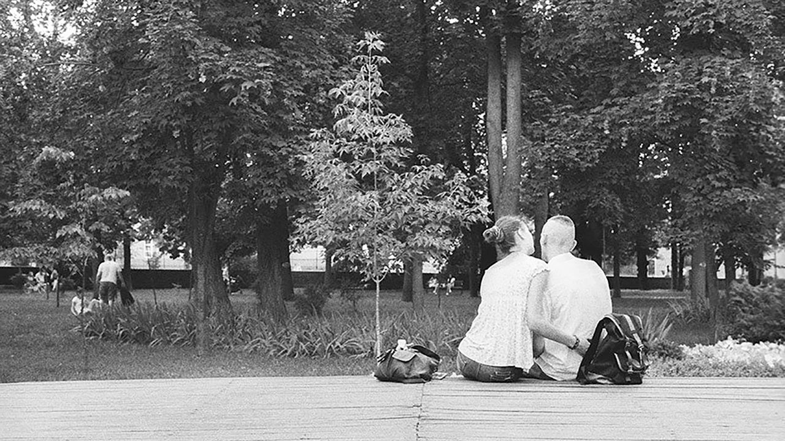

###### Reflections from Ukraine

# “Lucky Breaks” features a different kind of Ukrainian hero 

##### Yevgenia Belorusets offers embroidery in place of sculpture, a document not a monument 

 

> Mar 12th 2022 

Lucky Breaks. By Yevgenia Belorusets. Translated by Eugene Ostashevsky. New Directions; 112 pages; $14.95. Pushkin Press; $9.99

THE HEROES of “Lucky Breaks”, a beguiling book about war in Ukraine by Yevgenia Belorusets, do not conform to ideals of martial heroism. They do not engage in battle, except against the fear, displacement and loss that battles bring. Almost all are women, doing jobs generally seen as feminine: they are florists, manicurists, cosmetologists. They skirt the edges of historical events, rather than standing at their centres. The author explains this focus:


The insignificant and the small, the accidental, the superfluous, the repressed—all of these things attract my attention because they will never turn into the trophies that …winners carry from the present into the future so that they might lay down their booty, like bricks, to construct the dominant historical narrative.

Ms Belorusets is a photographer and artist with long experience documenting under-represented communities in Ukraine, from coalminers to queer people. After Vladimir Putin annexed Crimea and sparked a war in the Donbas in 2014, she turned her camera towards the region’s women. She began recording interviews and developed a haunting, lyrical writing style. In “Lucky Breaks”, she weaves together words and images, photographs and prose portraits of real and imaginary figures. Published in Ukraine in 2018 and now in English, it has acquired a fresh poignancy amid the renewed assault by Russia’s president—determined, as he seems to be, to come away with historic booty, regardless of how much blood he spills.

The short chapters are discrete but feature repeating elements, the same narrator and one recurring character, a spectral presence called Andrea, a writer for newspapers that no one reads. The women’s voices echo and collide; realism bleeds into dreams and fantasies. The images and texts are not illustrations or descriptions of each other, but rather subtle mutual commentaries, recalling the work of writers such as W.G. Sebald and Teju Cole.

The book is held together by invisible threads and recurring motifs—including the act of sewing. In Eugene Ostashevsky’s deft translation of the author’s Russian, a woman with “a snow-white face and snow-white arms, with a golden head of hair and a soft smile on her cherry lips” forgets a needle in her nightshirt after sewing up a hole. Another decides to leave her hometown and her mother, a legendary weaver of ribbons at the local factory. Embroidery, rather than sculpture, is the author’s technique, too; she offers the document, however unreliable, in place of the monument. Along the way, the categories of “fact” and “fiction” crumble.

War has now come to all of Ukraine, including Kyiv, where Ms Belorusets lives. Since the latest invasion began she has posted a poignant online diary on isolarii, a publishing project. In it, she turns her gaze on herself, at once the documentarian and the documented. Her phantasmagoric flourishes return: in her shelter, under Kyiv’s Golden Gate (which also features in “Lucky Breaks”), shadows converse. On the streets, jumpy soldiers see her camera as a threat. Despite the bombs, she carries on writing. “The catastrophe needs to be represented: only as part of a story can it be recognised as a catastrophe.” ■

