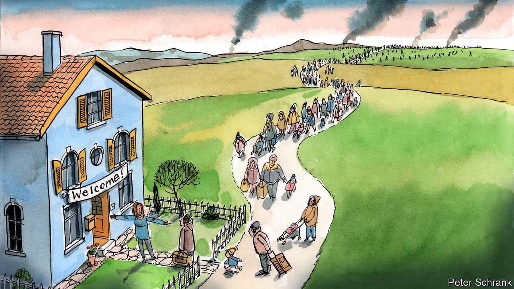

###### Charlemagne

# Europe is doing a good job helping refugees from Ukraine 

##### But the road ahead will be long 

 

> Mar 12th 2022 

SHE THOUGHT it might have been fireworks. But as Olga Nietsche looked out the window of her flat in Kyiv on the morning of February 24th, a rocket flew by and exploded not ten minutes’ walk away. The 28-year-old checked her phone, brimming with messages not about her work as a translator but about the onset of war. Then days went by when nothing made sense. Friends in Russia—former friends, now—insisted to her that she was lying about there being a war at all. It wasn’t long before she had to go. A mate with a car helped her get to Przemysl in Poland, normally a trip of several hours, now a days-long ordeal. It will take more trains to reach Berlin, where her mother lives. She carries only a few documents, a sleeping-bag and a change of clothes; her voice falters as she wonders what the male relatives she has left behind will face. For her part, all she wants is to sleep. It is a small luxury, but one she has not been afforded in what seems an eternity. Then, she says, she will volunteer to help other Ukrainians, using her language skills to help them get beyond the range of bombs, to reach the safety of European countries that are still at peace.

Ms Nietsche is part of what is likely to become the biggest surge of refugees in Europe since the second world war. Over 2m people have fled Ukraine since Russian troops marched in on February 24th. That figure will swell. Estimates, should the bloody campaign continue, vary from 5m to perhaps double that. Previous refugee flows, notably when over a million Syrians and others crossed the Mediterranean to Europe in 2015, ignited political squabbles that showed the EU at its worst. This time the bloc is displaying its best: a mix of generosity and pragmatism few might have guessed it was capable of.


More goodwill will be needed in coming weeks. In any conflict the first to flee are those who can: urban types like Ms Nietsche with passports, cars and credit cards. Those with friends or family in the thriving Ukrainian diaspora are especially likely to brave the journey, since they know they will have a couch to kip on when they arrive. Despite the huge numbers on the move, migration wonks are startled that facilities to process fleeing Ukrainians are merely filling up rather than overwhelmed. Ukrainians are booking Airbnbs en route to their relatives. Locals are helping in touching, imaginative ways. At Przemysl station, mothers found donated prams to replace those left behind. In Poland and beyond people are offering spare rooms or home-cooked meals.

Why such generosity now, when Europe has spent years discussing how to build fences to keep migrants out? Racism is surely a factor. Many Europeans feel more comfortable welcoming large numbers of Ukrainians than they do Syrians or Afghans. Another may be that today’s refugees are largely women and children. (Ukrainian males of fighting age had to stay behind and fight.) Previous waves were largely of single men, whom the locals found more threatening. Finally, proximity matters. To those on the EU’s eastern fringes, these refugees are neighbours. Europeans sympathise with them partly because the warmonger they are fleeing menaces the rest of Europe, too.

Poland, where most Ukrainian refugees have found their way, was already home to more than a million Ukrainians. Some had fled Russia’s original foray into their country in 2014, though they were also attracted by plentiful jobs with higher pay. The two countries speak similar languages and share a tangled history. Even before the crisis, Ukrainians enjoyed visa-free travel to the EU. Unlike Afghans or Eritreans, they did not come on overloaded dinghies, via refugee camps. So the EU’s decision to let them all stay for at least a year, no questions asked, was a relatively easy one. Ukrainian children can go to school; their parents can work. Europe’s social safety-nets will catch them if they cannot.

But strains will appear. The countries that have taken in the most Ukrainians so far, notably Poland and Hungary, have in the past opposed shuffling migrants from one EU country to the next—because they did not want to take in Africans or Muslims. Not all the Ukrainians who first turned up in countries bordering Ukraine will stay there. Where they might go is anyone’s guess; only Britain, now outside the EU, is putting up barriers. Politicians in host countries say Ukrainians will be eager to return home once peace is restored. But will they? The EU scheme to grant Ukrainians “temporary protection” status, unanimously approved on March 4th, was devised in the wake of the bloody break-up of Yugoslavia in the 1990s, when millions fled a series of wars. Harbouring them was initially intended as a short-term arrangement. But for many it became permanent: migrants integrated in their adopted countries, and stayed long after the wars ended.

A work of years

A population’s consent to welcome migrants is a fragile thing. Will the goodwill endure if Ukrainian refugees are joined by large numbers of Russians escaping from Vladimir Putin’s brutal regime? Would it survive a recession induced by sky-high energy prices, which the war has already caused? What if it were supplemented by a resurgence in arrivals from farther afield—if, for example, soaring food prices in the Middle East were to drive more migrants to chance the journey across the Mediterranean?

In 2015 Angela Merkel told Germany, “Wir schaffen das.” (We can handle this.) Her successors across Europe should steel their electorates in the same way today. Already Ukrainians are starting to arrive who will need more help than Ms Nietsche. Since Ukrainian refugees are allowed to work, they will pay taxes. But their children will need schools, and this will require both money and planning. The net cost of giving refuge to Ukrainians is unknown, and will surely be dwarfed by the economic shocks of the war itself. But the time to start preparing is now, while sympathy is still fresh. These past weeks, a united Europe has shown its best face; but the work has barely begun. ■

Read more from Charlemagne, our columnist on European politics:

 (Mar 5th) (Feb 26th) (Feb 19th)

Our recent coverage of the Ukraine crisis can be found 

