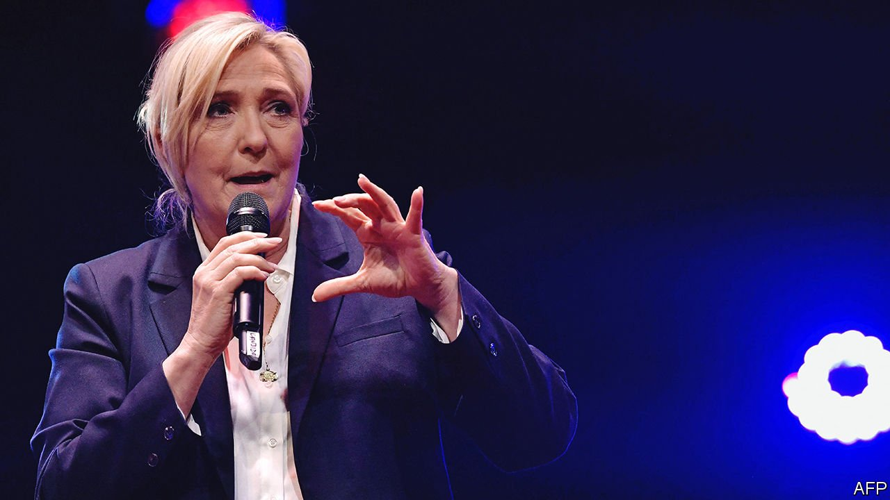

###### Paris grudge match

# Marine Le Pen hopes for another face-off against Emmanuel Macron 

##### The populist’s third try at France’s presidency is unlikely to succeed 

 

> Mar 12th 2022 

THIS IS THE heart of France’s champagne country, but no vineyard or chateau is to be seen. Instead, a procession of a dozen shiny navy-blue buses pulls up outside an angular concrete convention centre on the outskirts of the cathedral city of Reims. One by one, they disgorge flag-waving supporters, who have travelled from across the country. On the side of each bus is a giant full-colour portrait of their champion, and just two words: Marine présidente.

Time was, leaders of the French far right moved about incognito. It is a measure of how far the nationalist-populist Marine Le Pen has become an accepted political figure that, ahead of the presidential election on April 10th and 24th, she advertises her travels and those of her fans. “She’s a brave, respectful, honest woman, who has very French convictions and values,” declares a pensioner, stepping off the bus from southern France for the day, as the gathering crowd breaks into a rendition of La Marseillaise. “She’s the only option to save our country today.”


With just a month to go before the two-round vote, this year’s election is fast turning into a race to take on Mr Macron in the run-off. On March 9th The Economist’s forecasting model gave the sitting president a 99% probability of reaching the second round. Four candidates currently stand a chance of meeting him there, among them the centre-right Republicans’ Valérie Pécresse, the far-right Eric Zemmour and the hard-left Jean-Luc Mélenchon. Currently, the most likely contender is Ms Le Pen.

Mr Macron roundly defeated Ms Le Pen in the run-off in 2017, patiently exposing her as ill-prepared in their televised debate. This time, off-stage ahead of her rally in Reims, Ms Le Pen comes across as a more poised and sharper figure, hardened perhaps by two previous presidential defeats. She insists on the “thorough” policy detail her teams have worked on, covering themes from energy to taxation, and no longer plans to ditch the euro, a past policy that proved unpopular.

The point of the buses is to show that Ms Le Pen is in touch with people on the ground. As she strides on stage in Reims later that day, before 4,000 supporters chanting “Marine! Marine!”, the politician who grew up in a mansion outside Paris tries to show that she has lived like them too. After supplying red-meat promises to “save France” from foreign perils, she finishes with an unusually folksy tale: of her struggles as a single mother, her parents’ divorce and the bomb attack she endured on her childhood home. “I understand suffering,” she claims.

Ms Le Pen spews out plenty of nationalist rhetoric, vowing to end the legal right of families abroad to join immigrant relatives living in France and celebrating the country’s “Christian culture”. She still inspires loathing in some quarters; one campaign bus was stoned on its way to Reims. But she has spent years trying to purge her party of the jack-booted image it had under her father, Jean-Marie Le Pen, and make it more respectable. Her strategy is to appeal to blue-collar voters on both the right and the left, particularly in formerly Communist-voting parts of the rustbelt of northern France. Hence her emphasis on curbing the cost of living, which polls say is a much bigger worry than immigration. Among blue-collar voters, she is the most popular candidate.

Although Mr Zemmour’s candidacy has dented Ms Le Pen’s polling, it has also helped to make her politics appear less extreme. Mr Zemmour rails unabashedly against Islam; Ms Le Pen denounces not the religion but “Islamist ideology”. Each has, until recently, praised Vladimir Putin. Mr Zemmour declared he was against even welcoming Ukrainian refugees—before back-pedalling after an outcry. Ms Le Pen has argued in favour.

Polls suggest that Mr Macron would still beat Ms Le Pen in a run-off, albeit by a narrower margin than in 2017. Yet there is more at stake for Ms Le Pen. Mr Zemmour’s broader ambition is to “unite the right”: to bring together the Republicans’ socially conservative Catholic vote and Ms Le Pen’s nationalist vote under a single banner. He has already stolen from her team. This week her niece, Marion Maréchal, defected to his camp. Ms Le Pen is fighting for her party’s survival, convinced that Mr Zemmour’s main aim is not to win but to finish her off, whatever the election result. ■

