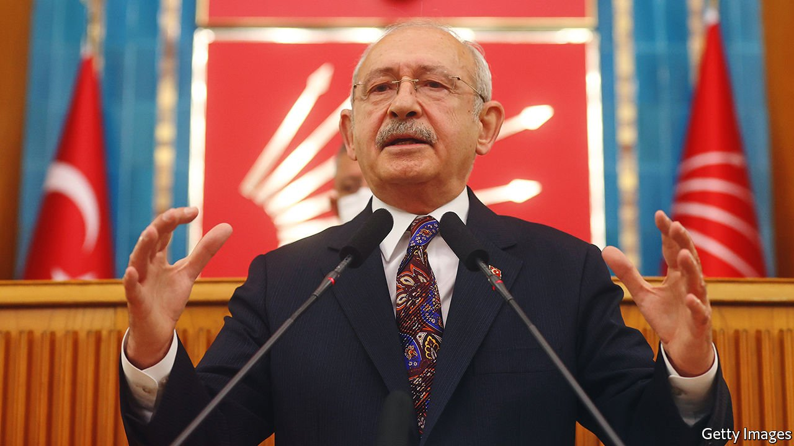

###### The compromise candidate

# Meet Turkish President Erdogan’s presumptive challenger 

##### Kemal Kilicdaroglu might make a better president than he does a campaigner 

 

> Mar 10th 2022 

KEMAL KILICDAROGLU, the leader of the social democratic Republican People’s Party (CHP), Turkey’s main opposition party, is bracing for the biggest showdown of his career. “Erdogan will do everything not to leave,” he says at his party’s headquarters, referring to the country’s president, Recep Tayyip Erdogan, and the outlook for next year’s elections. “He will pile on the pressure on the judiciary, he will try to silence the free media, and he will try to manipulate the election board,” says Mr Kilicdaroglu. “But at the ballot box, we will teach him a lesson.”

Mr Erdogan’s opponents are closing ranks. On February 28th six opposition parties, including the CHP, signed a declaration outlining their plans to overhaul the presidential system, which gives Mr Erdogan unchecked powers, restore more power to parliament and shore up state institutions, starting with the courts and the central bank. The alliance has yet to announce its candidate for president. But there is every indication Mr Kilicdaroglu will run.


Mr Erdogan and his Justice and Development (AK) party have seldom looked as vulnerable. Inflation has surged to over 54%, the result of Mr Erdogan’s misguided insistence on low interest rates. The currency, propped up since the start of the year by a deposit guarantee programme and costly central bank interventions, is again taking a battering, this time as a result of the war in Ukraine. Hopes of an economic recovery, which Mr Erdogan pinned on a calm summer and billions of dollars of tourism revenue, are being blown apart by Russian missiles in Ukraine.

The wave Mr Kilicdaroglu hopes to ride to the presidency swelled in 2019, when the CHP and its main partner, the IYI (“Good”) party, prevailed over AK in five of Turkey’s six largest cities, including Istanbul, in local elections. Mr Kilicdaroglu, who pieced together the opposition alliance, was a big part of the success.

Many opposition voters fear Mr Kilicdaroglu is the wrong candidate to take on Turkey’s strongman, however. Of the three most plausible opposition candidates for the presidency, Mr Kilicdaroglu polls the worst against Mr Erdogan, though he still leads by a decent margin. In a country whose entire political culture needs a shake-up, the bespectacled former civil servant, though affable and sprightly at 73, is hardly a symbol of rejuvenation.

Still, Mr Kilicdaroglu has a number of redeeming qualities. One is the direction in which he has taken his party over the past decade, away from an obsession with secularism, and towards a more moderate, inclusive politics. The notable exception is his attitude towards the nearly 4m Syrian refugees living in Turkey, whom Mr Kilicdaroglu has repeatedly promised to send home. He says he would not force them to leave, but make it easier for them to return by rebuilding Syria.

Mr Kilicdaroglu’s biggest strength may be the trust he enjoys among the rest of the opposition. The system Mr Erdogan foisted upon Turkey gives the president such broad powers that the risk of abusing them is considerable. Other opposition leaders feel more comfortable with Mr Kilicdaroglu at the wheel than anyone else (except, presumably, themselves), says Seren Selvin Korkmaz, head of the IstanPol Institute, a think-tank in Istanbul. The CHP’S leader may indeed have the makings of a good president. But he still needs to prove that he is a good candidate. ■

