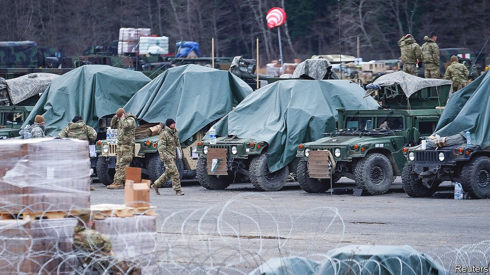
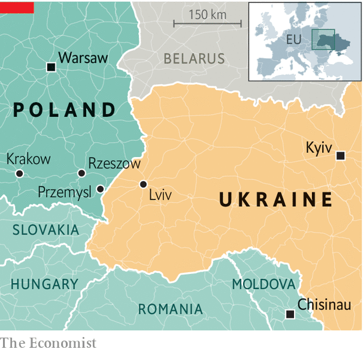

###### The frontline state

# Why Poland has become NATO’s linchpin in the war in Ukraine 

##### The West no longer dismisses its warnings about Russia 

 

> Mar 12th 2022 

POLISH LEADERS have long pushed their partners in NATO and the EU to forge closer ties with Ukraine, warning of the risk of Russian aggression, only to be dismissed as paranoid. Russia’s murderous and unprovoked invasion of Ukraine has proven them entirely right. Polish denunciations of Russia’s imperial ambitions, which Americans and western Europeans once pooh-poohed as post-communist stress disorder, have now become standard NATO talking points. But it is not just Poland’s view of Russia that is being taken more seriously; it is Poland’s role in the world. In a matter of a few weeks, the country has become the linchpin of the Western effort to defend Ukraine and deter Russia, a task as important as it is dangerous.

Hundreds of Stinger missiles, Javelin anti-tank weapons and other munitions have already poured into Ukraine through Poland and Romania, part of America’s $350m package to assist the besieged country. Poland itself has dispatched an ammunition convoy to Ukraine, and plans to send mortars, small drones and man-portable missile systems, known as MANPADS, from its own supplies. Weapons deliveries from other countries, including a €450m ($490m) consignment financed by the EU, are on the way, too. “The biggest share of military equipment, both lethal and non-lethal, will go through Poland,” says Konrad Muzyka of Rochan Consulting, a military-analysis firm. “Like it or not,” says Stanislaw Koziej, a former brigadier-general in Poland’s army, “we are going to be the main link in the chain connecting Ukraine and the West.”


 


Poland is nearer the eye of the storm than any other NATO member. It risks being drawn in further. For days the country mooted giving its MiG-29 fighter jets to Ukraine in exchange for F-16s from America. The Americans, who initially pushed the plan, balked when Poland asked to send the jets via an American airbase in Germany. On March 9th they backed out, saying transferring the jets risked escalation. Poland wants to do as much as possible, say officials in Warsaw, without being dragged into the war.

The crisis has also turned Poland, almost overnight, into the country with the second-largest refugee population in Europe. At least 2m people have escaped Ukraine since the start of the invasion, the most extensive and rapid movement of  in Europe’s post-war history. Over 1.3m have reached Poland. The country has coped remarkably well with the influx. But its resources are stretched.

Poland was already home to Europe’s largest Ukrainian diaspora, over a million strong, and so is an important recruiting ground for Ukraine’s resistance. In the first ten days of the war, Polish border guards recorded 217,000 crossings into Ukraine. A large share were Ukrainians heading back home to fight. “Our people are waiting,” says Aleksandr, who arrived at the border by bus from Estonia. “They’re going to tell us what to do, give us ammunition and guns, and then we’re off to work.”

Poland’s size, location and infrastructure make it the West’s most important gateway to Ukraine. The two countries share a 530km (330-mile) border, punctuated by over a dozen crossings. The airport in Rzeszow, about an hour’s drive from the border, is the closest big airport to Ukraine on NATO territory. Flight radar data show an uptick in military aircraft, almost certainly involved in weapons deliveries, flying in and out of Rzeszow since the start of the war. Were Kyiv to fall to the Russians, which is still far from guaranteed, Ukrainian troops and volunteers would probably regroup in the west of the country, in or around Lviv, only 80km from the Polish border. This would further raise Poland’s importance for Ukraine.

The war has already strengthened Poland’s position in NATO. The alliance is increasing its presence in Poland dramatically. America had deployed nearly 5,000 new troops to Poland in February, even before the Russian invasion, bringing the total to some 9,000. It also recently approved the sale to Poland of 250 Abrams tanks.

Poland also hopes to reconcile with the rest of the EU. The bloc has repeatedly chided Poland’s nationalist government for stacking its top court with cronies, threatening judges who rule against it and harassing the media. The stand-off prompted the EU to freeze €36bn in pandemic recovery funds earmarked for Poland and to fine it for ignoring rulings by the European Court of Justice. Poland has moved to meet some EU demands, and its efforts in the face of Russia’s aggression may earn it a more sympathetic hearing.

But there are incalculable risks involved, too. Analysts say Russian retaliation of one kind or another against Poland is a near certainty. The longer the war lasts, the more desperate Russia will be to destroy the supply lines connecting Poland to Ukraine. “I’m afraid that Russian rocket attacks against those supply lines are something we have to take into account in the coming days and weeks,” says Wojciech Kononczuk of the Centre for Eastern Studies, a think-tank in Warsaw. America clearly takes the possibility seriously: it is sending Patriot missile-defence batteries to Poland. Others mention the threat of Russian sabotage and cyberattacks inside Poland. A social-media monitoring group has already uncovered a Russian disinformation campaign intended to spread panic and drive up resentment towards refugees from Ukraine.

Vladimir Putin’s threats against countries that interfere in Ukraine are not to be taken lightly. But for Poland and NATO, the only risk bigger than that of Russian retaliation is the risk of Western inaction. “There’s no alternative, because we’re in the same boat,” says Mr Kononczuk. “The only difference is that Ukraine’s in the front, and we’re in the back.” ■

Our recent coverage of the Ukraine crisis can be found .

